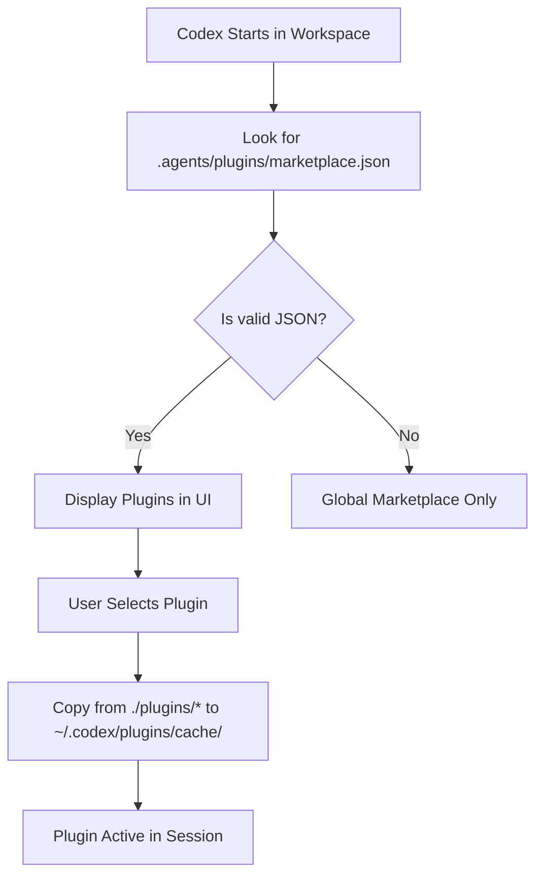

# Codex Local Marketplace Configuration

This directory (`.agents/`) contains the local repository marketplace configuration for **OpenAI Codex** plugins.

## How Codex Marketplaces Work

Codex uses a local discovery mechanism. When you open a repository in a Codex-enabled environment, it checks `.agents/plugins/marketplace.json` to see what local tools the repository provides.



## Marketplace JSON Structure

The `marketplace.json` must strictly define the source path and installation policies so Codex knows how to handle the integration.

### Example Entry: `earnings-analyzer-codex`
```json
{
  "name": "earnings-analyzer-codex",
  "source": {
    "source": "local",
    "path": "./plugins/earnings-analyzer-codex"
  },
  "policy": {
    "installation": "AVAILABLE",
    "authentication": "ON_INSTALL"
  },
  "category": "Finance"
}
```

*   `path`: Must be relative to the repository root and typically points to `./plugins/`.
*   `policy.installation`: `AVAILABLE` means the user must manually click install in the UI.

We currently expose 10 unique plugins through this marketplace, covering everything from AI News Briefings to ArXiv Paper Reading.