# Architecture: AI News Briefing System


This document describes the architecture, data flow, and design decisions behind the AI News Briefing system -- an automated daily AI news aggregation pipeline that uses one of four supported AI CLI engines (Claude Code, Codex, Gemini, Copilot) to search the web, compile a structured briefing, and publish it to Notion and/or Obsidian.

The system is cross-platform, supporting macOS (launchd) and Windows (Task Scheduler).

---

## Table of Contents

1. [System Architecture Overview](#1-system-architecture-overview)
2. [Execution Flow](#2-execution-flow)
3. [Core Pipeline Components](#3-core-pipeline-components)
4. [Teams Notification Pipeline](#4-teams-notification-pipeline)
5. [Slack Notification Pipeline](#5-slack-notification-pipeline)
6. [Custom Topic Briefing Pipeline](#6-custom-topic-briefing-pipeline)
7. [Obsidian Publishing Pipeline](#7-obsidian-publishing-pipeline)
8. [Test Suite](#8-test-suite)
9. [Quality Eval Harness](#9-quality-eval-harness)
10. [Research Ops Plugin Ecosystem](#10-research-ops-plugin-ecosystem)
11. [Data Flow](#11-data-flow)
12. [Search Strategy](#12-search-strategy)
13. [Output Format](#13-output-format)
14. [Scheduling Architecture](#14-scheduling-architecture)
15. [Error Handling](#15-error-handling)
16. [File System Layout](#16-file-system-layout)
17. [Security Considerations](#17-security-considerations)
18. [Future Enhancements and Extension Points](#18-future-enhancements-and-extension-points)

> [!NOTE]
> **Live Notion page:** [https://hoangsonw.notion.site/9c34d052d9354beda82a3423e2d2f404?v=d43c53fe405c4896bfd95ad0cc22246f](https://hoangsonw.notion.site/9c34d052d9354beda82a3423e2d2f404?v=d43c53fe405c4896bfd95ad0cc22246f)

---

## 1. System Architecture Overview

The system is composed of five primary layers: a platform-native scheduler, a scripted entry point, a CLI engine selection layer, the AI engine itself, and the Notion API as the output destination. The daily pipeline implements a registry pattern -- it checks for installed engines (Claude Code, Codex, Gemini, Copilot) and selects one based on the `AI_BRIEFING_CLI` environment variable or an automatic fallback chain (`claude` → `codex` → `gemini` → `copilot`). The custom-brief pipeline also supports all four engines, but does not run a fallback chain: it uses explicit `--cli/-Cli` when provided, otherwise `AI_BRIEFING_CLI`, otherwise `claude`. The core logic (prompt, search, compilation, Notion write, card generation) is identical across platforms and engines -- only the scheduling, scripting, and engine selection layers differ.

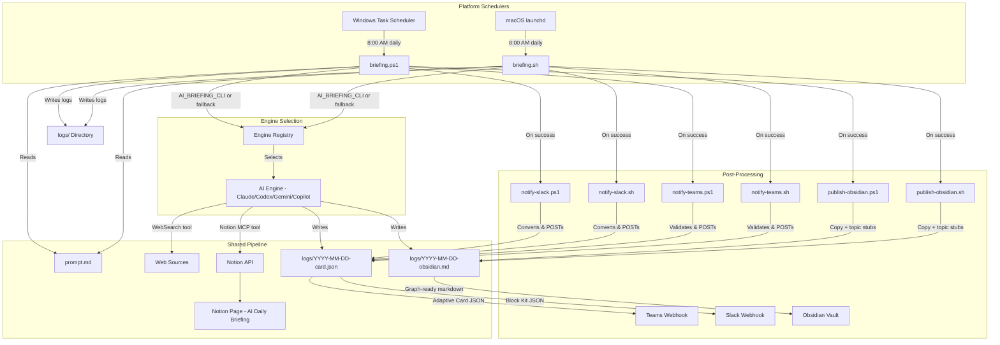
```mermaid
graph TD
    subgraph "Platform Schedulers"
        A1[macOS launchd] -->|8:00 AM daily| B1[briefing.sh]
        A2[Windows Task Scheduler] -->|8:00 AM daily| B2[briefing.ps1]
    end

    subgraph "Engine Selection"
        B1 -->|AI_BRIEFING_CLI or fallback| ES[Engine Registry]
        B2 -->|AI_BRIEFING_CLI or fallback| ES
        ES -->|Selects| D[AI Engine - Claude/Codex/Gemini/Copilot]
    end

    subgraph "Shared Pipeline"
        B1 -->|Reads| P[prompt.md]
        B2 -->|Reads| P
        D -->|WebSearch tool| E[Web Sources]
        D -->|Notion MCP tool| F[Notion API]
        F --> G[Notion Page - AI Daily Briefing]
        D -->|Writes| CJ["logs/YYYY-MM-DD-card.json"]
        D -->|Writes| OJ["logs/YYYY-MM-DD-obsidian.md"]
    end

    subgraph "Post-Processing"
        B1 -->|On success| T1[notify-teams.sh]
        B2 -->|On success| T2[notify-teams.ps1]
        T1 -->|Validates & POSTs| CJ
        T2 -->|Validates & POSTs| CJ
        CJ -->|Adaptive Card JSON| TW[Teams Webhook]
        B1 -->|On success| S1[notify-slack.sh]
        B2 -->|On success| S2[notify-slack.ps1]
        S1 -->|Converts & POSTs| CJ
        S2 -->|Converts & POSTs| CJ
        CJ -->|Block Kit JSON| SW[Slack Webhook]
        B1 -->|On success| OB1[publish-obsidian.sh]
        B2 -->|On success| OB2[publish-obsidian.ps1]
        OB1 -->|Copy + topic stubs| OJ
        OB2 -->|Copy + topic stubs| OJ
        OJ -->|Graph-ready markdown| OBV["Obsidian Vault"]
    end

    B1 -->|Writes logs| H[logs/ Directory]
    B2 -->|Writes logs| H
```

**Key design principles:**

- **Headless execution.** The entire pipeline runs without user interaction via the selected engine's headless/print mode.
- **Multi-engine support.** Four AI CLI engines are supported (Claude Code, Codex, Gemini, Copilot). Daily briefings use automatic fallback; custom briefs support explicit engine selection and default to `AI_BRIEFING_CLI` or `claude`.
- **Cross-platform.** Platform-specific code is isolated to the entry point scripts and scheduler configs. The prompt, search strategy, and output format are shared.
- **Single responsibility.** Each file has one job: scheduling, orchestration, prompt definition, or installation.
- **Cost containment.** A hard budget cap of $2.00 per run prevents runaway API costs.
- **Observability.** All output (stdout and stderr) is captured in date-stamped log files.
- **Multi-channel delivery.** Briefings publish to Notion and optionally post to Microsoft Teams and/or Slack via webhooks.

---

## 2. Execution Flow

The system supports multiple trigger paths that converge on the same execution pipeline.

### Platform Entry Points

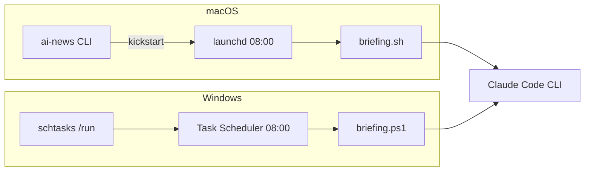
```mermaid
flowchart LR
    subgraph macOS
        L[launchd 08:00] --> BS[briefing.sh]
        AI[ai-news CLI] -->|kickstart| L
    end

    subgraph Windows
        TS[Task Scheduler 08:00] --> PS[briefing.ps1]
        MAN["schtasks /run"] --> TS
    end

    BS --> CC[Claude Code CLI]
    PS --> CC
```

### Full Lifecycle Sequence

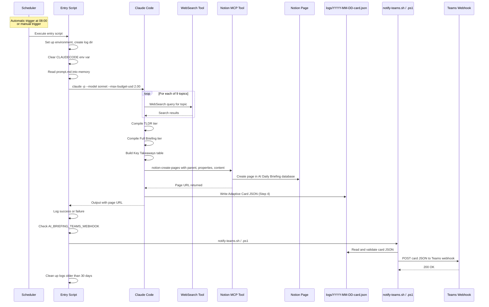
```mermaid
sequenceDiagram
    participant S as Scheduler
    participant E as Entry Script
    participant C as Claude Code
    participant W as WebSearch Tool
    participant N as Notion MCP Tool
    participant NP as Notion Page
    participant CF as logs/YYYY-MM-DD-card.json
    participant T as notify-teams.sh / .ps1
    participant TW as Teams Webhook

    Note over S: Automatic trigger at 08:00<br/>or manual trigger
    S->>E: Execute entry script

    E->>E: Set up environment, create log dir
    E->>E: Clear CLAUDECODE env var
    E->>E: Read prompt.md into memory
    E->>C: claude -p --model sonnet --max-budget-usd 2.00

    loop For each of 9 topics
        C->>W: WebSearch query for topic
        W-->>C: Search results
    end

    C->>C: Compile TLDR tier
    C->>C: Compile Full Briefing tier
    C->>C: Build Key Takeaways table

    C->>N: notion-create-pages with parent, properties, content
    N->>NP: Create page in AI Daily Briefing database
    N-->>C: Page URL returned

    C->>CF: Write Adaptive Card JSON (Step 4)

    C-->>E: Output with page URL
    E->>E: Log success or failure
    E->>E: Check AI_BRIEFING_TEAMS_WEBHOOK
    E->>T: notify-teams.sh / .ps1
    T->>CF: Read and validate card JSON
    T->>TW: POST card JSON to Teams webhook
    TW-->>T: 200 OK
    E->>E: Clean up logs older than 30 days
```

### Timing

Based on observed log data, a typical run takes approximately 3-5 minutes from start to completion. This covers the full cycle of web searches across 9 topics, content compilation, and Notion page creation.

---

## 3. Core Pipeline Components

The shared spine that every briefing variant (daily, custom, etc.) reuses. Schedulers fire entry-point scripts, which assemble a prompt, hand off to the selected AI CLI, and emit on-disk artifacts. Notification and publishing pipelines are kept out of this section — see Sections 4–7 for those.

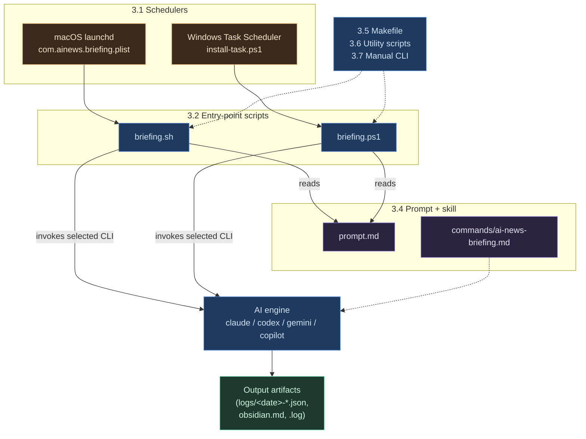
```mermaid
flowchart TD
    classDef sched fill:#3a2a1e,stroke:#d49b5b,color:#f5e6c8
    classDef ep    fill:#1e3a5f,stroke:#5b8dd8,color:#d4e4f8
    classDef prompt fill:#2a2440,stroke:#8b7ad4,color:#e4e4ef
    classDef art    fill:#1e3a2f,stroke:#5bd49b,color:#d4f8e2

    subgraph SCHED["3.1 Schedulers"]
        S1["macOS launchd<br/>com.ainews.briefing.plist"]:::sched
        S2["Windows Task Scheduler<br/>install-task.ps1"]:::sched
    end

    subgraph ENTRY["3.2 Entry-point scripts"]
        E1["briefing.sh"]:::ep
        E2["briefing.ps1"]:::ep
    end

    subgraph PROMPT["3.4 Prompt + skill"]
        P1["prompt.md"]:::prompt
        P2["commands/ai-news-briefing.md"]:::prompt
    end

    OPS["3.5 Makefile<br/>3.6 Utility scripts<br/>3.7 Manual CLI"]:::ep

    ART["Output artifacts<br/>(logs/&lt;date&gt;-*.json,<br/>obsidian.md, .log)"]:::art

    S1 --> E1
    S2 --> E2
    E1 -- reads --> P1
    E2 -- reads --> P1
    E1 -- invokes selected CLI --> CLI["AI engine<br/>claude / codex / gemini / copilot"]:::ep
    E2 -- invokes selected CLI --> CLI
    P2 -.-> CLI
    CLI --> ART
    OPS -.-> E1
    OPS -.-> E2
```

### 3.1 Schedulers

The system uses the native scheduler for each platform. Both are configured for identical behavior: fire once daily at 08:00, recover from missed runs when possible.

| Aspect | macOS (launchd) | Windows (Task Scheduler) |
|---|---|---|
| Config file | `com.ainews.briefing.plist` | Created by `install-task.ps1` |
| Task name | `com.ainews.briefing` | `AiNewsBriefing` |
| Default time | 08:00 | 08:00 |
| Missed run recovery | Fires on wake (sleep only) | `StartWhenAvailable` fires on wake or login |
| Powered-off recovery | Skipped for that day | Fires on next login |
| Concurrency guard | Single instance enforced by launchd | `ExecutionTimeLimit` of 30 minutes |
| Manual trigger | `launchctl kickstart` or `ai-news` CLI | `schtasks /run /tn AiNewsBriefing` |

#### macOS plist configuration

| Property | Value | Purpose |
|---|---|---|
| `Label` | `com.ainews.briefing` | Unique identifier for the job |
| `ProgramArguments` | `/bin/bash`, `briefing.sh` | Shell and script to execute |
| `StartCalendarInterval` | Hour: 8, Minute: 0 | Trigger at 08:00 daily |
| `StandardOutPath` | `logs/launchd-stdout.log` | Capture stdout from launchd itself |
| `StandardErrorPath` | `logs/launchd-stderr.log` | Capture stderr from launchd itself |
| `EnvironmentVariables` | `PATH`, `HOME` | Ensures Claude and tools are discoverable |

#### Windows Task Scheduler settings

| Setting | Value | Purpose |
|---|---|---|
| `AllowStartIfOnBatteries` | True | Run even on battery power (laptops) |
| `DontStopIfGoingOnBatteries` | True | Don't kill the task if AC is unplugged mid-run |
| `StartWhenAvailable` | True | Catch up on missed runs after sleep/shutdown |
| `ExecutionTimeLimit` | 30 minutes | Kill runaway tasks |
| `RunLevel` | Limited | No admin elevation required |

### 3.2 Entry Point Scripts

Both scripts are deliberately minimal -- their only job is to set up the environment and hand off to Claude Code. They share the same logic in platform-native languages.

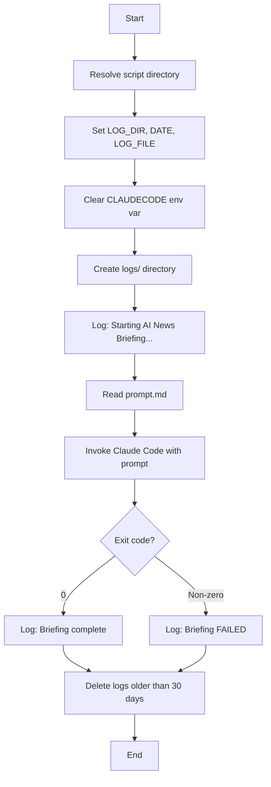
```mermaid
graph TD
    A[Start] --> B[Resolve script directory]
    B --> C[Set LOG_DIR, DATE, LOG_FILE]
    C --> D[Clear CLAUDECODE env var]
    D --> E[Create logs/ directory]
    E --> F["Log: Starting AI News Briefing..."]
    F --> G[Read prompt.md]
    G --> H[Invoke Claude Code with prompt]
    H --> I{Exit code?}
    I -->|0| J["Log: Briefing complete"]
    I -->|Non-zero| K["Log: Briefing FAILED"]
    J --> L[Delete logs older than 30 days]
    K --> L
    L --> M[End]
```

#### `briefing.sh` (macOS)

- **Language:** Bash with `set -e` (exit on error)
- **Claude path:** `$HOME/.local/bin/claude` (portable across users)
- **Log rotation:** `find` with `-mtime +30 -delete`
- **Error suppression:** `|| true` on cleanup to prevent script failure

#### `briefing.ps1` (Windows)

- **Language:** PowerShell 5.1+ with `Set-StrictMode` and `$ErrorActionPreference = "Stop"`
- **Claude path:** `$env:USERPROFILE\.local\bin\claude.exe`
- **Log rotation:** `Get-ChildItem` with `Where-Object` filtering by `LastWriteTime`
- **Error handling:** `try/catch` block captures Claude execution failures

**Shared design decisions:**

- **`unset CLAUDECODE` / `$env:CLAUDECODE = $null`**: Prevents nested session detection if the script is invoked from within a Claude Code terminal.
- **Log to file, not stdout:** All output is captured in date-stamped log files for observability without requiring a terminal.
- **30-day log rotation:** Prevents unbounded disk usage on both platforms.

### 3.3 Task Installer (`install-task.ps1`, Windows only)

A PowerShell script that registers (or re-registers) the Windows Task Scheduler task. Accepts `-Hour` and `-Minute` parameters for schedule customization. Removes any existing task with the same name before creating a new one, making it idempotent.

### 3.4 AI Prompt and Skill Definitions

The AI's behavior is governed by prompt files and Claude Code skill definitions:

- **Daily briefing:** `prompt.md` (headless) + `commands/ai-news-briefing.md` (interactive skill)
- **Custom brief:** `prompt-custom-brief.md` (headless with template variables) + `commands/custom-brief.md` (interactive skill)

The daily briefing prompts form the complete instruction set for a scheduled run. The custom brief prompt uses `{{TOPIC}}` and `{{PUBLISH_*}}` template variables that are injected by the CLI scripts at runtime. All prompts are shared across platforms with no platform-specific content.


```mermaid
flowchart TD
    classDef src   fill:#2a2440,stroke:#8b7ad4,color:#e4e4ef
    classDef step  fill:#1e3a5f,stroke:#5b8dd8,color:#d4e4f8
    classDef leaf  fill:#1e3a2f,stroke:#5bd49b,color:#d4f8e2

    PM["prompt.md<br/>headless instructions"]:::src
    SK["commands/ai-news-briefing.md<br/>Claude Code skill"]:::src

    subgraph S1["Step 1: Search"]
        direction TB
        B1["9 topic definitions"]:::leaf
        B2["Search query templates"]:::leaf
    end

    subgraph S2["Step 2: Compile"]
        direction TB
        C1["Tier 1 — TL;DR<br/>10-15 bullets"]:::leaf
        C2["Tier 2 — full briefing<br/>9 sections"]:::leaf
        C3["Key takeaways<br/>table"]:::leaf
    end

    subgraph S3["Step 3: Write to Notion"]
        direction TB
        D1["Page parameters"]:::leaf
        D2["Formatting rules"]:::leaf
        D3["Constraints"]:::leaf
    end

    subgraph S4["Step 4: Adaptive Card"]
        direction TB
        F1["logs/&lt;date&gt;-card.json"]:::leaf
        F2["Adaptive Card v1.4"]:::leaf
        F3["ASCII-safe, ≤ 26 KB"]:::leaf
    end

    PM --> S1
    PM --> S2
    PM --> S3
    SK --> S1
    SK --> S2
    SK --> S3
    SK --> S4
```

**How the prompt and skill guide Claude:**

1. **Topic enumeration.** The 9 topics are explicitly listed with examples of what to search for, removing ambiguity about scope.
2. **Search strategy.** Template queries like `"[topic] news today [current date]"` guide Claude toward recent content rather than evergreen articles.
3. **Two-tier output format.** The TL;DR tier provides a scannable summary; the full briefing tier provides depth. This separation is defined in the prompt, not in code.
4. **Exact Notion API parameters.** The `parent` database ID, property schema, and formatting rules are hardcoded in the prompt so Claude produces the correct API call every time.
5. **Guardrails.** Instructions like "Focus on NEWS from the past 24-48 hours only" and "If a topic has no significant news today, say 'No major updates today'" prevent hallucination and filler content.
6. **Card generation (Step 4).** The skill definition includes the Adaptive Card JSON template and constraints (valid JSON, ASCII-safe text, ≤26KB). Claude writes the final card payload directly to `logs/YYYY-MM-DD-card.json`, eliminating any need for post-hoc log parsing.

### 3.5 Makefile (Cross-Platform Task Runner)

The `Makefile` provides a unified command interface across macOS, Windows (Git Bash / MSYS2), and Linux. It auto-detects the platform at invocation and routes commands to the correct native tools.

**Design decisions:**

- **Platform detection.** Uses `uname -s` output to classify the environment as `macos`, `windows`, or `linux`. Handles MINGW, MSYS, and CYGWIN variants for Windows Git Bash environments.
- **Prerequisite gating.** The `check` target validates the Claude CLI binary exists before `run` or `install` execute, providing a clear error message instead of a cryptic failure.
- **Validation.** The `validate` target checks that all project files exist and that `prompt.md` contains the expected step structure (Step 0 through Step 3).
- **No dependencies beyond Make.** The Makefile uses only POSIX shell commands and platform-native tools. No additional packages are required.

**Target categories:**

| Category | Targets | Purpose |
|---|---|---|
| Daily Briefing | `run`, `run-bg`, `run-scheduled` | Trigger the daily briefing pipeline |
| Custom Brief | `custom-brief`, `custom-brief-bg` | Deep-research a specific topic on demand |
| Logs | `tail`, `log`, `logs`, `log-date`, `clean-logs`, `purge-logs` | View and manage log files |
| Scheduler | `install`, `uninstall`, `status` | Manage the platform scheduler |
| Validation | `check`, `validate` | Verify environment and project health |
| Info | `help`, `info`, `prompt` | Display configuration and documentation |

### 3.6 Utility Scripts (`scripts/`)

The `scripts/` directory contains **21 paired utility scripts** (`.sh` + `.ps1`) that support pipeline operations, delivery, quality evaluation, plugin authoring, diagnostics, and maintenance. Each pair implements identical functionality in platform-native languages; the Makefile auto-routes between them based on `$(PLATFORM)`.

**Design decisions:**

- **Cross-platform parity.** Every script exists as both a Bash and PowerShell variant. The two versions produce the same output and accept equivalent parameters.
- **Auto-backup on mutation.** Scripts that modify `prompt.md` (`topic-edit`, `backup-prompt`) automatically create a timestamped backup before writing.
- **Read-only by default.** Most scripts are diagnostic. Only `topic-edit`, `backup-prompt`, `update-schedule`, `uninstall`, `export-logs`, and `scaffold-plugin` perform writes.
- **No external dependencies.** All scripts use only built-in OS utilities (bash, PowerShell, grep, sed, Get-Content, Select-String, `sqlite3`, and `python3` where the eval store is involved).

**Script categories:**

| Category | Scripts | Purpose |
|---|---|---|
| Diagnostics | `health-check`, `log-summary`, `log-search`, `cost-report` | Inspect system health, run history, and spending |
| Testing | `dry-run`, `test-notion`, `test-obsidian` | Validate pipeline, MCP, and vault connectivity without side effects |
| Data Management | `export-logs`, `backup-prompt` | Archive logs and version prompt.md |
| Configuration | `topic-edit`, `update-schedule` | Modify topics and scheduler timing |
| Delivery | `notify`, `notify-teams`, `notify-slack`, `publish-obsidian` | Post briefing to OS, Teams, Slack, Obsidian vault |
| **Eval harness** | `eval-summary`, `eval-watch`, `eval-compare` | Inspect `eval/store.sqlite`, tail eval logs live, compare two judges or prompt versions |
| **Plugin authoring** | `plugin-validate`, `scaffold-plugin` | Lint every plugin/marketplace/SKILL.md/agent + parity check; bootstrap new plugins across 3 platforms |
| Lifecycle | `uninstall` | Full system removal |

**Interaction with other components:**

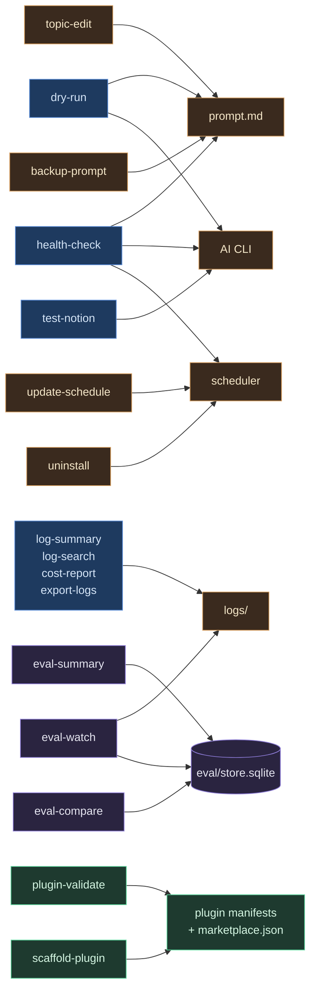
```mermaid
flowchart LR
    classDef diag fill:#1e3a5f,stroke:#5b8dd8,color:#d4e4f8
    classDef ops  fill:#3a2a1e,stroke:#d49b5b,color:#f5e6c8
    classDef eval fill:#2a2440,stroke:#8b7ad4,color:#e4e4ef
    classDef plug fill:#1e3a2f,stroke:#5bd49b,color:#d4f8e2

    PM["prompt.md"]:::ops
    CL["AI CLI"]:::ops
    SC["scheduler"]:::ops
    LG["logs/"]:::ops
    STORE[("eval/store.sqlite")]:::eval
    MFEST["plugin manifests<br/>+ marketplace.json"]:::plug

    HC["health-check"]:::diag       --> PM & CL & SC
    DR["dry-run"]:::diag            --> PM & CL
    TN["test-notion"]:::diag        --> CL
    TE["topic-edit"]:::ops          --> PM
    BP["backup-prompt"]:::ops       --> PM
    US["update-schedule"]:::ops     --> SC
    LS["log-summary<br/>log-search<br/>cost-report<br/>export-logs"]:::diag --> LG
    UN["uninstall"]:::ops           --> SC

    ES["eval-summary"]:::eval       --> STORE
    EW["eval-watch"]:::eval         --> LG
    EW                              --> STORE
    EC["eval-compare"]:::eval       --> STORE

    PV["plugin-validate"]:::plug    --> MFEST
    SP["scaffold-plugin"]:::plug    --> MFEST
```

#### Eval and plugin script details

| Script | Pairs with | Used when |
| --- | --- | --- |
| `eval-summary` | `make eval-summary` | After backfill, to glance at quality distribution + drift status + worst cards without spinning up the dashboard. |
| `eval-watch` | `make eval-watch` | While a long `eval-backfill` is in flight; streams the `eval-judge-*.log` and announces each new DB row. |
| `eval-compare` | `make eval-compare A=... B=...` | Validating a judge swap or prompt-version bump before re-baselining (Haiku vs Sonnet, v1 vs v2, real vs stub). |
| `plugin-validate` | `make plugin-validate` | CI gate, post-edit smoke check, post-`scaffold-plugin` verification. Same Python implementation in both sh and ps1. |
| `scaffold-plugin` | `make scaffold-plugin NAME=... DESC=...` | Bootstrapping a new plugin across Claude/Codex/Gemini in one command. Prints the marketplace.json snippet to paste. |

### 3.7 Manual CLI Trigger (macOS: `ai-news`)

Located at `~/.local/bin/ai-news` on macOS, this is a convenience script for on-demand execution. It calls `launchctl kickstart` to trigger the same launchd job, reusing the exact execution environment defined in the plist.

On Windows, the equivalent is `schtasks /run /tn AiNewsBriefing`, or simply `make run` on either platform.

## 4. Teams Notification Pipeline

After a successful briefing run, the system can optionally post a summary to Microsoft Teams via webhook. The Teams path is intentionally thin: it takes the generated card file, validates JSON, resolves webhook URL(s), and POSTs as-is.

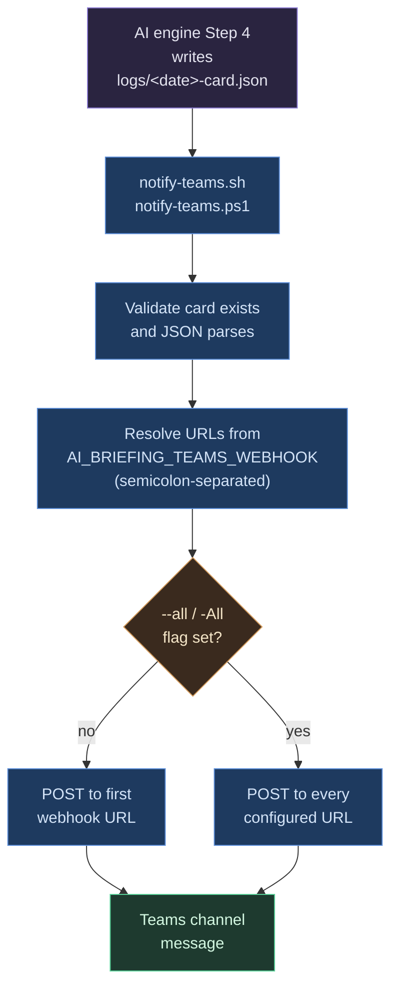
```mermaid
flowchart TD
    classDef art    fill:#2a2440,stroke:#8b7ad4,color:#e4e4ef
    classDef proc   fill:#1e3a5f,stroke:#5b8dd8,color:#d4e4f8
    classDef branch fill:#3a2a1e,stroke:#d49b5b,color:#f5e6c8
    classDef out    fill:#1e3a2f,stroke:#5bd49b,color:#d4f8e2

    A["AI engine Step 4<br/>writes<br/>logs/&lt;date&gt;-card.json"]:::art
    A --> B["notify-teams.sh<br/>notify-teams.ps1"]:::proc
    B --> C["Validate card exists<br/>and JSON parses"]:::proc
    C --> D["Resolve URLs from<br/>AI_BRIEFING_TEAMS_WEBHOOK<br/>(semicolon-separated)"]:::proc
    D --> E{"--all / -All<br/>flag set?"}:::branch
    E -- no  --> F["POST to first<br/>webhook URL"]:::proc
    E -- yes --> G["POST to every<br/>configured URL"]:::proc
    F --> H["Teams channel<br/>message"]:::out
    G --> H
```

### Runtime contract

1. Input: `logs/YYYY-MM-DD-card.json`.
2. Validation: file exists and is valid JSON.
3. Target resolution: parse `AI_BRIEFING_TEAMS_WEBHOOK` as semicolon-separated URL list.
4. Delivery:
   - default mode -> first URL only,
   - all mode (`--all` or `-All`) -> every URL in the list.
5. Exit behavior:
   - fail only if all target URLs fail,
   - warn if partial failures occur.

### Files involved

| File | Language | Purpose |
|---|---|---|
| `prompt.md` | Markdown | Defines Step 4 card generation contract. |
| `scripts/notify-teams.sh` | Bash | Validates card JSON and POSTs via `curl`. |
| `scripts/notify-teams.ps1` | PowerShell | Same behavior on Windows via `Invoke-WebRequest`. |
| `scripts/build-teams-card.py` | Python 3 | **Legacy.** Old log-parsing card builder. No longer referenced by any script. Kept in repo for historical reference. |

### Payload contract

The AI writes Adaptive Card JSON in Step 4 of `prompt.md`. This is the exact payload posted to Teams. No parser, no log extraction, no format conversion between generation and delivery.

Key constraints in the generation contract:

- valid JSON,
- payload size limit,
- Adaptive Card v1.4 envelope,
- required action button to Notion page URL.

### Teams webhook configuration

`AI_BRIEFING_TEAMS_WEBHOOK` stores one or more Teams webhook URLs.

macOS / Linux:

```bash
export AI_BRIEFING_TEAMS_WEBHOOK="https://teams-webhook-1;https://teams-webhook-2"
```

Windows:

```powershell
[Environment]::SetEnvironmentVariable("AI_BRIEFING_TEAMS_WEBHOOK", "https://teams-webhook-1;https://teams-webhook-2", "User")
```

Direct script tests:

```bash
bash scripts/notify-teams.sh --all --card-file logs/2026-03-24-card.json
```

```powershell
.\scripts\notify-teams.ps1 -All -CardFile .\logs\2026-03-24-card.json
```

## 5. Slack Notification Pipeline

Slack delivery reuses the same source card file from Step 4, then converts it to Block Kit before POST. This keeps generation centralized while still producing Slack-native rendering.

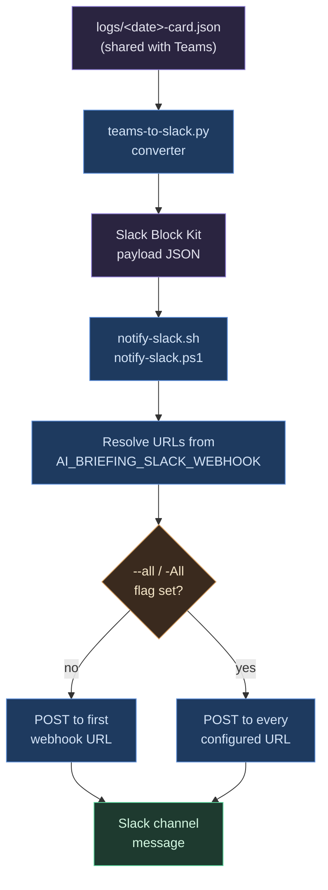
```mermaid
flowchart TD
    classDef art    fill:#2a2440,stroke:#8b7ad4,color:#e4e4ef
    classDef proc   fill:#1e3a5f,stroke:#5b8dd8,color:#d4e4f8
    classDef branch fill:#3a2a1e,stroke:#d49b5b,color:#f5e6c8
    classDef out    fill:#1e3a2f,stroke:#5bd49b,color:#d4f8e2

    A["logs/&lt;date&gt;-card.json<br/>(shared with Teams)"]:::art
    A --> B["teams-to-slack.py<br/>converter"]:::proc
    B --> C["Slack Block Kit<br/>payload JSON"]:::art
    C --> D["notify-slack.sh<br/>notify-slack.ps1"]:::proc
    D --> E["Resolve URLs from<br/>AI_BRIEFING_SLACK_WEBHOOK"]:::proc
    E --> F{"--all / -All<br/>flag set?"}:::branch
    F -- no  --> G["POST to first<br/>webhook URL"]:::proc
    F -- yes --> H["POST to every<br/>configured URL"]:::proc
    G --> I["Slack channel<br/>message"]:::out
    H --> I
```

### Runtime contract

1. Input: same `logs/YYYY-MM-DD-card.json` generated for Teams.
2. Conversion: `teams-to-slack.py` transforms Adaptive Card structure to Block Kit.
3. Validation: notify script confirms converted payload is valid JSON.
4. Target resolution: parse `AI_BRIEFING_SLACK_WEBHOOK` as semicolon-separated URL list.
5. Delivery and exit semantics match Teams notifier behavior.

### Files involved

| File | Language | Purpose |
|---|---|---|
| `scripts/teams-to-slack.py` | Python 3 | Converts Teams Adaptive Card JSON to Slack Block Kit JSON. Pure stdlib, no external deps. |
| `scripts/notify-slack.sh` | Bash | macOS/Linux entry point. Calls converter, validates result, POSTs via `curl`. |
| `scripts/notify-slack.ps1` | PowerShell | Windows entry point. Same logic using `Invoke-WebRequest`. |

### Teams-to-Slack mapping details

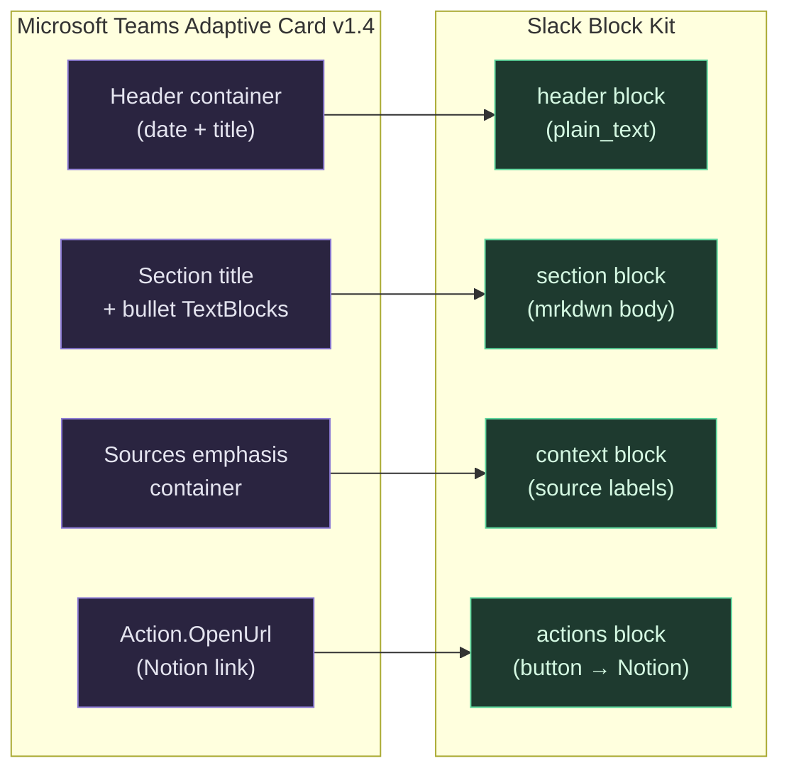
```mermaid
flowchart LR
    classDef tc fill:#2a2440,stroke:#8b7ad4,color:#e4e4ef
    classDef sl fill:#1e3a2f,stroke:#5bd49b,color:#d4f8e2

    subgraph TEAMS["Microsoft Teams Adaptive Card v1.4"]
        direction TB
        A["Header container<br/>(date + title)"]:::tc
        C["Section title<br/>+ bullet TextBlocks"]:::tc
        E["Sources emphasis<br/>container"]:::tc
        G["Action.OpenUrl<br/>(Notion link)"]:::tc
    end

    subgraph SLACK["Slack Block Kit"]
        direction TB
        B["header block<br/>(plain_text)"]:::sl
        D["section block<br/>(mrkdwn body)"]:::sl
        F["context block<br/>(source labels)"]:::sl
        H["actions block<br/>(button → Notion)"]:::sl
    end

    A --> B
    C --> D
    E --> F
    G --> H
```

The converter is in `scripts/teams-to-slack.py`. It walks the adaptive-card tree, emits one Slack block per logical Teams element, and preserves the Notion deep-link button.

Slack webhook configuration:

```bash
export AI_BRIEFING_SLACK_WEBHOOK="https://slack-webhook-1;https://slack-webhook-2"
```

```powershell
[Environment]::SetEnvironmentVariable("AI_BRIEFING_SLACK_WEBHOOK", "https://slack-webhook-1;https://slack-webhook-2", "User")
```

Direct script tests:

```bash
bash scripts/notify-slack.sh --all --card-file logs/2026-03-24-card.json
```

```powershell
.\scripts\notify-slack.ps1 -All -CardFile .\logs\2026-03-24-card.json
```

### Visual output examples

Teams:

<p align="center">
  
</p>

Slack:

<p align="center">
  
</p>

Deep-dive docs:

- [NOTIFY_TEAMS.md](NOTIFY_TEAMS.md)
- [NOTIFY_SLACK.md](NOTIFY_SLACK.md)

## 6. Custom Topic Briefing Pipeline

The custom brief is an on-demand deep research pipeline that investigates any user-defined topic using 5 parallel research agents. Unlike the daily briefing (which scans 9 fixed categories), the custom brief goes deep on a single topic from multiple angles.

### Architecture Overview

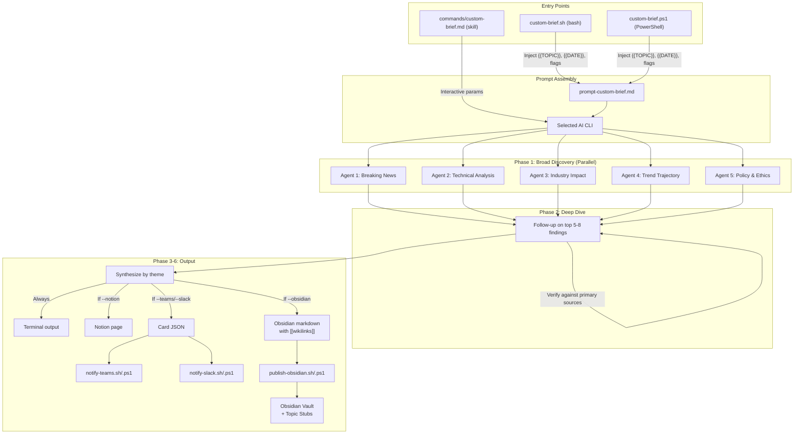
```mermaid
flowchart TD
    subgraph "Entry Points"
        SH["custom-brief.sh (bash)"]
        PS["custom-brief.ps1 (PowerShell)"]
        SK["commands/custom-brief.md (skill)"]
    end

    subgraph "Prompt Assembly"
        SH -->|"Inject {{TOPIC}}, {{DATE}}, flags"| PT[prompt-custom-brief.md]
        PS -->|"Inject {{TOPIC}}, {{DATE}}, flags"| PT
        SK -->|Interactive params| CC
        PT --> CC[Selected AI CLI]
    end

    subgraph "Phase 1: Broad Discovery (Parallel)"
        CC --> A1["Agent 1: Breaking News"]
        CC --> A2["Agent 2: Technical Analysis"]
        CC --> A3["Agent 3: Industry Impact"]
        CC --> A4["Agent 4: Trend Trajectory"]
        CC --> A5["Agent 5: Policy & Ethics"]
    end

    subgraph "Phase 2: Deep Dive"
        A1 --> DD[Follow-up on top 5-8 findings]
        A2 --> DD
        A3 --> DD
        A4 --> DD
        A5 --> DD
        DD -->|Verify against primary sources| DD
    end

    subgraph "Phase 3-6: Output"
        DD --> SYNTH[Synthesize by theme]
        SYNTH -->|Always| STDOUT[Terminal output]
        SYNTH -->|If --notion| NOTION[Notion page]
        SYNTH -->|If --teams/--slack| CARD[Card JSON]
        SYNTH -->|If --obsidian| OBS["Obsidian markdown<br/>with [[wikilinks]]"]
        CARD --> NT["notify-teams.sh/.ps1"]
        CARD --> NS["notify-slack.sh/.ps1"]
        OBS --> OP["publish-obsidian.sh/.ps1"]
        OP --> VAULT["Obsidian Vault<br/>+ Topic Stubs"]
    end
```

<p align="center">
  
</p>

### Phase timeline

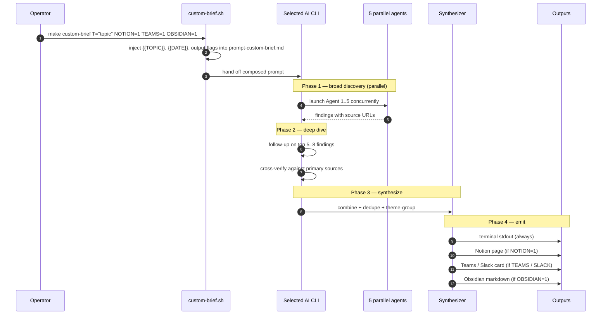
```mermaid
sequenceDiagram
    autonumber
    participant U as Operator
    participant SH as custom-brief.sh
    participant CC as Selected AI CLI
    participant A as 5 parallel agents
    participant SY as Synthesizer
    participant OUT as Outputs

    U->>SH: make custom-brief T="topic" NOTION=1 TEAMS=1 OBSIDIAN=1
    SH->>SH: inject {{TOPIC}}, {{DATE}}, output flags into prompt-custom-brief.md
    SH->>CC: hand off composed prompt

    Note over CC,A: Phase 1 — broad discovery (parallel)
    CC->>A: launch Agent 1..5 concurrently
    A-->>CC: findings with source URLs

    Note over CC: Phase 2 — deep dive
    CC->>CC: follow-up on top 5–8 findings
    CC->>CC: cross-verify against primary sources

    Note over CC,SY: Phase 3 — synthesize
    CC->>SY: combine + dedupe + theme-group

    Note over SY,OUT: Phase 4 — emit
    SY->>OUT: terminal stdout (always)
    SY->>OUT: Notion page (if NOTION=1)
    SY->>OUT: Teams / Slack card (if TEAMS / SLACK)
    SY->>OUT: Obsidian markdown (if OBSIDIAN=1)
```

### Research Agent Design

Each of the 5 agents receives a targeted search brief and returns findings with source URLs and publication dates. They run in parallel (launched as concurrent Agent tool calls) and cover orthogonal perspectives:

| Agent | Angle | Focus Areas |
|-------|-------|-------------|
| 1 | Breaking News | Product launches, announcements, releases |
| 2 | Technical Analysis | Benchmarks, evaluations, expert commentary |
| 3 | Industry Impact | Market moves, competitive dynamics, funding |
| 4 | Trend Trajectory | Milestones, evolution, future direction |
| 5 | Policy & Ethics | Regulation, legislation, safety concerns |

### Files Involved

| File | Purpose |
|------|---------|
| `custom-brief.sh` | Bash CLI with `--topic`, `--notion`, `--teams`, `--slack`, `--obsidian` params + REPL mode |
| `custom-brief.ps1` | PowerShell CLI with equivalent `-Topic`, `-Notion`, `-Teams`, `-Slack`, `-Obsidian` params |
| `prompt-custom-brief.md` | Prompt template with `{{TOPIC}}`, `{{DATE}}`, `{{PUBLISH_*}}` placeholders |
| `commands/custom-brief.md` | Claude Code skill for interactive sessions |
| `logs/custom-TIMESTAMP.log` | Execution log |
| `logs/custom-TIMESTAMP-card.json` | Adaptive Card JSON (if Teams/Slack requested) |
| `logs/custom-TIMESTAMP-obsidian.md` | Obsidian markdown with wikilinks (if Obsidian requested) |

### Prompt Template Variable Injection

The CLI scripts perform string replacement on `prompt-custom-brief.md` before passing it to the selected AI CLI engine:

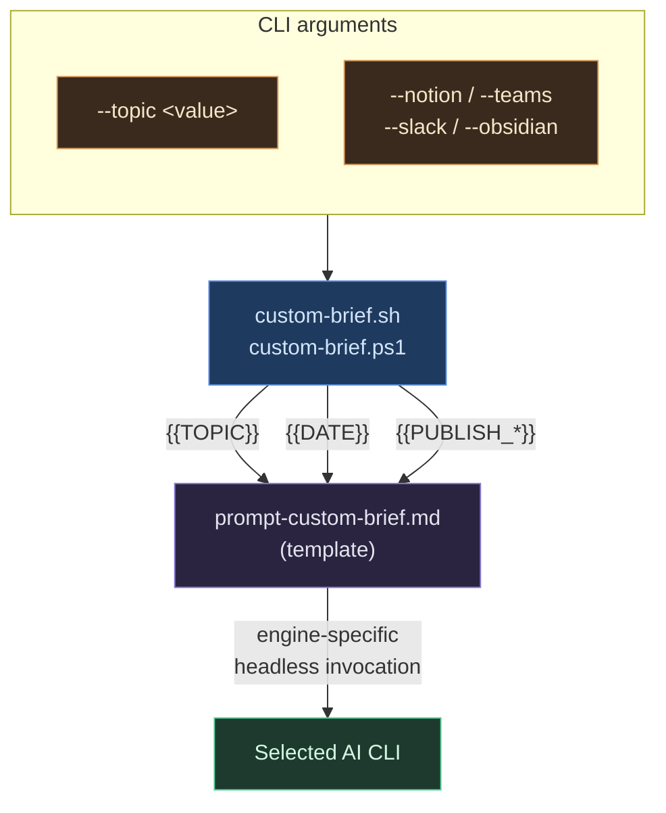
```mermaid
flowchart TD
    classDef arg  fill:#3a2a1e,stroke:#d49b5b,color:#f5e6c8
    classDef proc fill:#1e3a5f,stroke:#5b8dd8,color:#d4e4f8
    classDef tmpl fill:#2a2440,stroke:#8b7ad4,color:#e4e4ef
    classDef out  fill:#1e3a2f,stroke:#5bd49b,color:#d4f8e2

    subgraph ARGS["CLI arguments"]
        direction TB
        T["--topic &lt;value&gt;"]:::arg
        F["--notion / --teams<br/>--slack / --obsidian"]:::arg
    end

    ARGS --> S["custom-brief.sh<br/>custom-brief.ps1"]:::proc
    S -- "{{TOPIC}}" --> P["prompt-custom-brief.md<br/>(template)"]:::tmpl
    S -- "{{DATE}}" --> P
    S -- "{{PUBLISH_*}}" --> P
    P -- "engine-specific<br/>headless invocation" --> C["Selected AI CLI"]:::out
```

### Custom Brief Engine Selection

Custom brief supports all four engines (`claude`, `codex`, `gemini`, `copilot`) on both Bash and PowerShell entry scripts:

1. `--cli` / `-Cli` explicitly selects an engine.
2. If omitted, `AI_BRIEFING_CLI` is used when set.
3. If still unset, default is `claude`.
4. Interactive REPL mode lets users pick from the listed engines and shows availability.

Unlike daily briefing, custom brief does **not** run an automatic fallback chain after a failed engine run.

### Relationship to Daily Briefing

The custom brief reuses the same infrastructure:

| Component | Daily Briefing | Custom Brief |
|-----------|---------------|--------------|
| Notion database | Same (data_source_id) | Same |
| Teams notification | `notify-teams.sh/.ps1` | Same scripts |
| Slack notification | `notify-slack.sh/.ps1` + `teams-to-slack.py` | Same scripts |
| Obsidian publishing | `publish-obsidian.sh/.ps1` | Same scripts |
| Card template | Adaptive Card v1.4 | Same structure, different header |
| Page title | `YYYY-MM-DD - AI Daily Briefing` | `YYYY-MM-DD - Custom Brief: [Topic]` |
| Obsidian file | `logs/YYYY-MM-DD-obsidian.md` | `logs/custom-TIMESTAMP-obsidian.md` |
| Log naming | `logs/YYYY-MM-DD.log` | `logs/custom-YYYY-MM-DD-HHMMSS.log` |
| Deduplication | Yes (covered-stories.txt) | No (standalone) |

## 7. Obsidian Publishing Pipeline

Obsidian is a local-first knowledge base that stores notes as plain markdown files in a "vault" directory. Unlike Notion (which requires an API), Obsidian integration works by writing `.md` files directly to the file system. Obsidian's graph view automatically visualizes connections between notes via `[[wikilinks]]`.

### Architecture Overview

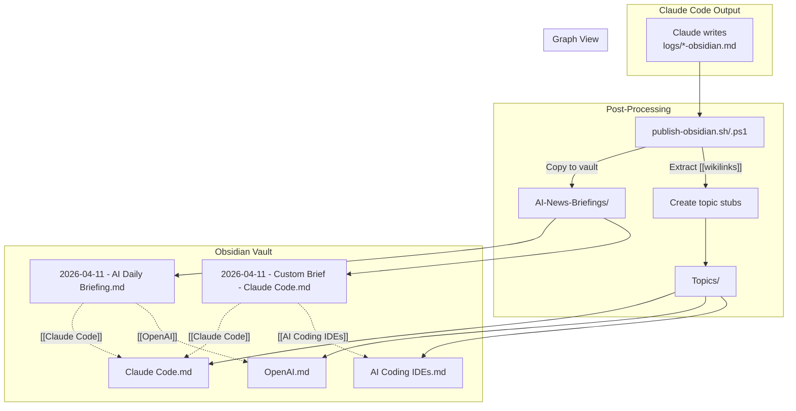
```mermaid
flowchart TD
    subgraph "Claude Code Output"
        CB["Claude writes<br/>logs/*-obsidian.md"]
    end

    subgraph "Post-Processing"
        CB --> PB["publish-obsidian.sh/.ps1"]
        PB -->|"Copy to vault"| VB["AI-News-Briefings/"]
        PB -->|"Extract [[wikilinks]]"| TS["Create topic stubs"]
        TS --> VT["Topics/"]
    end

    subgraph "Obsidian Vault"
        VB --> B1["2026-04-11 - AI Daily Briefing.md"]
        VB --> B2["2026-04-11 - Custom Brief - Claude Code.md"]
        VT --> T1["Claude Code.md"]
        VT --> T2["OpenAI.md"]
        VT --> T3["AI Coding IDEs.md"]
    end

    subgraph "Graph View"
        B1 -.->|"[[Claude Code]]"| T1
        B1 -.->|"[[OpenAI]]"| T2
        B2 -.->|"[[Claude Code]]"| T1
        B2 -.->|"[[AI Coding IDEs]]"| T3
    end
```

### Wikilink Strategy

The Obsidian markdown uses `[[wikilinks]]` extensively to create graph connections:

| Element | Wikilink Placement | Graph Effect |
|---------|-------------------|--------------|
| Section headings | `## [[Claude Code]] / [[Anthropic]]` | Briefing → topic edges |
| Related topics line | `Related topics: [[AI Coding]], [[LLMs]], ...` | Cross-topic edges |
| Inline mentions | `...announced by [[OpenAI]] today...` | Entity edges |
| Topic stub pages | `Topics/Claude Code.md` with backlinks | Hub nodes in graph |

### Topic Stub Pages

The publish script extracts all `[[wikilinks]]` from the briefing markdown and creates stub pages in `Topics/` for any that don't already exist. Each stub has YAML frontmatter:

```yaml
---
type: topic
created: 2026-04-11
---

# Claude Code

> Auto-generated topic page. Briefings mentioning this topic will appear as backlinks.
```

This creates a growing knowledge graph where topics accumulate backlinks from each briefing that mentions them.

### Files Involved

| File | Purpose |
|------|---------|
| `scripts/publish-obsidian.sh` | Bash: copies markdown to vault, creates topic stubs |
| `scripts/publish-obsidian.ps1` | PowerShell: equivalent Windows implementation |
| `scripts/test-obsidian.sh` | Bash: vault connectivity test (directory, permissions, config) |
| `scripts/test-obsidian.ps1` | PowerShell: equivalent Windows implementation |

### Environment Variables

| Variable | Required | Description |
|----------|----------|-------------|
| `AI_BRIEFING_OBSIDIAN_VAULT` | Yes | Absolute path to the Obsidian vault root directory |

### Error Handling

| Condition | Behavior |
|-----------|----------|
| Vault env var not set | Skip publishing silently (opt-in feature) |
| Vault directory missing | Error message, skip publishing, log warning |
| Vault not writable | Error message, skip publishing, log warning |
| Obsidian markdown not generated | Warning message, skip publishing |
| Topic stub already exists | Skip creation, count as existing |
| Publish script missing | Warning message, skip publishing |

## 8. Test Suite

201 non-blocking tests across bash and PowerShell verify the entire system without calling external services. Tests cover syntax, structure, argument handling, template substitution, card JSON validation, notification error paths, Obsidian publishing, and cross-platform portability.

### Test Architecture

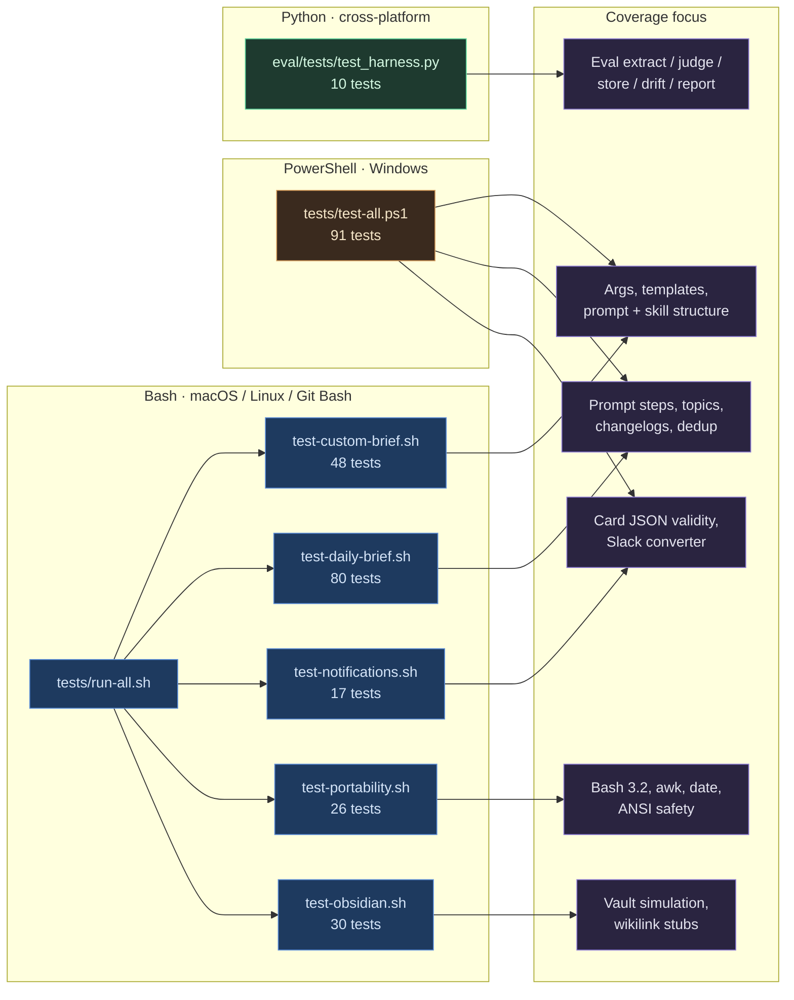
```mermaid
flowchart LR
    classDef sh fill:#1e3a5f,stroke:#5b8dd8,color:#d4e4f8
    classDef ps fill:#3a2a1e,stroke:#d49b5b,color:#f5e6c8
    classDef py fill:#1e3a2f,stroke:#5bd49b,color:#d4f8e2
    classDef cov fill:#2a2440,stroke:#8b7ad4,color:#e4e4ef

    subgraph BASH["Bash · macOS / Linux / Git Bash"]
        direction TB
        R["tests/run-all.sh"]:::sh
        R --> T1["test-custom-brief.sh<br/>48 tests"]:::sh
        R --> T2["test-daily-brief.sh<br/>80 tests"]:::sh
        R --> T3["test-notifications.sh<br/>17 tests"]:::sh
        R --> T4["test-portability.sh<br/>26 tests"]:::sh
        R --> T5["test-obsidian.sh<br/>30 tests"]:::sh
    end

    subgraph PWSH["PowerShell · Windows"]
        PS["tests/test-all.ps1<br/>91 tests"]:::ps
    end

    subgraph PYTEST["Python · cross-platform"]
        PY["eval/tests/test_harness.py<br/>10 tests"]:::py
    end

    subgraph COV["Coverage focus"]
        direction TB
        X1["Args, templates,<br/>prompt + skill structure"]:::cov
        X2["Prompt steps, topics,<br/>changelogs, dedup"]:::cov
        X3["Card JSON validity,<br/>Slack converter"]:::cov
        X4["Bash 3.2, awk, date,<br/>ANSI safety"]:::cov
        X5["Vault simulation,<br/>wikilink stubs"]:::cov
        X6["Eval extract / judge /<br/>store / drift / report"]:::cov
    end

    T1 --> X1
    T2 --> X2
    T3 --> X3
    T4 --> X4
    T5 --> X5
    PS --> X1
    PS --> X2
    PS --> X3
    PY --> X6
```

<p align="center">
  
</p>

### Design Decisions

- **Non-blocking.** No test calls Claude, Notion, Teams, Slack, or any external service. Tests validate contracts, not runtime behavior.
- **No test framework.** Pure bash/PowerShell with simple `pass()`/`fail()` helpers. Zero dependencies.
- **Cross-platform parity.** Bash tests cover macOS/Linux/Git Bash; PowerShell covers Windows. Both verify the same codebase from different angles.
- **Portability verification.** Dedicated suite checks bash 3.2 compatibility (macOS), BSD awk, and ANSI color auto-disable.

### Files

| File | Tests | Focus |
|---|---|---|
| `tests/run-all.sh` | -- | Runner: executes all `test-*.sh` suites |
| `tests/test-custom-brief.sh` | 48 | Custom brief: args, template, prompt, skill, Obsidian |
| `tests/test-daily-brief.sh` | 80 | Daily brief: prompt, topics, changelogs, scripts, Obsidian |
| `tests/test-notifications.sh` | 17 | Notifications: card JSON, converter, error paths |
| `tests/test-obsidian.sh` | 30 | Obsidian: publish script, wikilinks, vault simulation |
| `tests/test-portability.sh` | 26 | Cross-platform: bash version, awk, date, colors |
| `tests/test-all.ps1` | 91 | PowerShell: syntax, prompts, cards, converter, docs |

Full documentation: [TESTS.md](TESTS.md)

## 9. Quality Eval Harness

A self-contained LLM-as-judge pipeline that scores every published briefing on a fixed 5-axis rubric, persists scores to SQLite, and flags quality drift before readers notice. The harness reuses the same AI CLIs the rest of the project shells out to (`claude` / `codex` / `gemini`) so it inherits the project's existing auth and engine selection.

### Architecture

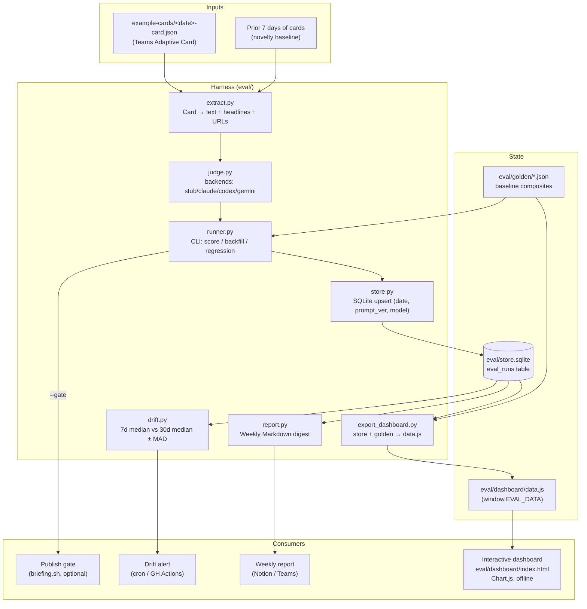
```mermaid
flowchart TD
    subgraph "Inputs"
        CARD["example-cards/&lt;date&gt;-card.json<br/>(Teams Adaptive Card)"]
        PRIOR["Prior 7 days of cards<br/>(novelty baseline)"]
    end

    subgraph "Harness (eval/)"
        EX["extract.py<br/>Card → text + headlines + URLs"]
        JU["judge.py<br/>backends: stub/claude/codex/gemini"]
        ST["store.py<br/>SQLite upsert (date, prompt_ver, model)"]
        DR["drift.py<br/>7d median vs 30d median ± MAD"]
        RP["report.py<br/>Weekly Markdown digest"]
        RUN["runner.py<br/>CLI: score / backfill / regression"]
        ED["export_dashboard.py<br/>store + golden → data.js"]
    end

    subgraph "State"
        DB[("eval/store.sqlite<br/>eval_runs table")]
        GOLD["eval/golden/*.json<br/>baseline composites"]
        DJS["eval/dashboard/data.js<br/>(window.EVAL_DATA)"]
    end

    subgraph "Consumers"
        GATE["Publish gate<br/>(briefing.sh, optional)"]
        ALERT["Drift alert<br/>(cron / GH Actions)"]
        REP["Weekly report<br/>(Notion / Teams)"]
        UI["Interactive dashboard<br/>eval/dashboard/index.html<br/>Chart.js, offline"]
    end

    CARD --> EX
    PRIOR --> EX
    EX --> JU --> RUN --> ST --> DB

    GOLD --> RUN
    DB --> DR --> ALERT
    DB --> RP --> REP
    DB --> ED --> DJS --> UI
    GOLD --> ED
    RUN -- "--gate" --> GATE
```

### Scoring rubric

Five integer axes (1–5), composite weighted mean:

| Axis             | Weight |
| ---------------- | -----: |
| factuality       |   0.30 |
| novelty          |   0.20 |
| source_diversity |   0.15 |
| signal_density   |   0.20 |
| coherence        |   0.15 |

Full definitions and pass thresholds: [`eval/rubric.md`](eval/rubric.md).

### Storage schema

```sql
CREATE TABLE eval_runs (
    card_date        TEXT,
    prompt_version   TEXT,
    judge_model      TEXT,
    ran_at           TEXT,
    factuality       INTEGER CHECK (BETWEEN 1 AND 5),
    novelty          INTEGER CHECK (BETWEEN 1 AND 5),
    source_diversity INTEGER CHECK (BETWEEN 1 AND 5),
    signal_density   INTEGER CHECK (BETWEEN 1 AND 5),
    coherence        INTEGER CHECK (BETWEEN 1 AND 5),
    composite        REAL,
    notes            TEXT,
    judge_raw        TEXT,
    PRIMARY KEY (card_date, prompt_version, judge_model)
);
```

The primary key intentionally includes both `prompt_version` and `judge_model`, so re-baselining (bumping the prompt or switching to a more capable judge) appends a new row rather than silently overwriting historic scores.

### Design decisions

- **Stub backend.** A deterministic heuristic judge ships in `judge.py` so unit tests, CI, and offline development never hit a paid API. The same harness paths execute against the real judge.
- **Median + MAD for drift, not mean + stddev.** With only ~30 daily samples and occasional sharp drops, MAD-based z-scores are far more robust to outliers and small-sample bias than parametric scaling.
- **Idempotent runs.** Re-judging the same `(date, prompt_version, judge_model)` triple overwrites the row and updates `ran_at`, so reruns after a transient failure produce a clean store.
- **Versioned prompt.** `PROMPT_VERSION` in `judge.py` is part of the key and is recorded with every score. Bump it whenever `eval/judge_prompt.md` changes substantively.
- **Optional publish gate.** Calling `runner.py score --gate` exits non-zero when composite falls below threshold, so it can be wired into `briefing.sh` as a pre-publish check without changing default behavior.

### Files

| File              | Role                                                       |
| ----------------- | ---------------------------------------------------------- |
| `rubric.md`       | Human-readable axis definitions, weights, thresholds.      |
| `judge_prompt.md` | Exact prompt sent to the judge. Versioned.                 |
| `extract.py`      | Adaptive-card JSON → flat text, headlines, source URLs.    |
| `judge.py`        | Backends (stub / claude / codex / gemini) + JSON parser.   |
| `store.py`        | SQLite upsert/fetch + composite formula.                   |
| `runner.py`       | CLI entry point: `score`, `backfill`, `regression`, `show`.|
| `drift.py`        | Trailing-window drift detector.                            |
| `report.py`       | Weekly Markdown report.                                    |
| `schema.sql`      | DB schema.                                                 |
| `seed_golden.py`  | Re-baseliner: lift store rows into `golden/`.              |
| `export_dashboard.py` | Export store + golden into `dashboard/data.js`.        |
| `golden/`         | Pinned baseline composites per card.                       |
| `dashboard/`      | Offline interactive UI (Chart.js trend + radar + table).   |
| `tests/`          | `python -m unittest discover -s eval/tests`.               |

### Interactive dashboard

<p align="center">
    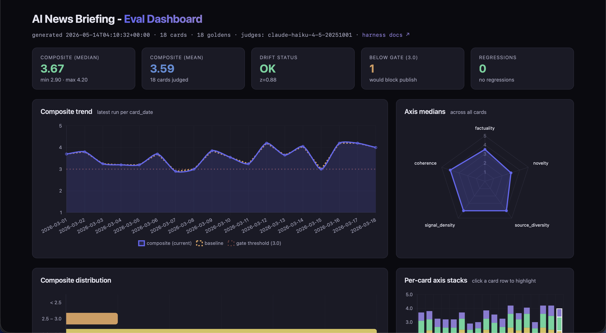
</p>

The `eval/dashboard/index.html` file is a single-file, offline-renderable UI over `eval/store.sqlite` + `eval/golden/`. The page reads a pre-generated `data.js` (since browsers cannot open SQLite directly and we intentionally avoid a server dep). `make eval-dashboard` invokes `export_dashboard.py`, which writes the JSON payload as `window.EVAL_DATA` into `data.js`; Chart.js (loaded from CDN) consumes it.

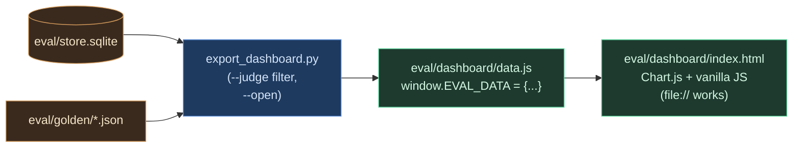
```mermaid
flowchart LR
    classDef src  fill:#3a2a1e,stroke:#d49b5b,color:#f5e6c8
    classDef code fill:#1e3a5f,stroke:#5b8dd8,color:#d4e4f8
    classDef out  fill:#1e3a2f,stroke:#5bd49b,color:#d4f8e2

    DB[("eval/store.sqlite")]:::src
    GD["eval/golden/*.json"]:::src
    EX["export_dashboard.py<br/>(--judge filter,<br/>--open)"]:::code
    JS["eval/dashboard/data.js<br/>window.EVAL_DATA = {...}"]:::out
    HTML["eval/dashboard/index.html<br/>Chart.js + vanilla JS<br/>(file:// works)"]:::out

    DB --> EX
    GD --> EX
    EX --> JS --> HTML
```

The dashboard surfaces: stat tiles (composite median/mean, drift status, gate fails, regressions), composite trend (with baseline + gate-threshold overlays), 5-axis radar of medians, composite histogram, per-card weighted-axis stacked bars, and a sortable/filterable/searchable card table with click-to-expand detail. Workflow: run `make eval-backfill JUDGE=claude` → `make eval-dashboard OPEN=1`.

Full documentation: [`eval/README.md`](eval/README.md).

---

## 10. Research Ops Plugin Ecosystem

Beyond the automated pipeline, this project has evolved into a **Unified Research Ops Ecosystem** containing 10 deeply integrated intelligence plugins available natively for **Claude Code**, **OpenAI Codex**, and **Gemini CLI**.

The architecture abstracts core logic into platform-agnostic Agent Skills and leverages localized marketplace discovery mechanisms.

### Platform abstraction

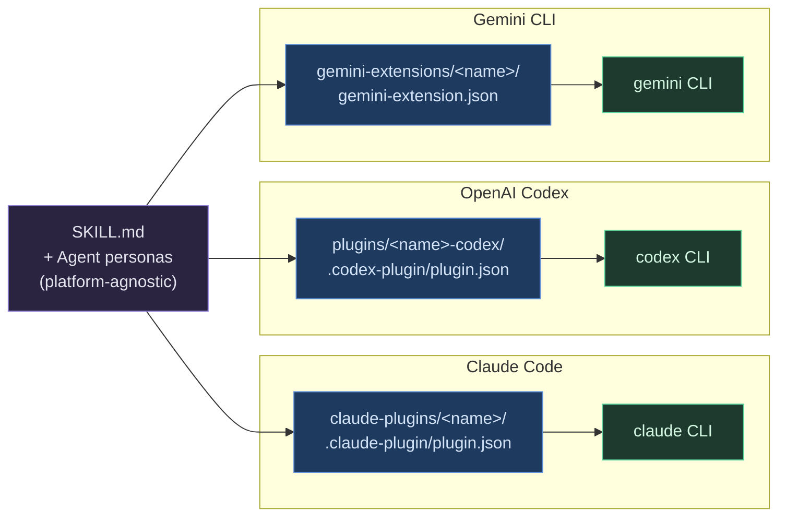
```mermaid
flowchart LR
    classDef logic   fill:#2a2440,stroke:#8b7ad4,color:#e4e4ef
    classDef manifest fill:#1e3a5f,stroke:#5b8dd8,color:#d4e4f8
    classDef cli     fill:#1e3a2f,stroke:#5bd49b,color:#d4f8e2

    Instr["SKILL.md<br/>+ Agent personas<br/>(platform-agnostic)"]:::logic

    subgraph CC["Claude Code"]
        CP["claude-plugins/&lt;name&gt;/<br/>.claude-plugin/plugin.json"]:::manifest
        CCLI["claude CLI"]:::cli
    end
    subgraph CX["OpenAI Codex"]
        CXP["plugins/&lt;name&gt;-codex/<br/>.codex-plugin/plugin.json"]:::manifest
        XCLI["codex CLI"]:::cli
    end
    subgraph GM["Gemini CLI"]
        GP["gemini-extensions/&lt;name&gt;/<br/>gemini-extension.json"]:::manifest
        GCLI["gemini CLI"]:::cli
    end

    Instr --> CP --> CCLI
    Instr --> CXP --> XCLI
    Instr --> GP --> GCLI
```

### Plugin catalog

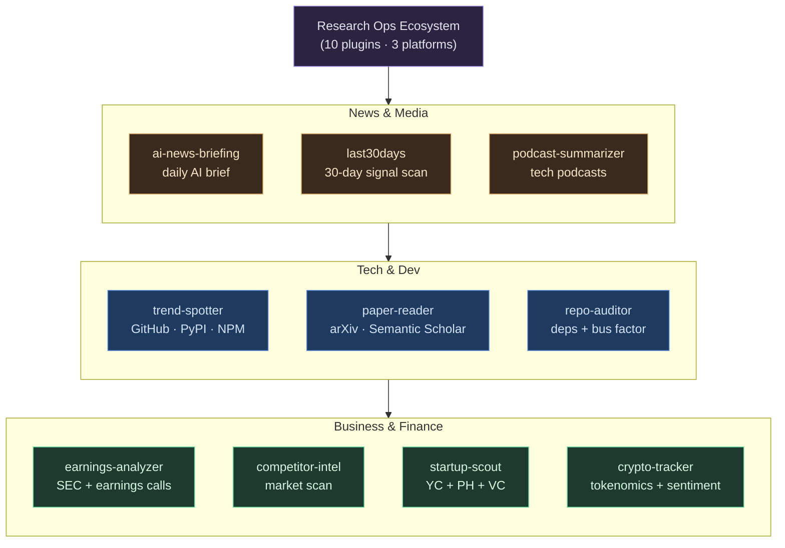
```mermaid
flowchart TD
    classDef media fill:#3a2a1e,stroke:#d49b5b,color:#f5e6c8
    classDef tech  fill:#1e3a5f,stroke:#5b8dd8,color:#d4e4f8
    classDef biz   fill:#1e3a2f,stroke:#5bd49b,color:#d4f8e2
    classDef ops   fill:#2a2440,stroke:#8b7ad4,color:#e4e4ef

    ROOT["Research Ops Ecosystem<br/>(10 plugins · 3 platforms)"]:::ops

    subgraph MEDIA["News & Media"]
        direction TB
        P1["ai-news-briefing<br/>daily AI brief"]:::media
        P2["last30days<br/>30-day signal scan"]:::media
        P3["podcast-summarizer<br/>tech podcasts"]:::media
    end
    subgraph TECH["Tech & Dev"]
        direction TB
        P4["trend-spotter<br/>GitHub · PyPI · NPM"]:::tech
        P5["paper-reader<br/>arXiv · Semantic Scholar"]:::tech
        P6["repo-auditor<br/>deps + bus factor"]:::tech
    end
    subgraph BIZ["Business & Finance"]
        direction TB
        P7["earnings-analyzer<br/>SEC + earnings calls"]:::biz
        P8["competitor-intel<br/>market scan"]:::biz
        P9["startup-scout<br/>YC + PH + VC"]:::biz
        P10["crypto-tracker<br/>tokenomics + sentiment"]:::biz
    end

    ROOT --> MEDIA
    MEDIA --> TECH
    TECH --> BIZ
```

For complete technical specifications, see [PLUGINS.md](PLUGINS.md).

---

## 11. Data Flow

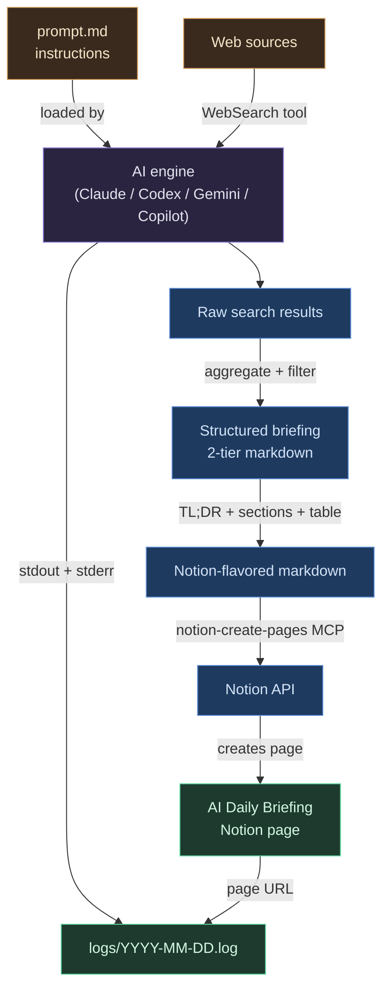
```mermaid
flowchart TD
    classDef src   fill:#3a2a1e,stroke:#d49b5b,color:#f5e6c8
    classDef agent fill:#2a2440,stroke:#8b7ad4,color:#e4e4ef
    classDef proc  fill:#1e3a5f,stroke:#5b8dd8,color:#d4e4f8
    classDef out   fill:#1e3a2f,stroke:#5bd49b,color:#d4f8e2

    H["prompt.md<br/>instructions"]:::src
    A["Web sources"]:::src

    H -- loaded by --> B["AI engine<br/>(Claude / Codex / Gemini / Copilot)"]:::agent
    A -- WebSearch tool --> B

    B --> C["Raw search results"]:::proc
    C -- aggregate + filter --> D["Structured briefing<br/>2-tier markdown"]:::proc
    D -- TL;DR + sections + table --> E["Notion-flavored markdown"]:::proc
    E -- notion-create-pages MCP --> F["Notion API"]:::proc
    F -- creates page --> G["AI Daily Briefing<br/>Notion page"]:::out

    B -- stdout + stderr --> I["logs/YYYY-MM-DD.log"]:::out
    G -- page URL --> I
```

**Data transformation stages:**

| Stage | Input | Output | Actor |
|---|---|---|---|
| Search | Topic definitions from prompt.md | Raw web search results | Claude Code via WebSearch |
| Filter | Raw results from multiple queries | Relevant news from past 24-48 hours | Claude Code (LLM reasoning) |
| Compile | Filtered news items | Two-tier Markdown briefing | Claude Code (LLM generation) |
| Format | Raw Markdown | Notion-flavored Markdown with tables | Claude Code (following prompt rules) |
| Publish | Formatted content + metadata | Notion database page | Claude Code via Notion MCP tool |
| Log | Page URL + status | Date-stamped log entry | Entry point script |

---

## 12. Search Strategy

The prompt defines 9 parallel topic searches. Each topic maps to a domain of AI news, and Claude executes multiple search queries per topic to ensure comprehensive coverage.

### Topic Search Architecture

```mermaid
flowchart TD
    classDef root  fill:#2a2440,stroke:#8b7ad4,color:#e4e4ef
    classDef topic fill:#1e3a5f,stroke:#5b8dd8,color:#d4e4f8

    S["AI engine<br/>Search phase"]:::root

    subgraph PROD["Vendors and platforms"]
        direction TB
        T1["1. Claude Code / Anthropic<br/><i>Claude Code news today &lt;date&gt;</i><br/><i>Anthropic announcement this week</i>"]:::topic
        T2["2. OpenAI / Codex / ChatGPT<br/><i>OpenAI Codex latest update</i><br/><i>ChatGPT new features &lt;month&gt;</i>"]:::topic
        T3["3. AI Coding IDEs<br/><i>Cursor Windsurf Copilot news today</i><br/><i>AI coding IDE update this week</i>"]:::topic
    end

    subgraph ECO["Agents, models, and open source"]
        direction TB
        T4["4. Agentic AI Ecosystem<br/><i>AI agent frameworks MCP news</i><br/><i>LangChain CrewAI AutoGen update</i>"]:::topic
        T5["5. AI Industry<br/><i>AI model release benchmark today</i><br/><i>Major AI company announcement</i>"]:::topic
        T6["6. Open Source AI<br/><i>Llama Mistral DeepSeek release</i><br/><i>Open source AI model news</i>"]:::topic
    end

    subgraph BIZ["Business, policy, and tooling"]
        direction TB
        T7["7. AI Startups and Funding<br/><i>AI startup funding round today</i><br/><i>AI acquisition announcement</i>"]:::topic
        T8["8. AI Policy and Regulation<br/><i>AI regulation policy news</i><br/><i>EU AI Act update &lt;month&gt;</i>"]:::topic
        T9["9. Dev Tools and Frameworks<br/><i>Vercel Next.js AI tools update</i><br/><i>Developer tooling AI news today</i>"]:::topic
    end

    S --> PROD
    S --> ECO
    S --> BIZ
```

### Topic Coverage Map

| # | Topic | Key Entities Monitored | Typical Queries per Run |
|---|---|---|---|
| 1 | Claude Code / Anthropic | Anthropic, Claude, Claude Code | 2-3 |
| 2 | OpenAI / Codex / ChatGPT | OpenAI, GPT models, Codex, ChatGPT | 2-3 |
| 3 | AI Coding IDEs | Cursor, Windsurf, Copilot, Xcode AI, JetBrains AI, Antigravity | 2-3 |
| 4 | Agentic AI Ecosystem | LangChain, CrewAI, AutoGen, MCP | 2-3 |
| 5 | AI Industry | Major labs, benchmarks, model releases | 2-3 |
| 6 | Open Source AI | Llama, Mistral, DeepSeek, Hugging Face | 2-3 |
| 7 | AI Startups & Funding | Funding rounds, acquisitions, launches | 2-3 |
| 8 | AI Policy & Regulation | EU AI Act, US policy, AI safety | 2-3 |
| 9 | Dev Tools & Frameworks | Vercel, Next.js, React Native, TypeScript | 2-3 |

Claude has discretion over the exact number and phrasing of queries. The prompt provides templates (e.g., `"[topic] news today [current date]"`) but does not rigidly prescribe every query. This allows the model to adapt its search strategy based on what it finds.

---

## 13. Output Format

The briefing follows a two-tier structure designed for different reading depths: a quick scan (Tier 1) and a deep read (Tier 2).

### Briefing Structure

```mermaid
flowchart TD
    classDef page  fill:#2a2440,stroke:#8b7ad4,color:#e4e4ef
    classDef meta  fill:#3a2a1e,stroke:#d49b5b,color:#f5e6c8
    classDef tier  fill:#1e3a5f,stroke:#5b8dd8,color:#d4e4f8
    classDef leaf  fill:#1e3a2f,stroke:#5bd49b,color:#d4f8e2

    A["Notion page"]:::page
    A --> B["Title:<br/>YYYY-MM-DD — AI Daily Briefing"]:::meta
    A --> C["Properties:<br/>Date · Status · Topics"]:::meta
    A --> D["Content body"]:::page

    D --> E["Tier 1: TL;DR"]:::tier
    D --> F["Divider ---"]:::leaf
    D --> G["Tier 2: Full briefing"]:::tier

    E --> E1["10-15 bullet points<br/>one sentence each<br/>~1 minute read"]:::leaf

    subgraph SECTIONS["9 topic sections (3-8 bullets each, source-attributed)"]
        direction TB
        G1["1. Claude Code / Anthropic"]:::leaf
        G2["2. OpenAI / Codex / ChatGPT"]:::leaf
        G3["3. AI Coding IDEs"]:::leaf
        G4["4. Agentic AI Ecosystem"]:::leaf
        G5["5. AI Industry"]:::leaf
        G6["6. Open Source AI"]:::leaf
        G7["7. AI Startups + Funding"]:::leaf
        G8["8. AI Policy + Regulation"]:::leaf
        G9["9. Dev Tools + Frameworks"]:::leaf
    end

    G --> SECTIONS
    G --> G10["Key takeaways table<br/>Theme · Signal columns"]:::leaf
```

### Notion Formatting Conventions

| Markdown Element | Notion Rendering | Usage |
|---|---|---|
| `##` | Section heading | One per topic in Tier 2 |
| `-` | Bullet point | All news items |
| `**bold**` | Bold text | Company names, emphasis |
| `---` | Horizontal divider | Separates TL;DR from Full Briefing |
| `>` | Block quote | Notable quotes from sources |
| `<table>` | Notion native table | Key Takeaways summary |

### Notion Page Properties

Each page is created with three properties:

- **Date**: The title field, formatted as `"YYYY-MM-DD - AI Daily Briefing"`
- **Status**: Always set to `"Complete"`
- **Topics**: Always set to `9` (the number of topic sections)

The parent database is identified by a hardcoded `data_source_id` in the prompt.

---

## 14. Scheduling Architecture

### Cross-Platform Scheduling Comparison

```mermaid
flowchart TD
    subgraph "macOS: launchd"
        direction TB
        ML[launchd daemon] -->|StartCalendarInterval| MT{08:00?}
        MT -->|Yes| MR[Run briefing.sh]
        MT -->|Sleeping| MW[Queue for wake]
        MT -->|Powered off| MS[Skipped]
        MW -->|Mac wakes| MR
    end

    subgraph "Windows: Task Scheduler"
        direction TB
        WS[Task Scheduler Service] -->|Daily trigger| WT{08:00?}
        WT -->|Yes| WR[Run briefing.ps1]
        WT -->|Sleeping/Off| WW[StartWhenAvailable]
        WW -->|Machine available| WR
    end
```

### Machine State Behavior

| Machine State at 08:00 | macOS (launchd) | Windows (Task Scheduler) |
|---|---|---|
| Awake | Job fires immediately | Task fires immediately |
| Sleeping | Fires on next wake | Fires on next wake (`StartWhenAvailable`) |
| Powered off | Skipped entirely | Fires on next login (`StartWhenAvailable`) |
| Job already running | Trigger ignored (single instance) | Governed by `ExecutionTimeLimit` |

**Key difference:** Windows `StartWhenAvailable` recovers from both sleep and cold boot. macOS launchd only recovers from sleep -- a cold boot after a missed interval does not retroactively fire the job.

### Schedule Customization

**macOS:** Edit `StartCalendarInterval` in the plist. For weekday-only, use an array of dicts with `Weekday` keys.

**Windows:** Re-run `install-task.ps1 -Hour <H> -Minute <M>`. The script is idempotent and replaces any existing task.

---

## 15. Error Handling

The system has multiple layers of error handling, from the script level down to the AI execution level. Both platform scripts implement the same error handling strategy.

### Error Path Diagram

```mermaid
graph TD
    A[Entry script starts] --> B{Log directory exists?}
    B -->|No| C[Create it]
    B -->|Yes| D[Continue]
    C --> D

    D --> E{CLAUDECODE env set?}
    E -->|Yes| F[Clear it]
    E -->|No| G[Continue]
    F --> G

    G --> H[Invoke Claude Code]
    H --> I{Budget exceeded?}
    I -->|Yes| J[Claude exits with error]
    H --> K{WebSearch failures?}
    K -->|Partial| L[Claude notes 'No major updates' for topic]
    K -->|Total| M[Claude produces empty briefing]
    H --> N{Notion API error?}
    N -->|Yes| O[Claude reports error in output]
    H --> P{Success}

    J --> Q[Log: FAILED with exit code]
    M --> Q
    O --> Q
    L --> P
    P --> R[Log: Briefing complete]

    Q --> S[Log rotation cleanup]
    R --> S
    S --> T[End]
```

### Error Categories

| Error Type | Detection | Recovery | Impact |
|---|---|---|---|
| Nested Claude session | `CLAUDECODE` env var set | Cleared by entry script | Prevented entirely |
| Budget exceeded ($2.00) | Claude exits with non-zero code | Logged as failure | No briefing for that run |
| WebSearch failure (single topic) | Claude observes empty/error results | Notes "No major updates today" | Partial briefing |
| WebSearch failure (all topics) | Claude cannot gather any news | Empty briefing or failure | Failed run logged |
| Notion API error | MCP tool returns error | Claude reports in stdout | No page created |
| Claude binary not found | Script exits on error | Logged as failure | No briefing |
| Engine not found (fallback mode) | Engine binary missing from PATH | Try next engine in chain | Transparent to user |
| All engines exhausted | No installed engine found | Logged as failure | No briefing |
| Log directory permission error | Directory creation fails | Script exits immediately | No briefing, no log |

### Budget Safety

The `--max-budget-usd 2.00` flag is the primary cost control mechanism. Claude Code tracks cumulative API costs during the run and terminates if the budget is exceeded. Based on observed runs, a typical briefing consumes well under this cap.

### Engine Fallback Chain

When `AI_BRIEFING_CLI` is not set, the entry scripts implement a fallback chain to find a working AI CLI engine:

1. Check if `claude` is on PATH → use Claude Code
2. Check if `codex` is on PATH → use Codex (OpenAI)
3. Check if `gemini` is on PATH → use Gemini (Google)
4. Check if `copilot` is on PATH → use Copilot (GitHub)
5. If none found → exit with error and log failure

When `AI_BRIEFING_CLI` is explicitly set, only that engine is tried. This is useful for CI environments or when you want deterministic engine selection.

Daily entry scripts invoke engines with engine-specific headless commands:

- Claude: `claude -p --model <model> --dangerously-skip-permissions "<prompt>"`
- Codex: `codex exec --full-auto "<prompt>"`
- Gemini: `gemini -p "<prompt>"`
- Copilot: `copilot --prompt "<prompt>" --allow-all-tools --allow-all-paths --allow-all-urls`

`AI_BRIEFING_MODEL` is currently applied to Claude invocations.

---

## 16. File System Layout

```mermaid
flowchart TD
    classDef root  fill:#2a2440,stroke:#8b7ad4,color:#e4e4ef
    classDef dir   fill:#1e3a5f,stroke:#5b8dd8,color:#d4e4f8
    classDef file  fill:#1e3a2f,stroke:#5bd49b,color:#d4f8e2
    classDef ext   fill:#3a2a1e,stroke:#d49b5b,color:#f5e6c8

    A["project root/"]:::root

    subgraph ENTRY["Entry + prompts"]
        direction TB
        B["briefing.sh"]:::file
        B2["briefing.ps1"]:::file
        C["prompt.md"]:::file
        CB["custom-brief.sh / .ps1"]:::file
        CBP["prompt-custom-brief.md"]:::file
    end

    subgraph WIKI["wiki/ + index.html"]
        direction TB
        IDX["index.html"]:::file
        W["wiki/style.css<br/>wiki/script.js"]:::file
    end

    subgraph OPS["Make + scheduler bootstrap"]
        direction TB
        MK["Makefile"]:::file
        D["com.ainews.briefing.plist"]:::file
        D2["install-task.ps1"]:::file
    end

    subgraph SCRIPTS["scripts/ (13 sh + ps1 pairs)"]
        direction TB
        SC_NOTIFY["notify-teams · notify-slack"]:::file
        SC_OBS["publish-obsidian · test-obsidian"]:::file
        SC_OPS["health-check · log-summary · dry-run · topic-edit · ..."]:::file
        SC_PY["teams-to-slack.py · build-teams-card.py (legacy)"]:::file
    end

    subgraph LOGS["logs/ (gitignored)"]
        direction TB
        G1["YYYY-MM-DD.log"]:::file
        G4["YYYY-MM-DD-card.json"]:::file
        G5["YYYY-MM-DD-obsidian.md"]:::file
        G2["launchd-stdout.log · launchd-stderr.log"]:::file
    end

    subgraph DOCS["Top-level docs"]
        direction TB
        DOC1["README.md · ARCHITECTURE.md · E2E_FLOW.md"]:::file
        DOC2["SETUP.md · TESTS.md · LOGS.md · PLUGINS.md"]:::file
        DOC3["CUSTOM_BRIEF.md · NOTIFY_TEAMS.md · NOTIFY_SLACK.md"]:::file
    end

    subgraph EVAL["eval/ (LLM-as-judge)"]
        direction TB
        EV1["rubric.md · judge_prompt.md · schema.sql"]:::file
        EV2["extract.py · judge.py · store.py · runner.py"]:::file
        EV3["drift.py · report.py · seed_golden.py"]:::file
        EV4["golden/ · tests/"]:::file
    end

    A --> ENTRY
    A --> WIKI
    A --> OPS
    A --> SCRIPTS
    A --> LOGS
    A --> DOCS
    A --> EVAL

    subgraph PLATFORM["Platform install targets"]
        direction TB
        H["macOS<br/>~/Library/LaunchAgents/<br/>com.ainews.briefing.plist"]:::ext
        K["macOS<br/>~/.local/bin/ai-news"]:::ext
        M["Windows Task Scheduler<br/>AiNewsBriefing"]:::ext
    end

    D -. copied to .-> H
    H -. invokes .-> B
    K -. kickstarts .-> H
    D2 -. registers .-> M
    M -. runs .-> B2
```

### File Descriptions

| File | Platform | Purpose | Tracked in Git |
|---|---|---|---|
| `index.html` | Shared | Landing page / project wiki | Yes |
| `wiki/style.css` | Shared | Landing page styles | Yes |
| `wiki/script.js` | Shared | Landing page interactions | Yes |
| `Makefile` | Shared | Cross-platform task runner (auto-detects OS) | Yes |
| `briefing.sh` | macOS | Entry point script (bash) | Yes |
| `briefing.ps1` | Windows | Entry point script (PowerShell) | Yes |
| `prompt.md` | Shared | Complete AI instruction set | Yes |
| `com.ainews.briefing.plist` | macOS | launchd job definition | Yes |
| `install-task.ps1` | Windows | Task Scheduler installer | Yes |
| `.gitignore` | Shared | Excludes `logs/`, `*.log`, `.DS_Store` | Yes |
| `ARCHITECTURE.md` | Shared | This document | Yes |
| `README.md` | Shared | User-facing documentation | Yes |
| `scripts/notify-teams.sh` | macOS/Linux | Teams notification entry point (Bash) | Yes |
| `scripts/notify-teams.ps1` | Windows | Teams notification entry point (PowerShell) | Yes |
| `scripts/notify-slack.sh` | macOS/Linux | Slack notification entry point (Bash) | Yes |
| `scripts/notify-slack.ps1` | Windows | Slack notification entry point (PowerShell) | Yes |
| `scripts/publish-obsidian.sh` | macOS/Linux | Obsidian vault publisher (Bash) — copies markdown, creates topic stubs | Yes |
| `scripts/publish-obsidian.ps1` | Windows | Obsidian vault publisher (PowerShell) | Yes |
| `scripts/test-obsidian.sh` | macOS/Linux | Obsidian vault connectivity test (Bash) | Yes |
| `scripts/test-obsidian.ps1` | Windows | Obsidian vault connectivity test (PowerShell) | Yes |
| `scripts/teams-to-slack.py` | Shared | Converts Teams Adaptive Card JSON to Slack Block Kit JSON | Yes |
| `scripts/build-teams-card.py` | Shared | **Legacy.** Old log-parsing card builder. No longer referenced. | Yes |
| `scripts/*.sh` | macOS/Linux | Utility scripts (12 tools) | Yes |
| `scripts/*.ps1` | Windows | Utility scripts (12 tools) | Yes |
| `logs/*.log` | Shared | Daily run logs | No (gitignored) |
| `logs/*-card.json` | Shared | Adaptive Card JSON written by Claude Code (Step 4). POSTed to Teams as-is. | No (gitignored) |
| `logs/*-obsidian.md` | Shared | Obsidian-formatted markdown with `[[wikilinks]]` written by Claude Code (Step 5). Published to vault by `publish-obsidian.sh/.ps1`. | No (gitignored) |
| `backups/` | Shared | Timestamped prompt.md backups | No (gitignored) |
| `~/.local/bin/ai-news` | macOS | Manual trigger CLI script | No (outside repo) |

### Log File Lifecycle

1. **Created**: At the start of each run, the entry script creates (or appends to) `logs/YYYY-MM-DD.log`.
2. **Appended**: Claude Code's full stdout and stderr are appended. Multiple runs on the same day share one log file.
3. **Card JSON**: Claude Code writes `logs/YYYY-MM-DD-card.json` as Step 4 of the briefing skill. This file is the exact Adaptive Card payload sent to Teams and is also the source for the Slack Block Kit conversion.
4. **Obsidian markdown**: Claude Code writes `logs/YYYY-MM-DD-obsidian.md` as Step 5 of the briefing skill. This file contains the full briefing formatted with YAML frontmatter and `[[wikilinks]]` for Obsidian's graph view. The publish script copies it to the vault.
5. **Rotated**: At the end of each run, logs older than 30 days are deleted.
5. **launchd logs** (macOS only): `launchd-stdout.log` and `launchd-stderr.log` capture output from launchd itself. These are not rotated automatically.

---

## 17. Security Considerations

### Permission Model

The `--dangerously-skip-permissions` flag is required for headless (non-interactive) execution of Claude Code. In normal interactive mode, Claude Code prompts the user before executing tools that access external services. In headless mode, this prompt cannot be displayed, so the flag bypasses all permission checks.

**Implications:**

- Claude Code can execute any available tool (WebSearch, Notion MCP, file system operations) without user confirmation.
- This is acceptable in this context because the prompt is fully controlled (not user-supplied) and the tool set is limited to read-only web search and Notion page creation.
- The script should never be modified to accept external or user-supplied prompts without re-evaluating this flag.

### Budget Caps

The `--max-budget-usd 2.00` flag provides a hard financial ceiling per run. This protects against:

- Infinite loops in search or compilation.
- Unexpectedly expensive model calls.
- Prompt injection via malicious web content that attempts to trigger expensive operations.

At a daily budget of $2.00, the maximum monthly cost is approximately $60 (assuming 30 runs).

### Log File Access

Log files contain timestamps, Claude Code's full output (including briefing content and Notion page URLs), and error messages that may reveal system paths. The `logs/` directory is gitignored to prevent accidental publication.

### Notion API Credentials

The Notion MCP tool authenticates via credentials managed by Claude Code's MCP configuration (not stored in this repository). The `data_source_id` in `prompt.md` identifies the target database but is not itself a secret -- it requires authenticated API access to use.

### Environment Variables

No secrets are stored in any tracked file. Claude Code's API key and Notion integration token are managed externally by the Claude Code and MCP runtime. The `AI_BRIEFING_OBSIDIAN_VAULT` variable contains only a local file path and poses no credential risk. The macOS plist explicitly sets `PATH` and `HOME` for deterministic execution; the Windows task inherits the user's environment.

---

## 18. Future Enhancements and Extension Points

### Adding or Modifying Topics

Edit `prompt.md`, Section "Topics to Search". Update the `Topics` property value if the count changes. No changes to entry scripts or scheduler configs are required.

### Changing the AI Model

Set the `AI_BRIEFING_MODEL` environment variable, or change the `--model` argument in the Claude entry script for your platform (current default: `opus`).

### Multi-Engine Support

**Implemented.** Four AI CLI engines are supported: Claude Code, Codex (OpenAI), Gemini (Google), and Copilot (GitHub). The system uses an engine registry pattern with automatic fallback. Set `AI_BRIEFING_CLI` to force a specific engine, or let the fallback chain select the first available. See [Section 8](#8-error-handling) for fallback chain details.

### Custom Topic Research

**Implemented.** See [Section 6](#6-custom-topic-briefing-pipeline) and [CUSTOM_BRIEF.md](CUSTOM_BRIEF.md). Run `make custom-brief T="topic" NOTION=1 TEAMS=1` or `./custom-brief.sh --topic "topic" --notion --teams`.

### Adding Notification Channels

| Channel | Status | Implementation Approach |
|---|---|---|
| Microsoft Teams | **Implemented** | Selected AI engine writes Adaptive Card JSON (Step 4), `notify-teams.sh/.ps1` validates and POSTs to Power Automate webhook. See [Section 4](#4-teams-notification-pipeline). |
| Slack | **Implemented** | `notify-slack.sh/.ps1` converts the Teams card JSON to Slack Block Kit using `teams-to-slack.py` and POSTs to Slack webhook. See [Section 5](#5-slack-notification-pipeline). |
| Obsidian | **Implemented** | Selected AI engine writes graph-ready markdown (Step 5) with `[[wikilinks]]` and YAML frontmatter. `publish-obsidian.sh/.ps1` copies to vault and creates topic stub pages. See [Section 7](#7-obsidian-publishing-pipeline). |
| macOS notification | Planned | `osascript -e 'display notification ...'` in `briefing.sh` |
| Windows toast | Planned | `New-BurntToastNotification` or `[Windows.UI.Notifications]` in `briefing.ps1` |
| Email | Planned | `mail`/`sendmail` (macOS) or `Send-MailMessage` (Windows) in the entry script |

### Adding Linux Support

The system could be extended to Linux by:

1. Reusing `briefing.sh` as-is (bash is available on Linux).
2. Creating a systemd timer + service unit (analogous to the launchd plist) or a cron entry.
3. No changes to `prompt.md` or the AI engine invocation.

### Adding a Web Dashboard

The log files follow a predictable naming convention (`YYYY-MM-DD.log`) and contain structured output. A lightweight web server could serve a dashboard showing run history, Notion page links, and cost tracking.

---

## Appendix: Quick Reference

### Commands by Platform

| Action | Make (cross-platform) | macOS (native) | Windows (native) |
|---|---|---|---|
| Run manually | `make run` | `ai-news` | `schtasks /run /tn AiNewsBriefing` |
| Run in background | `make run-bg` | `nohup bash briefing.sh &` | `Start-Process powershell briefing.ps1` |
| Custom brief | `make custom-brief T="topic"` | `bash custom-brief.sh --topic "topic"` | `.\custom-brief.ps1 -Topic "topic"` |
| Custom brief + publish | `make custom-brief T="topic" NOTION=1 TEAMS=1 OBSIDIAN=1` | `bash custom-brief.sh -t "topic" -n --teams -o` | `.\custom-brief.ps1 -Topic "topic" -Notion -Teams -Obsidian` |
| Tail live log | `make tail` | `tail -f logs/YYYY-MM-DD.log` | `Get-Content "logs\YYYY-MM-DD.log" -Wait` |
| Check job status | `make status` | `launchctl list \| grep ainews` | `schtasks /query /tn AiNewsBriefing` |
| Install scheduler | `make install` | `launchctl load ~/Library/LaunchAgents/...` | `.\install-task.ps1` |
| Remove scheduler | `make uninstall` | `launchctl unload ~/Library/LaunchAgents/...` | `schtasks /delete /tn AiNewsBriefing /f` |
| View recent logs | `make logs` | `ls -la logs/` | `Get-ChildItem logs\` |
| Validate project | `make validate` | -- | -- |
| Show config | `make info` | -- | -- |
| Health check | -- | `bash scripts/health-check.sh` | `.\scripts\health-check.ps1` |
| Dry run (no Notion) | -- | `bash scripts/dry-run.sh` | `.\scripts\dry-run.ps1` |
| Search logs | -- | `bash scripts/log-search.sh --search "term"` | `.\scripts\log-search.ps1 -Pattern "term"` |
| Cost report | -- | `bash scripts/cost-report.sh` | `.\scripts\cost-report.ps1` |
| Backup prompt | -- | `bash scripts/backup-prompt.sh --backup` | `.\scripts\backup-prompt.ps1 -Action backup` |
| Edit topics | -- | `bash scripts/topic-edit.sh --list` | `.\scripts\topic-edit.ps1 -Action list` |
| Test Teams notify | -- | `bash scripts/notify-teams.sh` | `.\scripts\notify-teams.ps1` |
| Test Slack notify | -- | `bash scripts/notify-slack.sh` | `.\scripts\notify-slack.ps1` |
| Set Teams webhook | -- | `export AI_BRIEFING_TEAMS_WEBHOOK="..."` | `[Environment]::SetEnvironmentVariable("AI_BRIEFING_TEAMS_WEBHOOK", "...", "User")` |
| Set Slack webhook | -- | `export AI_BRIEFING_SLACK_WEBHOOK="..."` | `[Environment]::SetEnvironmentVariable("AI_BRIEFING_SLACK_WEBHOOK", "...", "User")` |

### Environment Requirements

- macOS or Windows 10/11
- Claude Code CLI installed at `~/.local/bin/claude`
- Notion MCP integration configured in Claude Code
- WebSearch tool available in Claude Code
- GNU Make (optional, for Makefile targets -- pre-installed on macOS, `winget install GnuWin32.Make` on Windows)
- Active internet connection at time of execution

---

## Author

**Son Nguyen** &mdash; [github.com/hoangsonww](https://github.com/hoangsonww) &middot; [sonnguyenhoang.com](https://sonnguyenhoang.com)
