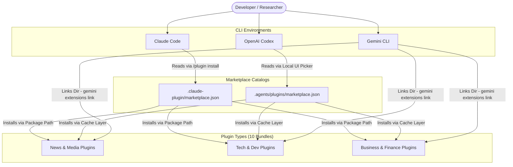
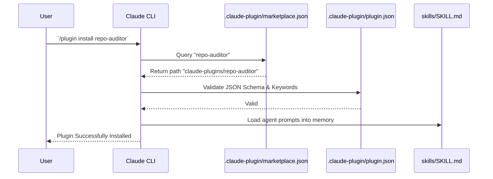
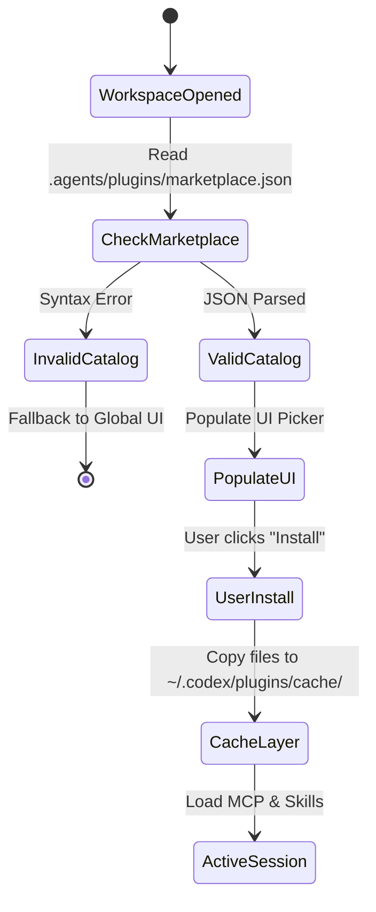
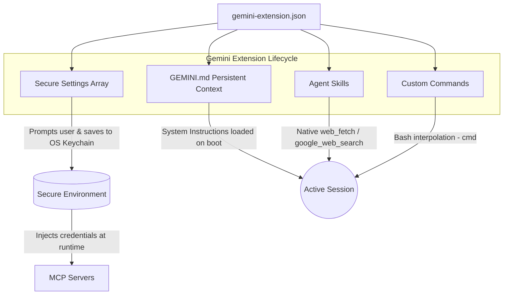

# The Unified Research Ops Ecosystem: Complete Developer Manual

Welcome to the definitive technical manual for the **Multi-CLI Research & Intelligence Ecosystem**. 

What began as a localized script to automate "AI News Briefings" has evolved into a massively scalable, deeply integrated suite of generic and highly-specialized intelligence agents. This document serves as the authoritative reference for the 10 core plugins available natively across **Claude Code**, **OpenAI Codex**, and **Google Gemini CLI**.

This suite of plugins and skills enable AI agents to perform complex research tasks, synthesize information from multiple sources, and generate actionable insights across domains like technology trends, financial analysis, academic research, and social intelligence.

---

## Table of Contents

1. [Ecosystem Philosophy & Design Patterns](#ecosystem-philosophy--design-patterns)
2. [Global Architecture & Discovery Mechanics](#global-architecture--discovery-mechanics)
3. [The 10 Intelligence Plugins (Comprehensive Catalog)](#the-10-intelligence-plugins-comprehensive-catalog)
    * [Category 1: News & Media Intelligence](#category-1-news--media-intelligence)
    * [Category 2: Technical & Developer Tools](#category-2-technical--developer-tools)
    * [Category 3: Business & Financial Analysis](#category-3-business--financial-analysis)
4. [Platform-Specific Implementations](#platform-specific-implementations)
    * [Claude Code Integration](#claude-code-integration)
    * [OpenAI Codex Integration](#openai-codex-integration)
    * [Google Gemini CLI Integration](#google-gemini-cli-integration)
5. [Security & Credential Management](#security--credential-management)
6. [Extending the Ecosystem (Developer Guide)](#extending-the-ecosystem-developer-guide)

---

## Ecosystem Philosophy & Design Patterns

The core philosophy of this ecosystem is **"Write Once, Agentize Everywhere."** 

Developers and researchers shouldn't have to change their primary CLI tool just to access a specific scraping capability or specialized prompt. By abstracting the core logic into Markdown-based agent instructions (`SKILL.md` / `GEMINI.md`) and leveraging the Model Context Protocol (MCP), we maintain feature parity across Anthropic, OpenAI, and Google environments.

### Core Tenets:
1. **Agentic Autonomy over Hardcoded Scripts**: Instead of writing brittle Python scrapers, we provide the LLMs with highly specific system prompts (Personas) and raw primitives (like `web_fetch` or `google_web_search`). The models dynamically route the research.
2. **Human Engagement over SEO**: Several of our plugins (like `last30days`) are explicitly instructed to ignore traditional SEO-optimized blog spam. They seek out Reddit upvotes, Hacker News points, and GitHub stars as the ultimate arbiters of truth.
3. **Local-First Marketplaces**: We do not rely on centralized, closed-source plugin stores. The entire ecosystem is distributed via local `.json` marketplace catalogs tracked directly in version control.

---

## Global Architecture & Discovery Mechanics

The ecosystem relies on localized marketplace catalog files. Instead of forcing users to install each plugin manually via Git or NPM, the respective CLI environments discover these local catalogs and automatically provision the required agents, skills, and MCP configurations into the active session.

---

## The 10 Intelligence Plugins (Comprehensive Catalog)

We currently maintain 10 distinct, production-ready intelligence plugins. Each plugin is bundled with its own isolated manifest, specific agent personas, and specialized web-scraping/MCP tools.

### Category 1: News & Media Intelligence

#### 1. `ai-news-briefing`
**The Flagship Automated News Pipeline.**
*   **The Problem**: Staying up to date with AI news requires checking 15 different newsletters, changelogs, and subreddits every morning.
*   **The Workflow**:
    1. Reads `logs/covered-stories.txt` to prevent duplicate reporting.
    2. Executes 5 parallel web searches across Models, Business, Policy, Open Source, and Dev Tools.
    3. Specifically crawls official changelogs (Cursor, Claude, Vercel) looking *only* for today's date.
    4. Formats a structured Markdown document.
    5. Publishes directly to a Notion Database via the `@modelcontextprotocol/server-notion` MCP server.
*   **Key Skills**: `daily-briefing`, `custom-brief`, `health-check`.
*   **Example Invocation**: `/ai-news-briefing:daily-briefing`

#### 2. `last30days`
**The Social Intelligence & Consensus Engine.**
*   **The Problem**: Google Search surfaces SEO-optimized marketing garbage. To find out what developers actually think about a tool, you have to manually trawl Reddit and Twitter.
*   **The Workflow**:
    1. **Entity Resolution**: Before searching, the agent deduces the correct subreddits and X handles (e.g., mapping "OpenClaw" to `@steipete` and `r/ClaudeCode`).
    2. **Time-Bounded Scraping**: Restricts all queries to the last 30 days.
    3. **Cluster Merging**: Identifies if a topic on Reddit is the exact same conversation happening on Hacker News, merging them into one narrative block.
    4. **Best Takes**: Extracts the most humorous, viral, or insightful raw quotes.
*   **Example Invocation**: `/last30days:last30days "Cursor vs Windsurf"`

#### 3. `podcast-summarizer`
**The Technical Content Synthesizer.**
*   **The Problem**: 2-hour technical podcasts are full of valuable frameworks, but users lack the time to listen to all of them. Standard YouTube summaries just provide useless, generic overviews.
*   **The Workflow**:
    1. Extracts the raw transcript via `web_fetch`.
    2. Actively strips out sponsor reads, ad transitions, and small talk.
    3. Extracts the core thesis of the episode.
    4. Isolates specific, unique insights or mental models shared by the guest.
    5. Generates 3-5 concrete, actionable takeaways for the user's own workflow.
*   **Example Invocation**: `/podcast-summarizer:summarize-podcast "https://youtube.com/watch?v=..."`

---

### Category 2: Technical & Developer Tools

#### 4. `trend-spotter`
**The Early-Stage Developer Trend Detector.**
*   **The Problem**: By the time a new framework or tool hits mainstream tech news, it's already established. Developers want to know what's gaining traction *right now*.
*   **The Workflow**:
    1. Scans GitHub trending repositories for velocity (stars gained in the last 7 days).
    2. Cross-references PyPI and NPM registries for abnormal download spikes.
    3. Searches X/Twitter and Hacker News for "Show HN" launches to gauge initial developer sentiment.
    4. Synthesizes a report identifying the paradigm shift driving the trend (e.g., "The shift from Python backends to Rust CLI tools").
*   **Example Invocation**: `/trend-spotter:analyze-trends "Frontend Build Tools"`

#### 5. `paper-reader`
**The Academic Research Translator.**
*   **The Problem**: Machine Learning research papers on ArXiv are incredibly dense, mathematically heavy, and difficult for product engineers to parse for practical implementation.
*   **The Workflow**:
    1. Queries ArXiv and Semantic Scholar for papers published in the last 3-6 months.
    2. Selects the top 3 most cited/relevant papers.
    3. Reads the abstracts and conclusion sections.
    4. Performs an **ELI5 (Explain Like I'm 5)** translation: What was the problem? How did they solve it (using analogies)? What was the quantitative result?
*   **Example Invocation**: `/paper-reader:read-papers "Advancements in MoE (Mixture of Experts) Routing"`

#### 6. `repo-auditor`
**The Open Source Security & Health Analyst.**
*   **The Problem**: Adopting a new open-source dependency is a liability. Developers need to quickly assess if a repo is abandoned, insecure, or poorly maintained.
*   **The Workflow**:
    1. Evaluates commit velocity and average issue resolution time.
    2. Calculates the "Bus Factor" (how many unique maintainers are actively pushing code).
    3. Scans the Issues tab for complaints about open CVEs or security vulnerabilities.
    4. Checks for reliance on deprecated major versions of core dependencies.
    5. Outputs a strict **PASS / WARN / FAIL** grade for production readiness.
*   **Example Invocation**: `/repo-auditor:audit-repo "https://github.com/expressjs/express"`

---

### Category 3: Business & Financial Analysis

#### 7. `earnings-analyzer`
**The Objective Financial Intelligence Agent.**
*   **The Problem**: Earnings reports are buried in 10-K SEC filings and hour-long corporate calls.
*   **The Workflow**:
    1. Fetches the most recent quarterly earnings call transcript.
    2. Extracts the top-line metrics (Revenue, EPS, Margins) and compares them to analyst estimates (Beat/Miss).
    3. Isolates the CFO/CEO's forward guidance and strategic narrative.
    4. Highlights the most contentious or revealing questions asked by analysts during the Q&A segment.
    5. Summarizes the immediate stock market reaction.
*   **Example Invocation**: `/earnings-analyzer:analyze-earnings "PLTR"`

#### 8. `competitor-intel`
**The Market Landscape & Feature Mapper.**
*   **The Problem**: Product managers need to know exactly what rivals are shipping and what their customers hate about them.
*   **The Workflow**:
    1. Identifies the top 3-5 direct competitors to the target product.
    2. Maps out a feature matrix based on releases from the last 90 days.
    3. Flags any recent pricing tier changes or business model shifts.
    4. Scrapes Reddit (e.g., `r/SaaS`) and G2/Capterra to extract visceral customer sentiment.
    5. Recommends strategic opportunities based on competitor vulnerabilities.
*   **Example Invocation**: `/competitor-intel:analyze-competitors "Vercel"`

#### 9. `startup-scout`
**The Early-Stage Venture Capital Analyst.**
*   **The Problem**: Identifying promising startups in a specific niche before they raise Series B funding requires constant monitoring of launch platforms.
*   **The Workflow**:
    1. Scrapes recent launches on Product Hunt and the latest Y Combinator batches.
    2. Cross-references Seed or Series A funding announcements in the target sector over the past 3 months.
    3. Evaluates the core value proposition of the top 5 companies against market incumbents.
    4. Generates a "Deal Flow Report" detailing founders, traction, and market potential.
*   **Example Invocation**: `/startup-scout:scout-startups "AI coding agents"`

#### 10. `crypto-tracker`
**The Web3 Fundamental Analyst.**
*   **The Problem**: The crypto space is dominated by hype and scam tokens. Investors need fundamental analysis based on code and tokenomics, not influencer tweets.
*   **The Workflow**:
    1. Analyzes the tokenomics: total supply, circulating supply, and upcoming vesting unlocks.
    2. Summarizes the core technological innovation from the project's whitepaper or documentation.
    3. Scrapes Crypto Twitter and `r/CryptoCurrency` to gauge real builder sentiment versus retail hype.
    4. Synthesizes a brief detailing the Bull Case, the Bear Case, and the current narrative.
*   **Example Invocation**: `/crypto-tracker:track-crypto "Solana"`

---

## Platform-Specific Implementations

While the core agent instructions remain identical across the ecosystem, the deployment mechanisms vary drastically depending on the CLI environment.

### Claude Code Integration

Claude Code relies on a centralized workspace manifest and discrete JSON schemas.

**Key Files:**
*   `claude-plugins/[plugin-name]/.claude-plugin/plugin.json`: Defines the namespace, author, and description.
*   `claude-plugins/[plugin-name]/skills/[skill-name]/SKILL.md`: The actual agent instructions.

---

### OpenAI Codex Integration

Codex utilizes a localized UI discovery mechanism and a heavily cached runtime environment.

**Key Differences from Claude:**
*   Codex skills use a slightly different YAML frontmatter format.
*   The `marketplace.json` must explicitly define `policy.installation: AVAILABLE` to allow UI installation.

---

### Google Gemini CLI Integration

Gemini CLI extensions are the most distinct, heavily relying on secure environment injection and bash-interpolated commands.

**Key Features:**
*   **Persistent Context**: The `GEMINI.md` file permanently overrides the system prompt for the session, allowing the agent to maintain a strict persona (e.g., "You are an Early-Stage VC Analyst").
*   **Secure Settings**: API keys are prompted via the UI and stored in the OS Keychain, preventing accidental commits.
*   **Native Tools**: Gemini extensions utilize native `google_web_search` and `web_fetch` built-ins instead of relying entirely on external MCP servers.

---

## Security & Credential Management

Because these agents interact with third-party APIs (Notion, Slack, OpenRouter), handling credentials securely is paramount.

1.  **Claude & Codex**: Rely on standard `.env` files loaded at the root of the project. MCP servers like `@modelcontextprotocol/server-notion` are configured in `.mcp.json` to read from the environment: `"NOTION_API_TOKEN": "replace_with_your_token_here"`.
2.  **Gemini CLI**: Utilizes the `settings` array in `gemini-extension.json`. If a setting is marked `"sensitive": true`, the CLI will securely prompt the user for the key upon linking the extension and store it in the system's encrypted keychain, entirely bypassing `.env` files.

---

## Extending the Ecosystem (Developer Guide)

To add an 11th plugin to the ecosystem, you must build it for all three platforms to maintain feature parity.

1.  **Define the Persona**: Write the core instructions. Decide what the agent's goal is and what steps it must take (e.g., "Search X", "Synthesize Y").
2.  **Create the Claude Package**:
    *   Create `claude-plugins/new-plugin/.claude-plugin/plugin.json`.
    *   Add the skill to `claude-plugins/new-plugin/skills/new-skill/SKILL.md`.
    *   Update `.claude-plugin/marketplace.json`.
3.  **Create the Codex Package**:
    *   Duplicate the Claude folder into `plugins/new-plugin-codex/`.
    *   Rename `.claude-plugin` to `.codex-plugin`.
    *   Update `.agents/plugins/marketplace.json`.
4.  **Create the Gemini Package**:
    *   Create `gemini-extensions/new-plugin/gemini-extension.json`.
    *   Extract the system prompt into `gemini-extensions/new-plugin/GEMINI.md`.
    *   Place the skill in `gemini-extensions/new-plugin/skills/new-skill/SKILL.md`.

By following this exact pattern, your new intelligence agent will immediately become available to developers across all three major AI CLI ecosystems.