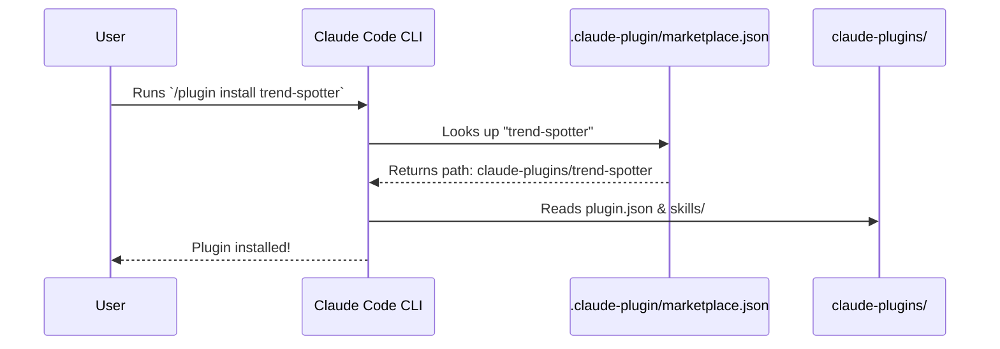
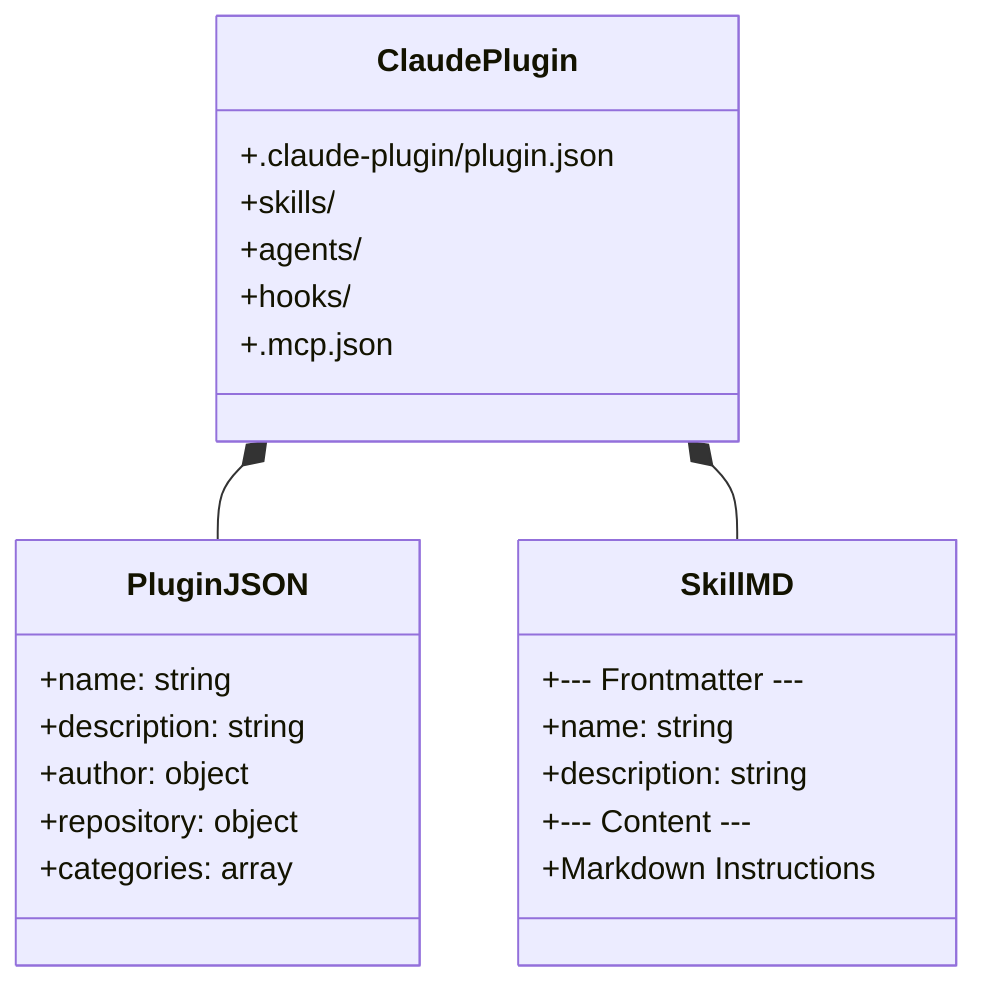

# Claude Code Plugins

This directory (`claude-plugins/`) contains the plugins designed specifically for the **Claude Code** CLI environment.

## The Claude Marketplace

Claude Code utilizes a centralized repository marketplace located at `.claude-plugin/marketplace.json` at the root of the project. This allows developers to use the native `/plugin install` command to discover and add functionality to their session.



## Available Plugins

We offer a robust suite of 10 intelligence and research plugins natively bundled for Claude Code:

1.  **`ai-news-briefing`**: The flagship automated news pipeline and custom research engine.
2.  **`last30days`**: Deep social intelligence scraping Reddit, X, and HN based on engagement.
3.  **`trend-spotter`**: Identifies early-stage developer trends via GitHub and package registries.
4.  **`earnings-analyzer`**: Synthesizes SEC filings and earnings call transcripts into executive briefs.
5.  **`paper-reader`**: Translates complex ArXiv machine learning papers into ELI5 concepts.
6.  **`competitor-intel`**: Analyzes market rivals, feature gaps, and sentiment across SaaS products.

7.  **`repo-auditor`**: Scans GitHub repositories for security, staleness, and code quality.
8.  **`podcast-summarizer`**: Extracts and synthesizes transcripts from YouTube and podcasts into actionable show notes.
9.  **`startup-scout`**: Identifies early-stage startups using YC, Product Hunt, and VC announcements.
10. **`crypto-tracker`**: Performs fundamental Web3 analysis on tokenomics and community sentiment.

## Internal Anatomy of a Claude Plugin

Each plugin in this directory adheres to the strict `.claude-plugin` schema.



### Installation Example

Ensure your terminal is at the project root, launch Claude Code, and run:

```bash
/plugin install paper-reader
/plugin install competitor-intel

# Then invoke them using their namespace:
/paper-reader:read-papers "Latest advancements in MoE architectures"
/competitor-intel:analyze-competitors "Vercel"
```