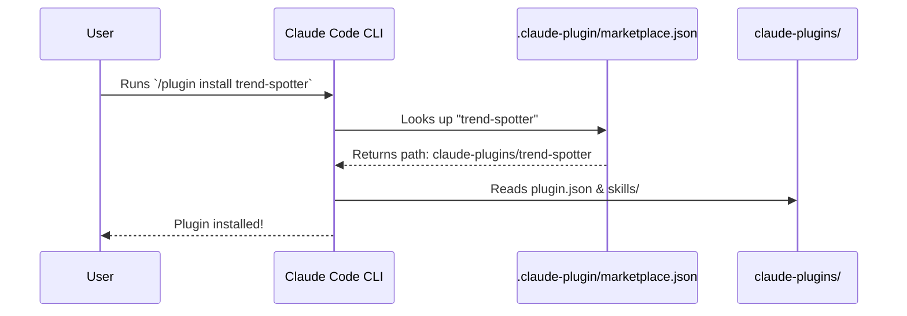
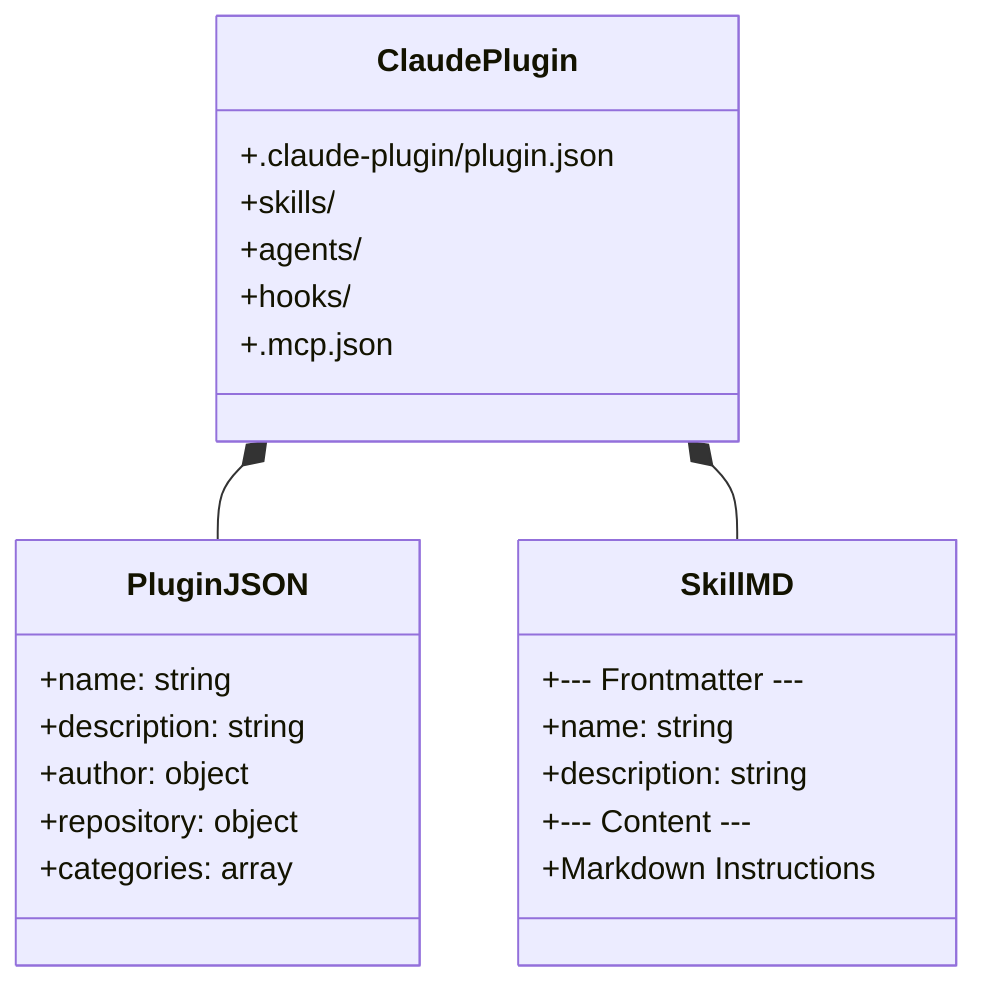

# Claude Code Plugins

This directory (`claude-plugins/`) contains the plugins designed specifically for the **Claude Code** CLI environment.

## The Claude Marketplace

Claude Code utilizes a centralized repository marketplace located at `.claude-plugin/marketplace.json` at the root of the project. This allows developers to use the native `/plugin install` command to discover and add functionality to their session.



## Available Plugins

We offer a robust suite of 10 intelligence and research plugins natively bundled for Claude Code:

1.  **`ai-news-briefing`**: The flagship automated news pipeline, custom research engine, and **5-axis LLM-as-judge quality eval harness** with offline dashboard.
2.  **`last30days`**: Deep social intelligence scraping Reddit, X, and HN based on engagement.
3.  **`trend-spotter`**: Identifies early-stage developer trends via GitHub and package registries.
4.  **`earnings-analyzer`**: Synthesizes SEC filings and earnings call transcripts into executive briefs.
5.  **`paper-reader`**: Translates complex ArXiv machine learning papers into ELI5 concepts.
6.  **`competitor-intel`**: Analyzes market rivals, feature gaps, and sentiment across SaaS products.

7.  **`repo-auditor`**: Scans GitHub repositories for security, staleness, and code quality.
8.  **`podcast-summarizer`**: Extracts and synthesizes transcripts from YouTube and podcasts into actionable show notes.
9.  **`startup-scout`**: Identifies early-stage startups using YC, Product Hunt, and VC announcements.
10. **`crypto-tracker`**: Performs fundamental Web3 analysis on tokenomics and community sentiment.

## Internal Anatomy of a Claude Plugin

Each plugin in this directory adheres to the strict `.claude-plugin` schema.



### Installation Example

Ensure your terminal is at the project root, launch Claude Code, and run:

```bash
/plugin install paper-reader
/plugin install competitor-intel

# Then invoke them using their namespace:
/paper-reader:read-papers "Latest advancements in MoE architectures"
/competitor-intel:analyze-competitors "Vercel"
```

## Flagship plugin: `ai-news-briefing` skill catalog

The `ai-news-briefing` plugin bundles the daily pipeline alongside a self-contained quality eval harness so authors can score, regression-gate, and visualize briefings without leaving the CLI.

| Skill | Maps to | Use case |
| --- | --- | --- |
| `daily-briefing` | scheduled run | Generate today's briefing end-to-end. |
| `custom-brief` | on-demand deep research | Multi-agent investigation of a user-defined topic. |
| `trigger-briefing` | manual `make run` | Re-fire a missed scheduled run. |
| `summarize-url` | one article | Fetch + one-paragraph summary of a single URL. |
| `health-check` | env / deps audit | Verify CLI, MCP, webhooks, vault, eval store. |
| `eval-score` | `make eval D=... JUDGE=claude` | Judge one card on the 5-axis rubric and persist the score. |
| `eval-backfill` | `make eval-backfill JUDGE=claude` | Score every card under `example-cards/` in parallel. |
| `eval-drift` | `make eval-drift D=...` | Trailing-7d vs 30d median + MAD; alert on quality slides. |
| `eval-regression` | `make eval-regression JUDGE=claude` | Re-judge the pinned 18-card golden set; fail on Δ > 0.5. |
| `eval-report` | `make eval-report D=... W=7` | Markdown weekly digest with axis medians + per-day table. |
| `eval-dashboard` | `make eval-dashboard OPEN=1` | Build offline Chart.js dashboard (`eval/dashboard/index.html`). |

Three agents back the skills:

| Agent | Role |
| --- | --- |
| `deep-researcher` | Orchestrates 5 parallel research agents for custom briefs. |
| `news-analyst` | Editorial polish + fact-check on a draft briefing. |
| `quality-judge` | Strict 5-axis rubric scorer with concrete per-axis evidence and fix recommendations. |

One hook ships in `hooks/hooks.json`: a `PostToolUse` matcher on `Write|Edit` of `logs/*-card.json` auto-runs the stub-backend `eval-score` so every newly written card gets a baseline quality reading (zero API cost). Switch to the real Claude judge with `make eval D=<date> JUDGE=claude` whenever you want a higher-fidelity score; rows are keyed on `(card_date, prompt_version, judge_model)` so both versions coexist in the store.