# Briefing Quality Eval Harness

LLM-as-judge scoring for every published AI News Briefing card. Tracks composite quality over time, guards against regressions via a pinned golden set, and surfaces drift before readers notice it. Self-contained Python, zero runtime deps beyond the stdlib, offline-testable via a deterministic `stub` backend.

> **TL;DR.** Cards in → 5-axis rubric → weighted composite → SQLite store → drift / report / gate. Stub backend for tests, real Claude / Codex / Gemini for production runs. Re-runs are idempotent on `(card_date, prompt_version, judge_model)`. Drift uses median + MAD (robust). Regression gate is the full 18-card real-judge backfill, not a hand-picked subset.

---

## Table of contents

1. [Why this exists](#why-this-exists)
2. [Architecture at a glance](#architecture-at-a-glance)
3. [Quick start](#quick-start)
4. [Scoring rubric](#scoring-rubric)
5. [Lifecycle of a single eval](#lifecycle-of-a-single-eval)
6. [Judge backends](#judge-backends)
7. [Card extraction](#card-extraction)
8. [Storage model](#storage-model)
9. [Idempotency rules](#idempotency-rules)
10. [CLI reference](#cli-reference)
11. [Backfill pipeline](#backfill-pipeline)
12. [Golden set and regression gate](#golden-set-and-regression-gate)
13. [Re-baselining workflow](#re-baselining-workflow)
14. [Drift detection](#drift-detection)
15. [Weekly report](#weekly-report)
16. [Publish gate](#publish-gate)
17. [Failure-mode decision graph](#failure-mode-decision-graph)
18. [Cost model](#cost-model)
19. [Testing](#testing)
20. [File map](#file-map)
21. [Versioning and prompt evolution](#versioning-and-prompt-evolution)
22. [Roadmap and explicit non-goals](#roadmap-and-explicit-non-goals)
23. [FAQ](#faq)

---

## Why this exists

The daily briefing pipeline ships text to readers every morning. Until this harness landed, the only visibility into quality was: an operator opening the Notion page and reading it. That meant:

- **Silent prompt drift.** Tweak the daily prompt, ship a worse briefing for two weeks, notice only when a stakeholder complains.
- **Silent source rot.** Web search results degrade for a topic, factuality silently drops, no signal.
- **Silent model regressions.** Upgrade the underlying CLI / model and the agent's behavior changes; no objective comparison.
- **No regression test.** A "refactor" of `prompt.md` could quietly destroy quality.

The eval harness turns briefing quality into a **measurable, queryable property** of every card. Daily scores accumulate in a small SQLite database. Trends are visible. Regressions fail loud. Drift fires alerts. Bad cards can optionally block the publish step.

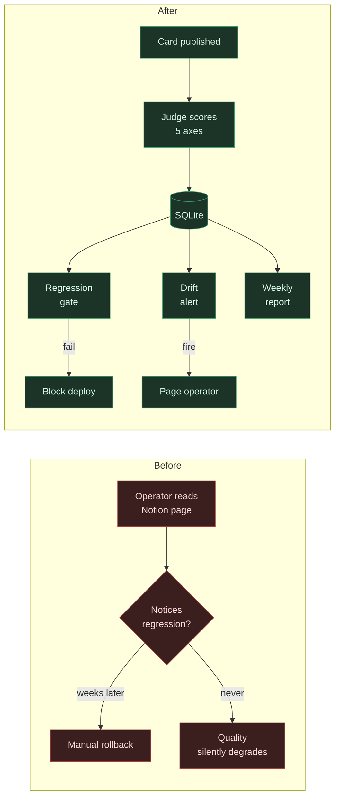
```mermaid
flowchart LR
    classDef before fill:#3b1e1e,stroke:#a13a3a,color:#f8d4d4
    classDef after  fill:#1c3328,stroke:#3da06a,color:#d4f8e2

    subgraph BEFORE["Before"]
        B1[Operator reads<br/>Notion page] --> B2{Notices<br/>regression?}
        B2 -- weeks later --> B3[Manual rollback]
        B2 -- never --> B4[Quality<br/>silently degrades]
    end

    subgraph AFTER["After"]
        A1[Card published] --> A2[Judge scores<br/>5 axes]
        A2 --> A3[(SQLite)]
        A3 --> A4[Regression<br/>gate]
        A3 --> A5[Drift<br/>alert]
        A3 --> A6[Weekly<br/>report]
        A4 -- fail --> A7[Block deploy]
        A5 -- fire --> A8[Page operator]
    end

    class B1,B2,B3,B4 before
    class A1,A2,A3,A4,A5,A6,A7,A8 after
```

---

## Architecture at a glance

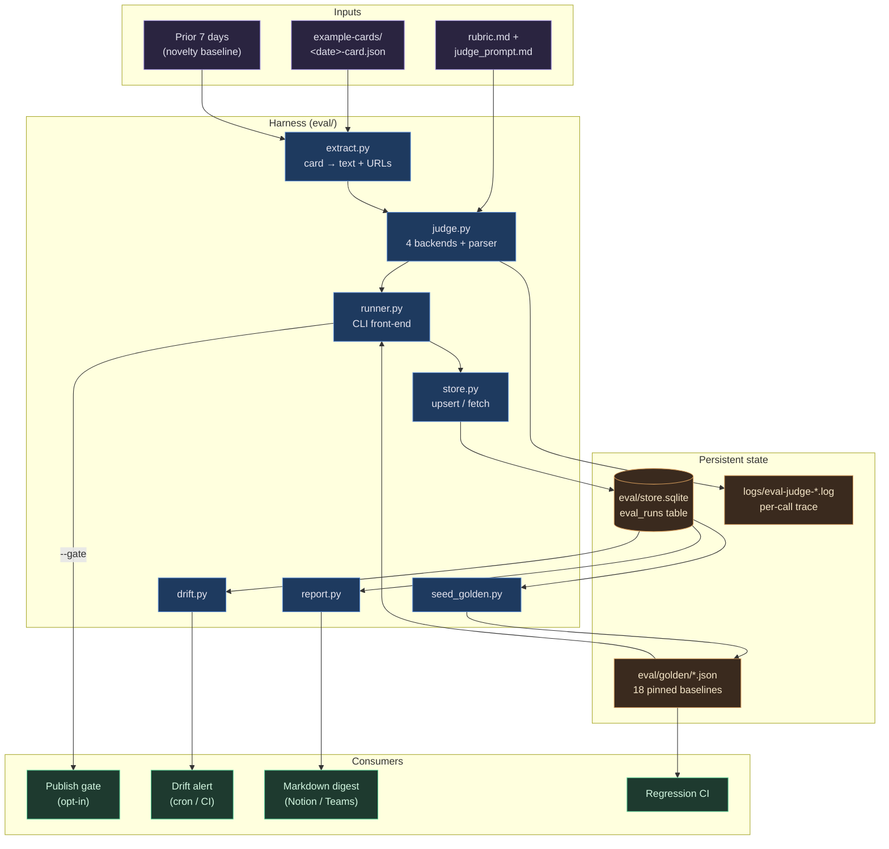
```mermaid
flowchart TD
    classDef input  fill:#2a2440,stroke:#8b7ad4,color:#e4e4ef
    classDef core   fill:#1e3a5f,stroke:#5b8dd8,color:#e4e4ef
    classDef store  fill:#3a2a1e,stroke:#d49b5b,color:#f5e6c8
    classDef out    fill:#1e3a2f,stroke:#5bd49b,color:#d4f8e2

    subgraph INPUTS["Inputs"]
        CARD["example-cards/<br/>&lt;date&gt;-card.json"]:::input
        PRIOR["Prior 7 days<br/>(novelty baseline)"]:::input
        RUBRIC["rubric.md +<br/>judge_prompt.md"]:::input
    end

    subgraph CORE["Harness (eval/)"]
        EX["extract.py<br/>card → text + URLs"]:::core
        JU["judge.py<br/>4 backends + parser"]:::core
        RUN["runner.py<br/>CLI front-end"]:::core
        ST["store.py<br/>upsert / fetch"]:::core
        DR["drift.py"]:::core
        RP["report.py"]:::core
        SG["seed_golden.py"]:::core
    end

    subgraph STATE["Persistent state"]
        DB[("eval/store.sqlite<br/>eval_runs table")]:::store
        GOLD["eval/golden/*.json<br/>18 pinned baselines"]:::store
        LOG["logs/eval-judge-*.log<br/>per-call trace"]:::store
    end

    subgraph CONSUMERS["Consumers"]
        GATE["Publish gate<br/>(opt-in)"]:::out
        ALERT["Drift alert<br/>(cron / CI)"]:::out
        REPORT["Markdown digest<br/>(Notion / Teams)"]:::out
        REGR["Regression CI"]:::out
    end

    CARD --> EX
    PRIOR --> EX
    RUBRIC --> JU
    EX --> JU
    JU --> RUN
    JU --> LOG
    RUN --> ST --> DB
    DB --> DR --> ALERT
    DB --> RP --> REPORT
    DB --> SG --> GOLD
    GOLD --> RUN
    RUN -- "--gate" --> GATE
    GOLD --> REGR
```

Six Python modules, one SQLite table, two on-disk artifacts (the DB and the golden JSONs), one log directory. The CLI front-end (`runner.py`) is the only entry point most operators ever touch.

---

## Quick start

```bash
# 1. Run unit tests (stub backend, no API, no network)
make eval-test

# 2. Score one card with the offline stub judge
make eval D=2026-03-18

# 3. Score the same card with the real Claude Haiku judge
make eval D=2026-03-18 JUDGE=claude

# 4. Backfill every card in example-cards/ (parallel, 4 workers)
make eval-backfill JUDGE=claude

# 5. Re-judge the pinned golden set; exit 2 if any drops > 0.5
make eval-regression JUDGE=claude

# 6. Drift check; exit 3 on a 2-day streak below trailing-30d band
make eval-drift D=2026-03-18 ALERT_EXIT=1

# 7. Weekly Markdown report
make eval-report D=2026-03-18 W=7 OUT=logs/eval-week.md

# 8. Re-seed golden from the latest backfill in store.sqlite
make eval-seed-golden JUDGE=claude CLEAN=1

# 9. Dump stored rows
make eval-show
```

All of the above work offline if you pass `JUDGE=stub` (the default).

---

## Scoring rubric

Five integer axes, scored 1–5 each. Composite is a weighted mean:

| Axis              | Weight | 1 (bad)                                  | 5 (excellent)                                                  |
| ----------------- | -----: | ---------------------------------------- | -------------------------------------------------------------- |
| `factuality`      |   0.30 | Unverifiable claims, no sources cited    | Every concrete claim maps to a cited source                    |
| `novelty`         |   0.20 | Stories already covered in last 7 days   | All stories new vs. prior 7-day window                         |
| `source_diversity`|   0.15 | One or two domains dominate              | 5+ distinct domains, primary + secondary mix                   |
| `signal_density`  |   0.20 | Vague hype words, no numbers             | Concrete numbers, named entities, specific outcomes per item   |
| `coherence`       |   0.15 | Bullet soup, no narrative                | Items grouped by theme with a clear takeaway per topic         |

Composite formula:

```
composite = round(
    0.30 · factuality
  + 0.20 · novelty
  + 0.15 · source_diversity
  + 0.20 · signal_density
  + 0.15 · coherence
, 2)
```

Weight rationale (mermaid):

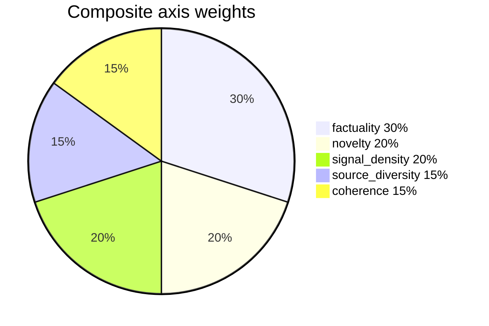
```mermaid
pie title Composite axis weights
    "factuality 30%" : 30
    "novelty 20%" : 20
    "signal_density 20%" : 20
    "source_diversity 15%" : 15
    "coherence 15%" : 15
```

Two **hard caps** are baked into the rubric (and enforced in the judge prompt):

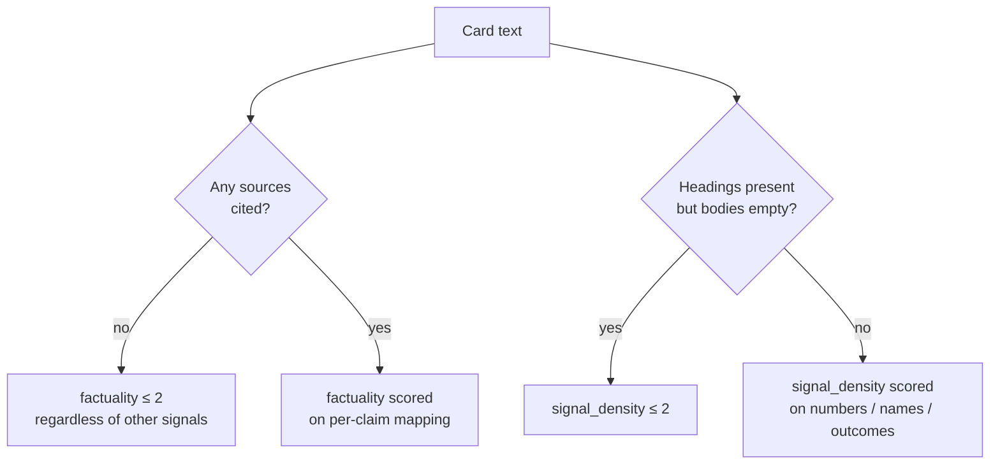
```mermaid
flowchart TD
    A[Card text] --> B{Any sources<br/>cited?}
    B -- no  --> C[factuality ≤ 2<br/>regardless of other signals]
    B -- yes --> D[factuality scored<br/>on per-claim mapping]

    A --> E{Headings present<br/>but bodies empty?}
    E -- yes --> F[signal_density ≤ 2]
    E -- no  --> G[signal_density scored<br/>on numbers / names / outcomes]
```

Real-world hits in the shipping golden set: cards `2026-03-04`, `2026-03-05`, and `2026-03-15` triggered the factuality cap on first backfill.

### Pass thresholds

| Gate               | Rule                                                                                                |
| ------------------ | --------------------------------------------------------------------------------------------------- |
| **Publish gate**   | `composite ≥ 3.0` AND no axis < 2                                                                   |
| **Regression gate**| Per-card composite drop ≤ 0.5 vs. baseline                                                          |
| **Drift alert**    | Rolling-7d median composite > 1.5 MADs below trailing-30d median for 2 consecutive days             |

---

## Lifecycle of a single eval

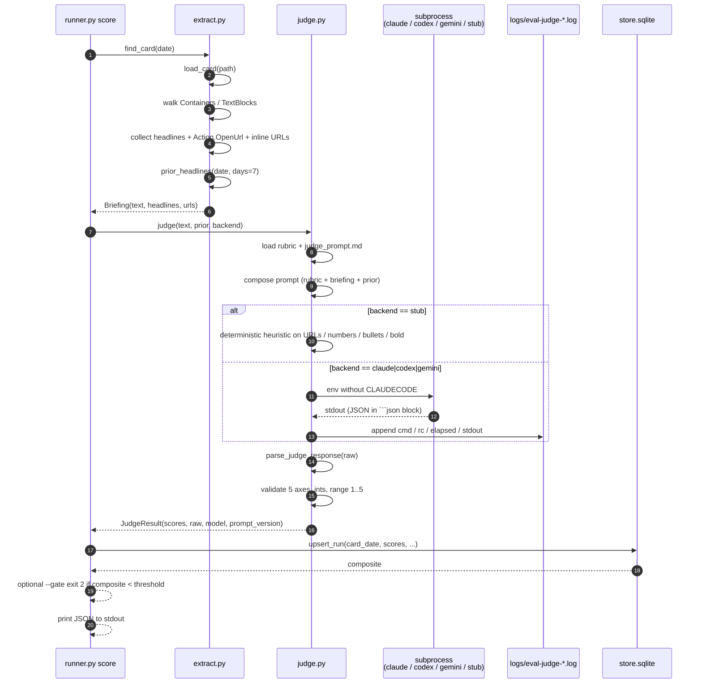
```mermaid
sequenceDiagram
    autonumber
    participant CLI as runner.py score
    participant EX  as extract.py
    participant J   as judge.py
    participant SUB as subprocess<br/>(claude / codex / gemini / stub)
    participant LOG as logs/eval-judge-*.log
    participant DB  as store.sqlite

    CLI->>EX: find_card(date)
    EX->>EX: load_card(path)
    EX->>EX: walk Containers / TextBlocks
    EX->>EX: collect headlines + Action.OpenUrl + inline URLs
    EX->>EX: prior_headlines(date, days=7)
    EX-->>CLI: Briefing(text, headlines, urls)

    CLI->>J: judge(text, prior, backend)
    J->>J: load rubric + judge_prompt.md
    J->>J: compose prompt (rubric + briefing + prior)

    alt backend == stub
        J->>J: deterministic heuristic on URLs / numbers / bullets / bold
    else backend == claude|codex|gemini
        J->>SUB: env without CLAUDECODE
        SUB-->>J: stdout (JSON in ```json block)
        J->>LOG: append cmd / rc / elapsed / stdout
    end

    J->>J: parse_judge_response(raw)
    J->>J: validate 5 axes, ints, range 1..5
    J-->>CLI: JudgeResult(scores, raw, model, prompt_version)

    CLI->>DB: upsert_run(card_date, scores, ...)
    DB-->>CLI: composite
    CLI-->>CLI: optional --gate exit 2 if composite < threshold
    CLI-->>CLI: print JSON to stdout
```

Each step is independently testable. The stub backend skips the subprocess hop entirely, which is why `make eval-test` runs in under 100 ms.

---

## Judge backends

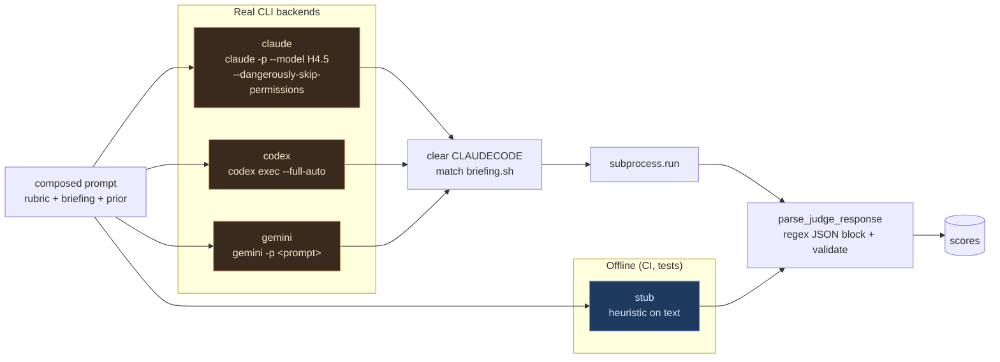
```mermaid
flowchart LR
    classDef offline fill:#1e3a5f,stroke:#5b8dd8,color:#d4e4f8
    classDef online  fill:#3a2a1e,stroke:#d49b5b,color:#f5e6c8

    subgraph OFFLINE["Offline (CI, tests)"]
        STUB["stub<br/>heuristic on text"]:::offline
    end

    subgraph ONLINE["Real CLI backends"]
        C["claude<br/>claude -p --model H4.5<br/>--dangerously-skip-permissions"]:::online
        CX["codex<br/>codex exec --full-auto"]:::online
        G["gemini<br/>gemini -p &lt;prompt&gt;"]:::online
    end

    PROMPT["composed prompt<br/>rubric + briefing + prior"] --> STUB
    PROMPT --> C --> ENV[clear CLAUDECODE<br/>match briefing.sh]
    PROMPT --> CX --> ENV
    PROMPT --> G  --> ENV
    ENV --> SUB[subprocess.run]
    SUB --> PARSE[parse_judge_response<br/>regex JSON block + validate]
    STUB --> PARSE
    PARSE --> OUT[(scores)]
```

| Backend  | Default model                          | Notes                                                              |
| -------- | -------------------------------------- | ------------------------------------------------------------------ |
| `stub`   | `stub-v1`                              | Deterministic; reads URL / number / bullet / bold density. No API. |
| `claude` | `claude-haiku-4-5-20251001` (override via `EVAL_JUDGE_MODEL`) | Best price / quality. ~$0.002 / card.       |
| `codex`  | Whatever `codex` is logged into        | Useful for cross-judge sanity.                                     |
| `gemini` | Whatever `gemini` is logged into       | Useful for cross-judge sanity.                                     |

### Why we shell out instead of using SDKs

The whole AI News Briefing project shells out to CLIs already (see `briefing.sh`, `custom-brief.sh`). The harness inherits the same auth, model selection, and quota story — zero new credentials, zero new SDK pins. The trade-off is process-launch overhead (~5 s on macOS) which is why backfill is parallelized (see below).

### `CLAUDECODE` clearing

`claude -p` refuses to launch if `CLAUDECODE=1` is set in the parent env (you can't nest Claude Code sessions). Since this harness often runs from inside Claude Code, `_run_cli` strips `CLAUDECODE` and `CLAUDE_CODE` from the subprocess environment, exactly like `briefing.sh` does.

---

## Card extraction

Briefing cards are Microsoft Teams Adaptive Card JSON. `extract.py` walks the nested `Container` / `TextBlock` tree and produces a flat view the judge can score.

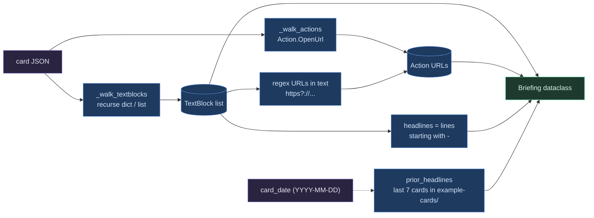
```mermaid
flowchart LR
    classDef raw  fill:#2a2440,stroke:#8b7ad4,color:#e4e4ef
    classDef proc fill:#1e3a5f,stroke:#5b8dd8,color:#d4e4f8
    classDef out  fill:#1e3a2f,stroke:#5bd49b,color:#d4f8e2

    JSON["card JSON"]:::raw --> WALK["_walk_textblocks<br/>recurse dict / list"]:::proc
    JSON --> ACT["_walk_actions<br/>Action.OpenUrl"]:::proc
    WALK --> TEXT[(TextBlock list)]:::proc
    ACT  --> URLS[(Action URLs)]:::proc
    TEXT --> INLINE["regex URLs in text<br/>https?://..."]:::proc
    INLINE --> URLS
    TEXT --> HEAD["headlines = lines<br/>starting with - "]:::proc

    TEXT --> B["Briefing dataclass"]:::out
    URLS --> B
    HEAD --> B

    DATE["card_date (YYYY-MM-DD)"]:::raw -.-> PRIOR["prior_headlines<br/>last 7 cards in example-cards/"]:::proc
    PRIOR --> B
```

Public surface:

```python
@dataclass
class Briefing:
    card_date: str       # "2026-03-18"
    title: str           # first TextBlock
    body_text: str       # all TextBlocks joined by \n
    headlines: list[str] # lines starting with "- "
    source_urls: list[str]  # sorted unique URLs

load_card(path) -> Briefing
prior_headlines(card_date, days=7) -> list[str]
find_card(card_date) -> Path
```

---

## Storage model

One SQLite table, no joins, no ORM:

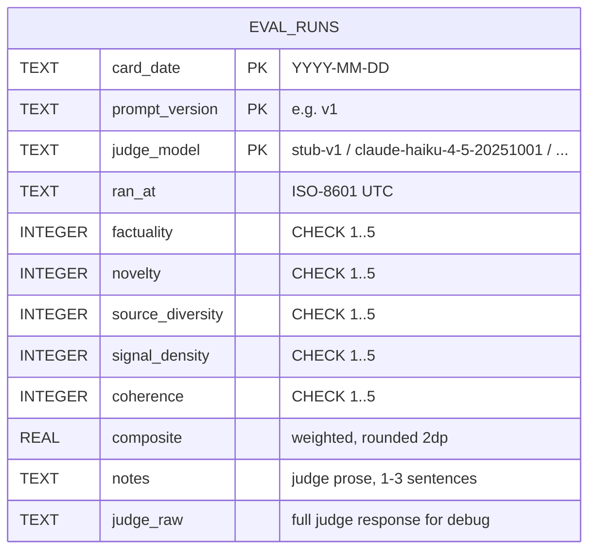
```mermaid
erDiagram
    EVAL_RUNS {
        TEXT    card_date          PK "YYYY-MM-DD"
        TEXT    prompt_version     PK "e.g. v1"
        TEXT    judge_model        PK "stub-v1 / claude-haiku-4-5-20251001 / ..."
        TEXT    ran_at                 "ISO-8601 UTC"
        INTEGER factuality             "CHECK 1..5"
        INTEGER novelty                "CHECK 1..5"
        INTEGER source_diversity       "CHECK 1..5"
        INTEGER signal_density         "CHECK 1..5"
        INTEGER coherence              "CHECK 1..5"
        REAL    composite              "weighted, rounded 2dp"
        TEXT    notes                  "judge prose, 1-3 sentences"
        TEXT    judge_raw              "full judge response for debug"
    }
```

The composite primary key is the load-bearing design decision. It means:

1. **Same card, same prompt, same judge** → upsert overwrites. Re-runs after a transient failure produce a clean store.
2. **Same card, new prompt version** → new row. Bumping `PROMPT_VERSION` does NOT silently overwrite historic scores.
3. **Same card, new judge** → new row. Switching from `stub` to `claude` keeps both for comparison.
4. **Same card, same prompt+judge but different `ran_at`** → still one row (the latest). Indexed by `ran_at` for quick "latest run" queries.

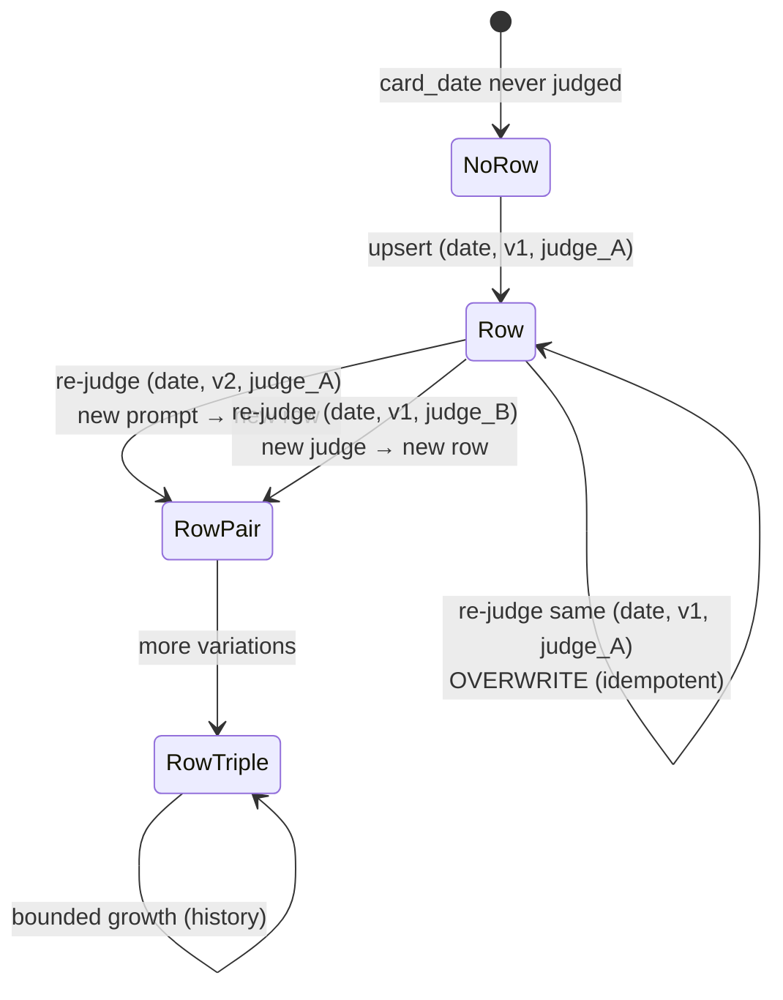
```mermaid
stateDiagram-v2
    [*] --> NoRow: card_date never judged
    NoRow --> Row: upsert (date, v1, judge_A)
    Row --> Row: re-judge same (date, v1, judge_A)<br/>OVERWRITE (idempotent)
    Row --> RowPair: re-judge (date, v2, judge_A)<br/>new prompt → new row
    Row --> RowPair: re-judge (date, v1, judge_B)<br/>new judge → new row
    RowPair --> RowTriple: more variations
    RowTriple --> RowTriple: bounded growth (history)
```

---

## Idempotency rules

| Operation                                              | Effect on `eval_runs`                                                            |
| ------------------------------------------------------ | -------------------------------------------------------------------------------- |
| `runner.py score --date D --judge stub`                | INSERT or REPLACE row for `(D, "v1", "stub-v1")`                                 |
| `runner.py score --date D --judge claude` (after stub) | INSERT new row for `(D, "v1", "claude-haiku-4-5-20251001")`. Stub row untouched. |
| Re-run identical command                               | Updates `ran_at` and `judge_raw`; preserves history of past versions.            |
| `runner.py backfill --judge X`                         | Many score-per-date upserts in parallel. Failures logged, others continue.       |
| `runner.py regression --judge X`                       | Re-scores each `golden/*.json`, writes/updates the corresponding `eval_runs` row, compares to pinned baseline. |
| Bump `PROMPT_VERSION` in `judge.py`                    | All future runs land in new rows. Old `v1` rows preserved.                       |

---

## CLI reference

All commands are wrapped by `make` targets but every flag is available directly via `python3 eval/runner.py`.

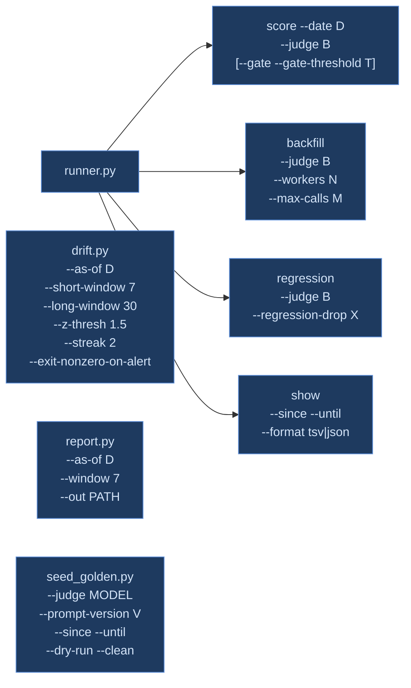
```mermaid
flowchart LR
    classDef cmd fill:#1e3a5f,stroke:#5b8dd8,color:#d4e4f8

    R["runner.py"]:::cmd --> S["score --date D<br/>--judge B<br/>[--gate --gate-threshold T]"]:::cmd
    R --> BF["backfill<br/>--judge B<br/>--workers N<br/>--max-calls M"]:::cmd
    R --> RG["regression<br/>--judge B<br/>--regression-drop X"]:::cmd
    R --> SH["show<br/>--since --until<br/>--format tsv|json"]:::cmd

    DR["drift.py<br/>--as-of D<br/>--short-window 7<br/>--long-window 30<br/>--z-thresh 1.5<br/>--streak 2<br/>--exit-nonzero-on-alert"]:::cmd
    RP["report.py<br/>--as-of D<br/>--window 7<br/>--out PATH"]:::cmd
    SG["seed_golden.py<br/>--judge MODEL<br/>--prompt-version V<br/>--since --until<br/>--dry-run --clean"]:::cmd
```

### Exit codes

| Command           | 0      | 1                | 2                                | 3                                  |
| ----------------- | ------ | ---------------- | -------------------------------- | ---------------------------------- |
| `score [--gate]`  | pass   | harness error    | gate fail (composite < threshold) | —                                  |
| `backfill`        | all OK | partial failure  | —                                | —                                  |
| `regression`      | all OK | no goldens found | one+ card dropped > threshold     | —                                  |
| `show`            | always | —                | —                                | —                                  |
| `drift.py`        | always | —                | —                                | alert (with `--exit-nonzero-on-alert`) |

---

## Backfill pipeline

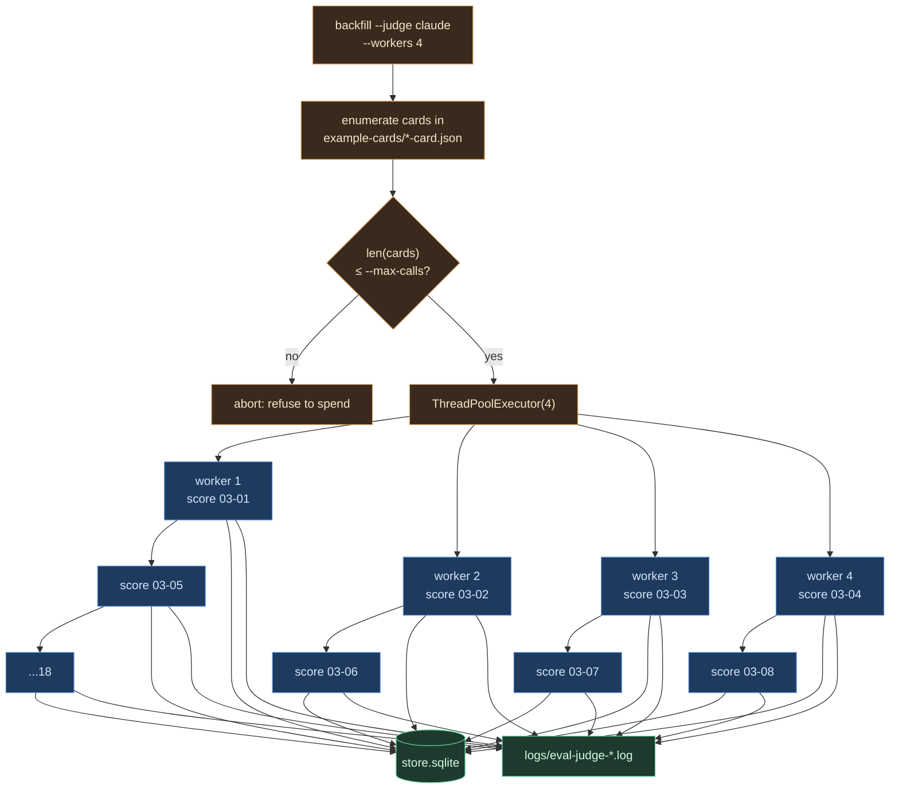
```mermaid
flowchart TD
    classDef ctrl fill:#3a2a1e,stroke:#d49b5b,color:#f5e6c8
    classDef work fill:#1e3a5f,stroke:#5b8dd8,color:#d4e4f8
    classDef out  fill:#1e3a2f,stroke:#5bd49b,color:#d4f8e2

    A["backfill --judge claude<br/>--workers 4"]:::ctrl
    A --> ENUM["enumerate cards in<br/>example-cards/*-card.json"]:::ctrl
    ENUM --> CAP{"len(cards)<br/>≤ --max-calls?"}:::ctrl
    CAP -- no --> ABORT["abort: refuse to spend"]:::ctrl
    CAP -- yes --> POOL["ThreadPoolExecutor(4)"]:::ctrl

    POOL --> W1["worker 1<br/>score 03-01"]:::work
    POOL --> W2["worker 2<br/>score 03-02"]:::work
    POOL --> W3["worker 3<br/>score 03-03"]:::work
    POOL --> W4["worker 4<br/>score 03-04"]:::work

    W1 --> W5["score 03-05"]:::work
    W2 --> W6["score 03-06"]:::work
    W3 --> W7["score 03-07"]:::work
    W4 --> W8["score 03-08"]:::work
    W5 --> WN["...18"]:::work

    W1 & W2 & W3 & W4 & W5 & W6 & W7 & W8 & WN --> DB[(store.sqlite)]:::out
    W1 & W2 & W3 & W4 & W5 & W6 & W7 & W8 & WN --> LOG["logs/eval-judge-*.log"]:::out
```

Measured: 18 cards in **235 s** with 4 workers (~13 s / card amortized), vs ~30 s / card serial. Stub backend forces `workers=1` so test output stays ordered. Failures are logged but do not abort the run.

### Per-call trace

Each subprocess invocation appends a block to `logs/eval-judge-YYYY-MM-DD.log`:

```
--- 2026-05-13T19:48:03 rc=0 elapsed=31.2s ---
CMD: /Users/.../claude -p --model claude-haiku-4-5-20251001 --dangerously-skip-permissions <prompt>
STDIN[:200]: ...
STDOUT[:2000]:
```json
{
  "factuality": 4,
  "novelty": 3,
  ...
}
```
```

So you can `tail -f` and watch real progress instead of staring at silent subprocesses.

---

## Golden set and regression gate

`eval/golden/<date>.json` pins the expected baseline composite + per-axis scores for each card. The shipping golden set is the **full 18-card real-judge backfill** under `claude-haiku-4-5-20251001` v1, with composites spanning 2.9–4.2.

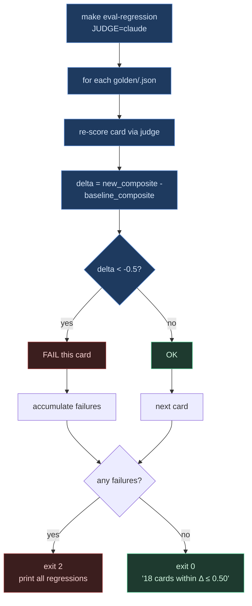
```mermaid
flowchart TD
    classDef base fill:#3a2a1e,stroke:#d49b5b,color:#f5e6c8
    classDef test fill:#1e3a5f,stroke:#5b8dd8,color:#d4e4f8
    classDef pass fill:#1e3a2f,stroke:#5bd49b,color:#d4f8e2
    classDef fail fill:#3b1e1e,stroke:#a13a3a,color:#f8d4d4

    A["make eval-regression<br/>JUDGE=claude"]:::test --> B["for each golden/<date>.json"]:::test
    B --> C["re-score card via judge"]:::test
    C --> D["delta = new_composite -<br/>baseline_composite"]:::test
    D --> E{"delta < -0.5?"}:::test
    E -- yes --> F["FAIL this card"]:::fail
    E -- no  --> G["OK"]:::pass
    F --> H["accumulate failures"]
    G --> I["next card"]
    H --> J{"any failures?"}
    I --> J
    J -- yes --> K["exit 2<br/>print all regressions"]:::fail
    J -- no  --> L["exit 0<br/>'18 cards within Δ ≤ 0.50'"]:::pass
```

Each golden file:

```json
{
  "card_date": "2026-03-18",
  "baseline_composite": 4.0,
  "baseline_judge": "claude-haiku-4-5-20251001",
  "baseline_prompt_version": "v1",
  "baseline_ran_at": "2026-05-14T02:51:27+00:00",
  "baseline_axes": {
    "factuality": 4,
    "novelty": 3,
    "source_diversity": 4,
    "signal_density": 5,
    "coherence": 4
  },
  "notes": "Novelty drags from GPT-5.4 mini pricing (prior week). Strong sourcing and concrete numbers throughout."
}
```

Why 18 cards, not 3:
- 3 cards (any subset) gives 3 binary signals.
- 18 cards covers the full quality distribution: the cheap wins (`03-12`, `03-16`, `03-17` at 4.2), the genuinely middling (`03-13` at 3.65), and the cards that triggered hard caps (`03-04`, `03-05` at 3.2, `03-07` at 2.9, `03-15` at 3.0). A regression that only hurts one corner of the distribution still trips a fail.

---

## Re-baselining workflow

You re-baseline when you intentionally change the judge prompt, switch to a more capable judge, or otherwise rebase quality expectations. **Never hand-edit golden files** — regenerate from the store.

```mermaid
sequenceDiagram
    autonumber
    participant DEV as Operator
    participant BF  as make eval-backfill
    participant SG  as make eval-seed-golden
    participant RG  as make eval-regression
    participant DB  as store.sqlite
    participant GD  as eval/golden/

    DEV->>DEV: Bump PROMPT_VERSION or switch judge
    DEV->>BF: backfill JUDGE=claude
    BF->>DB: write 18 new rows (new prompt_version OR new judge_model)
    DEV->>SG: seed-golden JUDGE=claude CLEAN=1
    SG->>DB: SELECT latest per card_date<br/>filtered to claude-haiku-4-5-20251001
    SG->>GD: clean + write 18 new JSON files
    DEV->>RG: regression JUDGE=claude
    RG->>DB: re-score; compare to new baselines
    RG-->>DEV: 18 / 18 within Δ ≤ 0.50  → ship
```

Flags:

```bash
# Dry-run (no writes) — preview what would change
python3 eval/seed_golden.py --judge claude-haiku-4-5-20251001 --dry-run

# Limit to a date range (e.g. only the new cards)
python3 eval/seed_golden.py --since 2026-03-15 --until 2026-03-18

# Filter to a specific prompt version
python3 eval/seed_golden.py --prompt-version v2

# Wipe stale dates before writing
python3 eval/seed_golden.py --clean
```

---

## Drift detection

`drift.py` answers: **"Has quality slid in the last week?"** using a robust statistic.

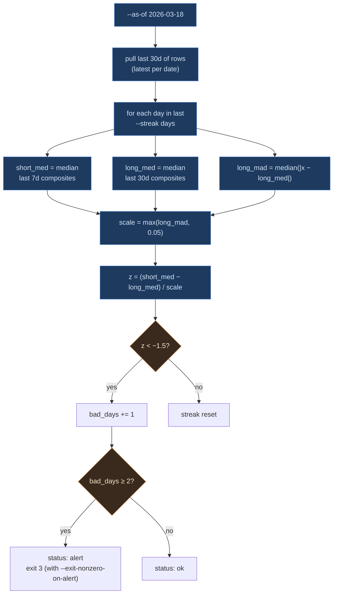
```mermaid
flowchart TD
    classDef calc fill:#1e3a5f,stroke:#5b8dd8,color:#d4e4f8
    classDef dec  fill:#3a2a1e,stroke:#d49b5b,color:#f5e6c8

    A["--as-of 2026-03-18"]:::calc --> B["pull last 30d of rows<br/>(latest per date)"]:::calc
    B --> C["for each day in last<br/>--streak days"]:::calc
    C --> D["short_med = median<br/>last 7d composites"]:::calc
    C --> E["long_med = median<br/>last 30d composites"]:::calc
    C --> F["long_mad = median(|x − long_med|)"]:::calc
    D & E & F --> G["scale = max(long_mad, 0.05)"]:::calc
    G --> H["z = (short_med − long_med) / scale"]:::calc
    H --> I{"z < −1.5?"}:::dec
    I -- yes --> J["bad_days += 1"]
    I -- no  --> K["streak reset"]
    J --> L{"bad_days ≥ 2?"}:::dec
    L -- yes --> ALERT["status: alert<br/>exit 3 (with --exit-nonzero-on-alert)"]
    L -- no  --> OK["status: ok"]
```

### Why median + MAD, not mean + stddev

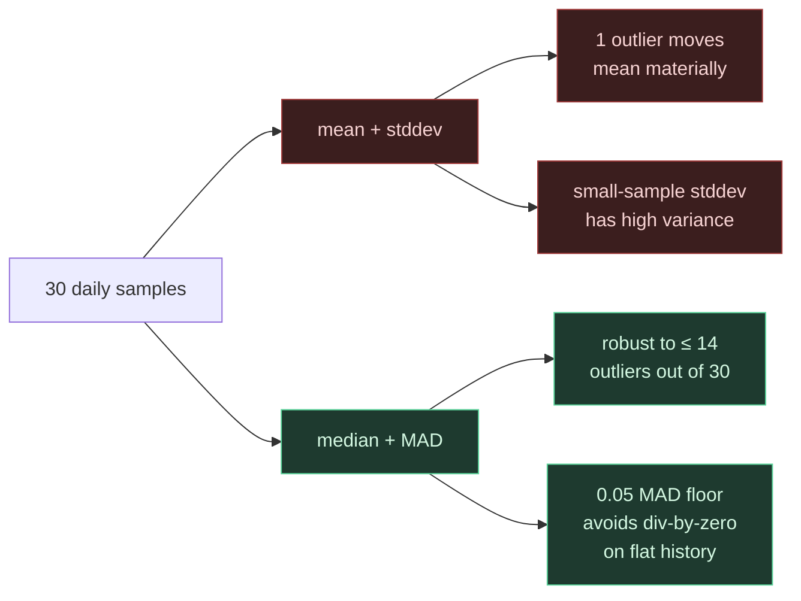
```mermaid
flowchart LR
    classDef ok   fill:#1e3a2f,stroke:#5bd49b,color:#d4f8e2
    classDef bad  fill:#3b1e1e,stroke:#a13a3a,color:#f8d4d4

    N["30 daily samples"] --> M1["mean + stddev"]:::bad
    N --> M2["median + MAD"]:::ok

    M1 --> M1A["1 outlier moves<br/>mean materially"]:::bad
    M1 --> M1B["small-sample stddev<br/>has high variance"]:::bad

    M2 --> M2A["robust to ≤ 14<br/>outliers out of 30"]:::ok
    M2 --> M2B["0.05 MAD floor<br/>avoids div-by-zero<br/>on flat history"]:::ok
```

Validated by unit tests in `tests/test_harness.py::DriftTests`: flat history → `status: ok`; 8-day drop streak → `status: alert` with ≥ 2 alert entries.

### Output shape

```json
{
  "as_of": "2026-03-18",
  "status": "alert",
  "short_window": 7,
  "long_window": 30,
  "z_thresh": 1.5,
  "streak_required": 2,
  "alerts": [
    {"day": "2026-03-18", "short_median": 1.0, "long_median": 3.45, "z": -3.27},
    {"day": "2026-03-17", "short_median": 1.0, "long_median": 3.45, "z": -3.27}
  ]
}
```

---

## Weekly report

`report.py` emits a Markdown digest for a rolling window. Designed to be piped into Notion / Teams via the project's existing publish scripts, or committed under `logs/eval-reports/`.

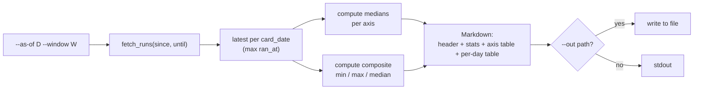
```mermaid
flowchart LR
    A["--as-of D --window W"] --> B["fetch_runs(since, until)"]
    B --> C["latest per card_date<br/>(max ran_at)"]
    C --> D["compute medians<br/>per axis"]
    C --> E["compute composite<br/>min / max / median"]
    D --> F["Markdown:<br/>header + stats + axis table + per-day table"]
    E --> F
    F --> G{"--out path?"}
    G -- yes --> H["write to file"]
    G -- no  --> I["stdout"]
```

Example tail:

```markdown
# Briefing Eval Report — 2026-03-12 → 2026-03-18

**Coverage:** 7/7 days
**Composite (median):** 4.20
**Composite (min/max):** 4.20 / 4.20

## Axis medians

| axis | median |
| --- | ---: |
| factuality | 4.0 |
| ...
```

---

## Publish gate

Optional. Default behavior is observational — scores are written but no pipeline step changes. To make the harness gate the publish step, call `runner.py score --gate` before the Notion / Teams / Slack publish:

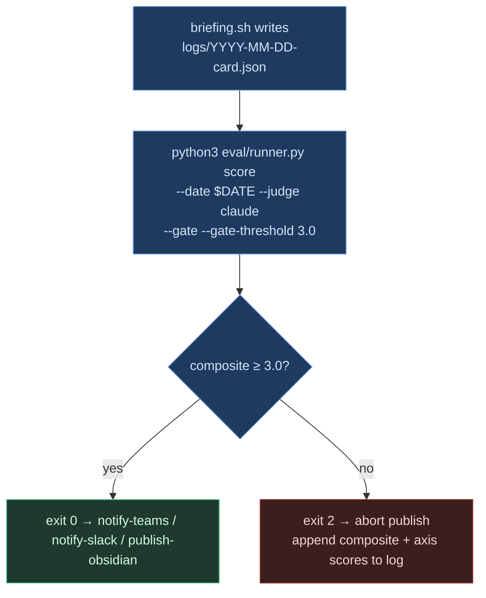
```mermaid
flowchart TD
    classDef ok   fill:#1e3a2f,stroke:#5bd49b,color:#d4f8e2
    classDef bad  fill:#3b1e1e,stroke:#a13a3a,color:#f8d4d4
    classDef calc fill:#1e3a5f,stroke:#5b8dd8,color:#d4e4f8

    A["briefing.sh writes<br/>logs/YYYY-MM-DD-card.json"]:::calc --> B["python3 eval/runner.py score<br/>--date $DATE --judge claude<br/>--gate --gate-threshold 3.0"]:::calc
    B --> C{"composite ≥ 3.0?"}:::calc
    C -- yes --> D["exit 0 → notify-teams / notify-slack / publish-obsidian"]:::ok
    C -- no  --> E["exit 2 → abort publish<br/>append composite + axis scores to log"]:::bad
```

Bash wrapper:

```bash
python3 eval/runner.py score --date "$DATE" --judge claude --gate --gate-threshold 3.0 \
  || { echo "Briefing failed eval gate (composite < 3.0); not publishing." >&2; exit 1; }
```

Exit codes: `0 = pass`, `2 = gate fail`, `1 = harness error`.

Default `--gate-threshold` is 3.0. With the current real-judge baseline (median 3.7, min 2.9), this would have blocked `2026-03-07` (2.9) and required intervention on the few cards that hit the no-source hard cap. Tune per your tolerance.

---

## Failure-mode decision graph

The harness is designed to fail loud at the right place. Where each failure lands:

```mermaid
flowchart TD
    classDef caught fill:#1e3a2f,stroke:#5bd49b,color:#d4f8e2
    classDef raise  fill:#3b1e1e,stroke:#a13a3a,color:#f8d4d4

    F1[Card file missing]:::raise -.-> H1["find_card → FileNotFoundError<br/>backfill: print + continue"]
    F2[Card unparseable JSON]:::raise -.-> H2["json.loads raises<br/>backfill: print + continue"]
    F3[Judge CLI not installed]:::raise -.-> H3["_run_cli → RuntimeError<br/>'claude CLI not found; use --judge stub'"]
    F4[Judge CLI returns rc != 0]:::raise -.-> H4["RuntimeError with stderr[:400]"]
    F5[Judge times out (240s)]:::raise -.-> H5["subprocess.TimeoutExpired → RuntimeError"]
    F6[Judge returns prose only]:::raise -.-> H6["parse_judge_response → ValueError"]
    F7[Axis out of 1-5]:::raise -.-> H7["parse_judge_response → ValueError"]
    F8[Same date judged twice]:::caught -.-> H8["ON CONFLICT DO UPDATE — latest wins"]
    F9[CLAUDECODE blocks claude]:::caught -.-> H9["env cleared in _run_cli"]
    F10[Drift db has only stub rows]:::caught -.-> H10["evaluate compares whatever's there<br/>latest-per-date wins"]
    F11[No golden files]:::raise -.-> H11["regression: exit 1, 'add some first'"]
```

All exceptions go through normal Python exception chaining, so stack traces in CI logs point at the real cause.

---

## Cost model

Real backfill measured: 18 cards × Claude Haiku 4.5 = ~$0.04, 235 s wall time at 4 workers.

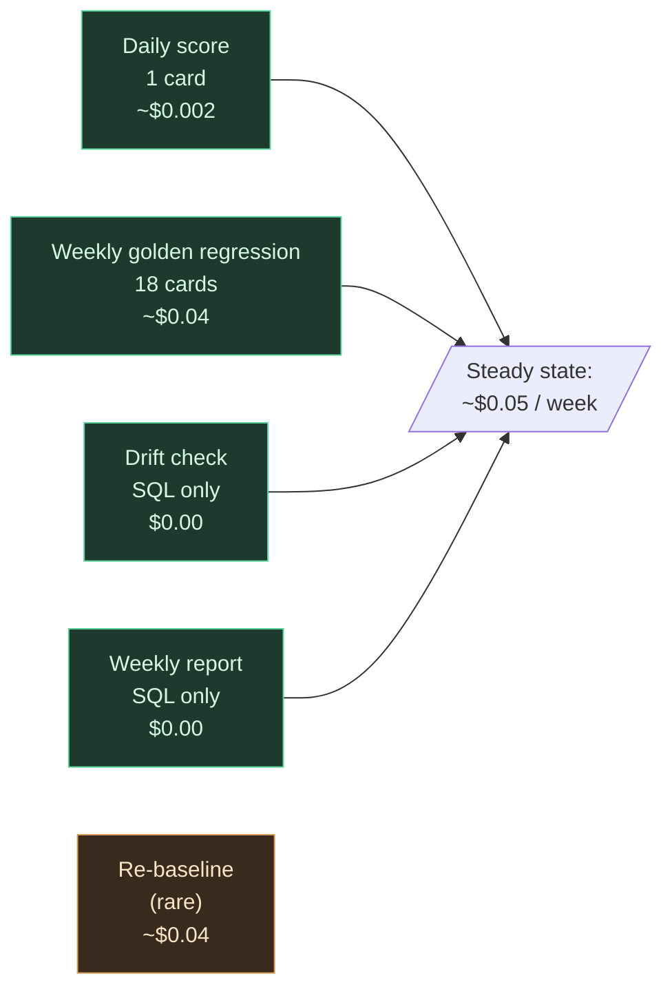
```mermaid
flowchart LR
    classDef cheap fill:#1e3a2f,stroke:#5bd49b,color:#d4f8e2
    classDef warn  fill:#3a2a1e,stroke:#d49b5b,color:#f5e6c8

    A["Daily score<br/>1 card<br/>~$0.002"]:::cheap
    B["Weekly golden regression<br/>18 cards<br/>~$0.04"]:::cheap
    C["Drift check<br/>SQL only<br/>$0.00"]:::cheap
    D["Weekly report<br/>SQL only<br/>$0.00"]:::cheap
    E["Re-baseline<br/>(rare)<br/>~$0.04"]:::warn

    A --> TOTAL[/"Steady state:<br/>~$0.05 / week"/]
    B --> TOTAL
    C --> TOTAL
    D --> TOTAL
```

Hard caps:
- `backfill --max-calls 50` (default) blocks accidental sweeps.
- Subprocess timeout 240 s prevents wedged calls from hanging the harness indefinitely.

---

## Testing

```bash
make eval-test
# or directly:
python3 -m unittest discover -s eval/tests -v
```

All 10 cases run against the stub backend — zero API, zero network, < 100 ms.

| Suite          | Tests | Asserts                                                                                |
| -------------- | ----- | -------------------------------------------------------------------------------------- |
| `ExtractTests` |   2   | Card → headlines + URLs; 7-day prior window resolves from real `example-cards/`.       |
| `JudgeTests`   |   3   | Stub returns valid 5-axis ints; parser rejects garbage; parser rejects out-of-range.   |
| `StoreTests`   |   2   | Composite formula matches rubric (`3.30` for known input); upsert idempotent on key.   |
| `DriftTests`   |   2   | Flat 30-day history → `status: ok`; 8-day drop → `status: alert` with ≥ 2 entries.     |
| `ReportTests`  |   1   | Markdown report contains header, composite-median line, per-day row.                   |

`DriftTests` patches `store.DB_PATH_DEFAULT` to a tempdir so it never touches the real `eval/store.sqlite`. Drift seeds rows then forces composite values via direct UPDATE (bypassing the rubric-weighted formula) to construct specific scenarios.

---

## File map

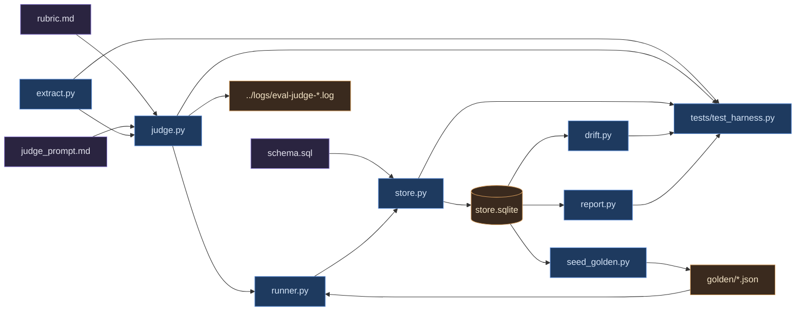
```mermaid
flowchart LR
    classDef spec fill:#2a2440,stroke:#8b7ad4,color:#e4e4ef
    classDef code fill:#1e3a5f,stroke:#5b8dd8,color:#d4e4f8
    classDef data fill:#3a2a1e,stroke:#d49b5b,color:#f5e6c8

    R["rubric.md"]:::spec
    JP["judge_prompt.md"]:::spec
    SC["schema.sql"]:::spec

    EX["extract.py"]:::code
    JU["judge.py"]:::code
    ST["store.py"]:::code
    RUN["runner.py"]:::code
    DR["drift.py"]:::code
    RP["report.py"]:::code
    SG["seed_golden.py"]:::code

    DB[(store.sqlite)]:::data
    GD["golden/*.json"]:::data
    LOG["../logs/eval-judge-*.log"]:::data
    T["tests/test_harness.py"]:::code

    R --> JU
    JP --> JU
    SC --> ST
    EX --> JU
    JU --> RUN
    RUN --> ST --> DB
    DB --> DR
    DB --> RP
    DB --> SG --> GD
    GD --> RUN
    JU --> LOG
    EX & JU & ST & DR & RP --> T
```

| File              | Role                                                                |
| ----------------- | ------------------------------------------------------------------- |
| `rubric.md`       | Axis definitions, weights, pass thresholds.                         |
| `judge_prompt.md` | Exact prompt sent to the judge. Versioned via `PROMPT_VERSION`.     |
| `schema.sql`      | One-table SQLite schema with `CHECK` constraints on each axis.      |
| `extract.py`      | Adaptive-card JSON → flat text + headlines + URLs.                  |
| `judge.py`        | Backends (stub / claude / codex / gemini) + JSON parser + logging.  |
| `store.py`        | Composite formula + idempotent upsert + filtered fetch.             |
| `runner.py`       | CLI: `score` / `backfill` / `regression` / `show`.                  |
| `drift.py`        | Median + MAD trailing-window detector.                              |
| `report.py`       | Weekly Markdown digest builder.                                     |
| `seed_golden.py`  | Lift store rows into pinned golden JSONs.                           |
| `golden/`         | 18 pinned baselines under `claude-haiku-4-5-20251001` v1.           |
| `tests/`          | 10 unittest cases against the stub backend.                         |

---

## Versioning and prompt evolution

Three things are versioned, and all three feed the store's primary key:

| Versioned thing      | Where it lives                  | Bump when                                            |
| -------------------- | ------------------------------- | ---------------------------------------------------- |
| Judge prompt         | `judge_prompt.md`               | Wording of the rubric prompt changes substantively.  |
| `PROMPT_VERSION`     | `judge.py`                      | Same as above — must be bumped to take effect.       |
| Judge model          | `EVAL_JUDGE_MODEL` env / flag   | Switching to a different Claude / Codex / Gemini ID. |

```mermaid
stateDiagram-v2
    [*] --> v1_haiku: ship
    v1_haiku --> v1_sonnet: try a stronger judge<br/>(switch model)
    v1_sonnet --> v1_haiku: revert
    v1_haiku --> v2_haiku: bump PROMPT_VERSION<br/>after rubric edit
    v2_haiku --> v2_haiku: stable
    v2_haiku --> v2_sonnet: explore better judge
```

Every state above produces a distinct row per card in `eval_runs`. You can `SELECT` any combination to compare. The golden set tracks one specific combination — the shipping one.

---

## Roadmap and explicit non-goals

```mermaid
flowchart LR
    classDef now  fill:#1e3a2f,stroke:#5bd49b,color:#d4f8e2
    classDef next fill:#3a2a1e,stroke:#d49b5b,color:#f5e6c8
    classDef no   fill:#3b1e1e,stroke:#a13a3a,color:#f8d4d4

    subgraph SHIPPED["Now (shipped)"]
        S1[5-axis rubric v1]:::now
        S2[4 backends incl. stub]:::now
        S3[SQLite idempotent store]:::now
        S4[Parallel backfill]:::now
        S5[Drift detector]:::now
        S6[Golden regression]:::now
        S7[Weekly Markdown report]:::now
        S8[Optional publish gate]:::now
    end

    subgraph NEXT["Plausible next"]
        N1[Wire --gate into briefing.sh]:::next
        N2[Cross-judge consensus<br/>(claude + gemini agree)]:::next
        N3[GitHub Actions cron for nightly drift]:::next
        N4[Per-topic axis breakdown]:::next
    end

    subgraph NO["Explicit non-goals"]
        X1[Human-in-loop labeling UI]:::no
        X2[Auto-rebaselining]:::no
        X3[Per-plugin scoring]:::no
        X4[A/B prompt framework]:::no
        X5[Retry logic on CLI failure]:::no
    end
```

Auto-rebaselining is the most-requested non-goal: you should never silently move a baseline. Re-baselines should be deliberate operator actions with a clear story.

---

## FAQ

**Why a stub backend at all?**
Tests, CI, and offline iteration. Hitting a paid API on every unit test run is wasteful and slow. The stub exercises every code path in the harness except the subprocess hop.

**Why not call the Anthropic SDK directly?**
The rest of the project shells out to CLIs. The harness does the same so it inherits the existing auth, quota, and model-selection story. Zero new credentials, zero new SDK pins.

**Why are 6 cards in the shipping golden below the publish-gate threshold?**
Because those cards really are below the threshold. The judge is doing its job. With a `--gate-threshold 3.0` enabled, three cards (`03-07`, `03-08`, `03-15`) would have been blocked. Those are exactly the cards an operator would want to know about.

**The stub gives composite 4.2 but real Claude gives 3.7 median. Which is right?**
Real Claude. The stub is a heuristic over URL / number / bullet / bold density — it knows nothing about novelty, factuality mapping, or coherence. It exists to keep tests fast, not to score quality.

**What happens if I bump `PROMPT_VERSION` without re-baselining?**
The regression gate will still re-judge against the old baseline composites, which were produced under the old prompt. Deltas become noise. Bumping the prompt should always be followed by `make eval-backfill` → `make eval-seed-golden` → `make eval-regression`.

**Can I run two judges in parallel for cross-validation?**
Yes — run `backfill JUDGE=claude` and `backfill JUDGE=gemini` separately. The PK includes `judge_model`, so both sets of rows coexist. Then compare with custom SQL (a `cross-judge` subcommand is in the [roadmap](#roadmap-and-explicit-non-goals)).

**Why not store the full briefing text in the DB?**
The card files are already in `example-cards/` (or `logs/` for fresh runs) and they're the source of truth. Storing them again would just create drift between artifacts. The DB stores the *judgment*, not the input.

**Why a 0.05 floor on MAD?**
When history is dead flat (e.g. all 4.2 from stub), MAD is exactly 0. The floor prevents division-by-zero and prevents a z-score blowup on the first sample that deviates.

**What if the judge returns valid JSON but with extra prose around it?**
`parse_judge_response` does a non-greedy regex search for a ```` ```json {...} ``` ```` block first, then falls back to a bare `{ ... "factuality" ... }` extraction. Prose before / after the JSON is ignored.

**Is the harness coupled to the daily briefing or could I use it for custom briefs too?**
Today it's coupled to the daily card schema (Microsoft Adaptive Card JSON). Custom briefs would need an analogous extractor. The judge / store / drift / report machinery is briefing-agnostic.
