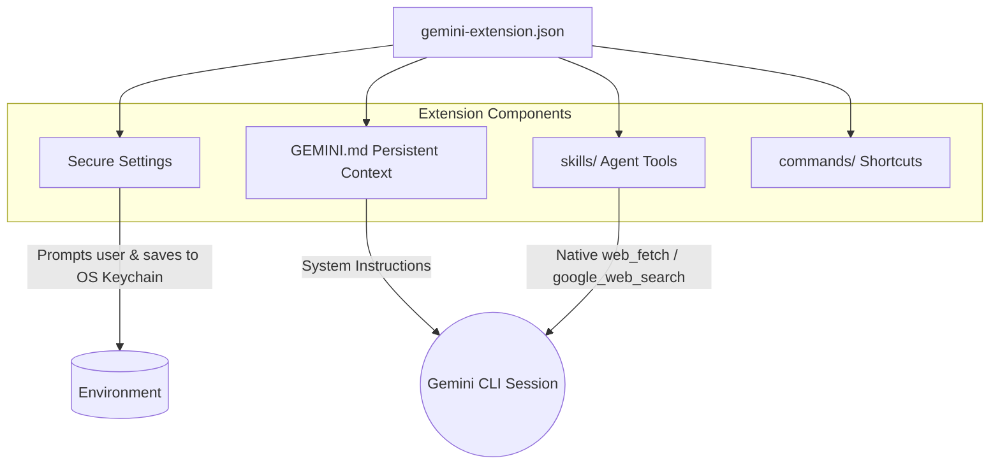

# Gemini CLI Extensions

This directory (`gemini-extensions/`) contains 10 deeply integrated extensions designed for the **Google Gemini CLI**.

## The Gemini Advantage

Gemini CLI extensions use a unique structure that emphasizes secure credential injection and persistent system context (`GEMINI.md`), allowing the model to take on a strict "persona" for the duration of the session.



## Available Extensions

We offer the full suite of our Research Ops agents as Gemini Extensions:

1.  **`ai-news-briefing`**: Custom slash commands (`/news:dry-run`) using bash interpolation (`!{...}`), secure prompts for Notion API tokens, plus the full 5-axis LLM-as-judge quality eval harness (6 eval skills + `quality-judge` agent + offline Chart.js dashboard).
2.  **`last30days`**: Instructs Gemini to prioritize social signals (Reddit/X/HN) over generic web results.
3.  **`trend-spotter`**: Uses Gemini's `google_web_search` to map GitHub repository velocity.
4.  **`earnings-analyzer`**: Synthesizes transcripts and financial news objectively.
5.  **`paper-reader`**: Connects to ArXiv and outputs ELI5 plain-English summaries.
6.  **`competitor-intel`**: Maps feature gaps and Reddit sentiment for target SaaS products.

7.  **`repo-auditor`**: Scans GitHub repositories for security, staleness, and code quality using Native fetch.
8.  **`podcast-summarizer`**: Extracts and synthesizes transcripts from YouTube and podcasts into actionable show notes.
9.  **`startup-scout`**: Identifies early-stage startups using YC, Product Hunt, and VC announcements.
10. **`crypto-tracker`**: Performs fundamental Web3 analysis on tokenomics and community sentiment.

## How to Link and Use

Gemini CLI extensions are meant to be linked locally to your installation.

```bash
# Link the trend-spotter extension
cd gemini-extensions/trend-spotter
gemini extensions link .

# Link the paper-reader extension
cd ../paper-reader
gemini extensions link .
```

Once linked, restart your Gemini CLI. If an extension defines `settings` (like API keys), the CLI will securely prompt you for them upon startup. The skills (e.g., `/analyze-trends`) will be automatically bundled into your session.

## `ai-news-briefing` — bundled skills and agents

| Skill | Behavior |
| --- | --- |
| `daily-briefing` | Run the scheduled 9-topic pipeline (search → compile → Notion + Adaptive Card + Obsidian markdown). |
| `custom-brief` | On-demand 5-agent deep research on a user-defined topic. |
| `trigger-briefing` | Re-fire a missed scheduled run. |
| `summarize-url` | One-paragraph summary of a single URL. |
| `health-check` | Verify CLIs, MCP, webhooks, vault, eval store. |
| `eval-score` | Judge one card on the 5-axis rubric and persist to `eval/store.sqlite`. |
| `eval-backfill` | Score every card in `example-cards/` in parallel. |
| `eval-drift` | Trailing-7d-vs-30d median + MAD; alert on quality slides. |
| `eval-regression` | Re-judge the pinned 18-card golden set; fail on Δ > 0.5. |
| `eval-report` | Markdown weekly digest with axis medians + per-day table. |
| `eval-dashboard` | Build the offline Chart.js dashboard at `eval/dashboard/index.html`. |

| Agent | Persona |
| --- | --- |
| `deep-researcher` | Orchestrator for 5 parallel research agents (Breaking / Technical / Industry / Trend / Policy). |
| `news-analyst` | Editorial polish + per-claim source verification on a draft briefing. |
| `quality-judge` | 5-axis rubric scorer with concrete per-axis evidence and fix recommendations. |

`GEMINI.md` lists every skill + agent so the model loads with full context. The extension manifest (`gemini-extensions/ai-news-briefing/gemini-extension.json`) declares the secure-environment settings for `NOTION_API_TOKEN`, `AI_BRIEFING_OBSIDIAN_VAULT`, `AI_BRIEFING_TEAMS_WEBHOOK`, and `AI_BRIEFING_SLACK_WEBHOOK`.