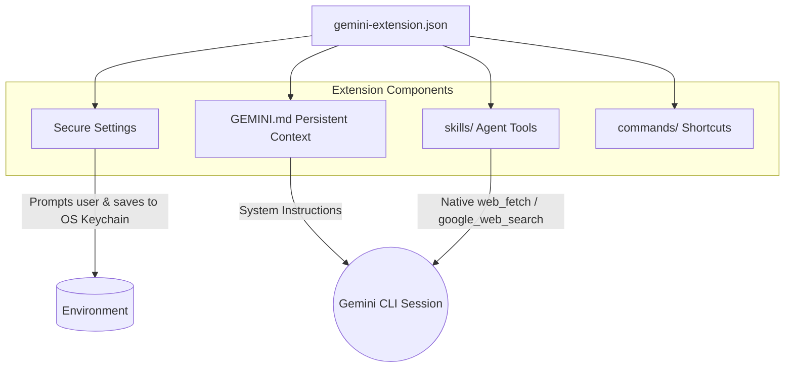

# Gemini CLI Extensions

This directory (`gemini-extensions/`) contains 10 deeply integrated extensions designed for the **Google Gemini CLI**.

## The Gemini Advantage

Gemini CLI extensions use a unique structure that emphasizes secure credential injection and persistent system context (`GEMINI.md`), allowing the model to take on a strict "persona" for the duration of the session.



## Available Extensions

We offer the full suite of our Research Ops agents as Gemini Extensions:

1.  **`ai-news-briefing`**: Features custom slash commands (`/news:dry-run`) using bash interpolation (`!{...}`) and secure prompts for Notion API tokens.
2.  **`last30days`**: Instructs Gemini to prioritize social signals (Reddit/X/HN) over generic web results.
3.  **`trend-spotter`**: Uses Gemini's `google_web_search` to map GitHub repository velocity.
4.  **`earnings-analyzer`**: Synthesizes transcripts and financial news objectively.
5.  **`paper-reader`**: Connects to ArXiv and outputs ELI5 plain-English summaries.
6.  **`competitor-intel`**: Maps feature gaps and Reddit sentiment for target SaaS products.

7.  **`repo-auditor`**: Scans GitHub repositories for security, staleness, and code quality using Native fetch.
8.  **`podcast-summarizer`**: Extracts and synthesizes transcripts from YouTube and podcasts into actionable show notes.
9.  **`startup-scout`**: Identifies early-stage startups using YC, Product Hunt, and VC announcements.
10. **`crypto-tracker`**: Performs fundamental Web3 analysis on tokenomics and community sentiment.

## How to Link and Use

Gemini CLI extensions are meant to be linked locally to your installation.

```bash
# Link the trend-spotter extension
cd gemini-extensions/trend-spotter
gemini extensions link .

# Link the paper-reader extension
cd ../paper-reader
gemini extensions link .
```

Once linked, restart your Gemini CLI. If an extension defines `settings` (like API keys), the CLI will securely prompt you for them upon startup. The skills (e.g., `/analyze-trends`) will be automatically bundled into your session.