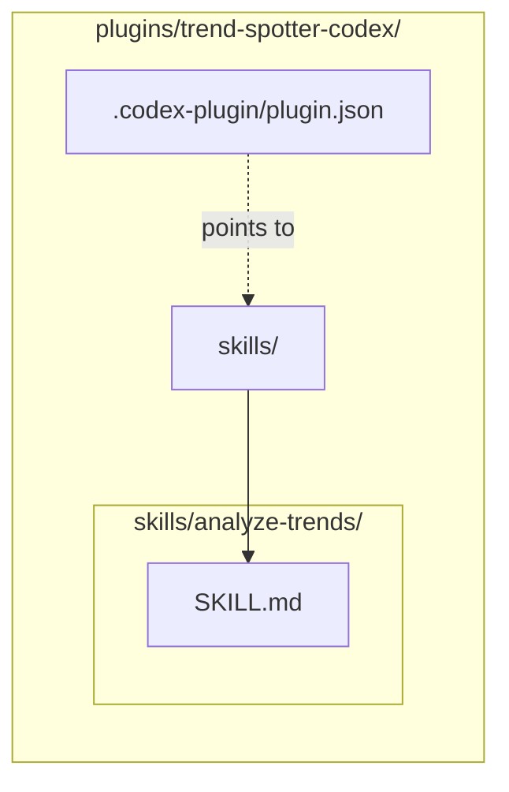

# Codex Plugins

This directory (`plugins/`) contains the raw source code for our 10 **OpenAI Codex** plugins. 

## Available Plugins

We have ported our entire Research Ops ecosystem to support Codex's native tooling format.

1.  **`ai-news-briefing-codex`**: News automation, Notion/Teams MCP integrations, and a 5-axis LLM-as-judge quality eval harness (6 eval skills + `quality-judge` agent + offline dashboard).
2.  **`last30days-codex`**: Social intelligence (Reddit/X/HN) trend tracking.
3.  **`trend-spotter-codex`**: Developer trend detection via GitHub velocity.
4.  **`earnings-analyzer-codex`**: Deep financial research via SEC filings and transcripts.
5.  **`paper-reader-codex`**: ArXiv academic paper summarization and ELI5 translation.
6.  **`competitor-intel-codex`**: Market landscape analysis and rival feature matrix mapping.

7.  **`repo-auditor-codex`**: Scans GitHub repositories for security, staleness, and code quality.
8.  **`podcast-summarizer-codex`**: Extracts and synthesizes transcripts from YouTube and podcasts into actionable show notes.
9.  **`startup-scout-codex`**: Identifies early-stage startups using YC, Product Hunt, and VC announcements.
10. **`crypto-tracker-codex`**: Performs fundamental Web3 analysis on tokenomics and community sentiment.

## Architecture

Codex plugins require a specific `.codex-plugin/plugin.json` manifest. The skills must be placed in a `/skills/` directory with `SKILL.md` files that utilize the `name:` frontmatter property.

## Development & Usage

Because these plugins are referenced by `.agents/plugins/marketplace.json`, you do not need to manually install them via CLI.
1. Open this repository in a Codex-supported editor.
2. Open the Plugin Directory UI.
3. You will see the "AI News Briefing Ecosystem (Codex)" marketplace.
4. Click install on the desired research agent.

## `ai-news-briefing-codex` — full skill catalog

The flagship Codex plugin mirrors the Claude Code plugin one-to-one (skills + agents are platform-agnostic Markdown). After install, the skills appear under the plugin namespace and the agents activate via Codex's agent picker.

| Skill | Behavior |
| --- | --- |
| `daily-briefing` | Scheduled run — 9-topic search + Notion publish + Adaptive Card + Obsidian markdown. |
| `custom-brief` | On-demand 5-agent deep research on a user-defined topic. |
| `trigger-briefing` | Re-fire a scheduled run that was skipped or failed. |
| `summarize-url` | Fetch + one-paragraph summary of a single URL. |
| `health-check` | Verify CLI, MCP servers, webhooks, vault, eval store. |
| `eval-score` | Judge one card on the 5-axis rubric; persists to `eval/store.sqlite`. |
| `eval-backfill` | Score every card under `example-cards/` in parallel (4 workers default). |
| `eval-drift` | Trailing-7d-vs-30d median + MAD; alert on z < -1.5 for 2+ days. |
| `eval-regression` | Re-judge the 18-card golden set; fail on Δ < -0.5. |
| `eval-report` | Markdown weekly digest with axis medians + per-day table. |
| `eval-dashboard` | Build offline Chart.js dashboard at `eval/dashboard/index.html`. |

| Agent | Persona |
| --- | --- |
| `deep-researcher` | Orchestrator for 5 parallel research agents (Breaking / Technical / Industry / Trend / Policy). |
| `news-analyst` | Editorial polish + per-claim source verification on a draft briefing. |
| `quality-judge` | 5-axis rubric scorer with concrete per-axis evidence and per-axis fix recommendations. |

The Codex manifest (`plugins/ai-news-briefing-codex/.codex-plugin/plugin.json`) wires both `skills/` and `agents/` directories and references `.mcp.json` for the Notion + fetch MCP servers.