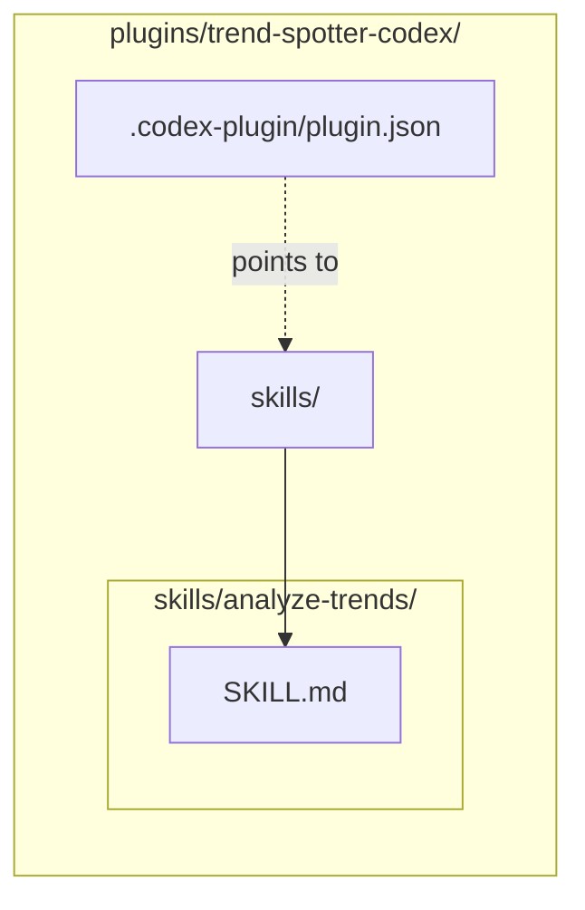

# Codex Plugins

This directory (`plugins/`) contains the raw source code for our 10 **OpenAI Codex** plugins. 

## Available Plugins

We have ported our entire Research Ops ecosystem to support Codex's native tooling format.

1.  **`ai-news-briefing-codex`**: News automation and Notion/Teams MCP integrations.
2.  **`last30days-codex`**: Social intelligence (Reddit/X/HN) trend tracking.
3.  **`trend-spotter-codex`**: Developer trend detection via GitHub velocity.
4.  **`earnings-analyzer-codex`**: Deep financial research via SEC filings and transcripts.
5.  **`paper-reader-codex`**: ArXiv academic paper summarization and ELI5 translation.
6.  **`competitor-intel-codex`**: Market landscape analysis and rival feature matrix mapping.

7.  **`repo-auditor-codex`**: Scans GitHub repositories for security, staleness, and code quality.
8.  **`podcast-summarizer-codex`**: Extracts and synthesizes transcripts from YouTube and podcasts into actionable show notes.
9.  **`startup-scout-codex`**: Identifies early-stage startups using YC, Product Hunt, and VC announcements.
10. **`crypto-tracker-codex`**: Performs fundamental Web3 analysis on tokenomics and community sentiment.

## Architecture

Codex plugins require a specific `.codex-plugin/plugin.json` manifest. The skills must be placed in a `/skills/` directory with `SKILL.md` files that utilize the `name:` frontmatter property.

## Development & Usage

Because these plugins are referenced by `.agents/plugins/marketplace.json`, you do not need to manually install them via CLI. 
1. Open this repository in a Codex-supported editor.
2. Open the Plugin Directory UI.
3. You will see the "AI News Briefing Ecosystem (Codex)" marketplace.
4. Click install on the desired research agent.